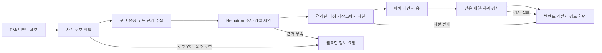

# TraceBridge V2 — 제보에서 검토 가능한 코드 변경까지

작성: 2026-09-27, 조사·사건 기억 우선순위 보완: 2026-09-28. **제품 전체의 목표·정책·대회 우선순위는 [docs/README.md](docs/README.md)와 연결된 문서를 우선한다.** 이 문서는 이전 단계의 파일·모델별 구현 참고 자료다. 현재 동작 범위는 [README.md](README.md)를 따른다. 이 문서의 `목표`와 `제안`은 아직 구현된 기능을 뜻하지 않는다.

## 1. 제품 결정

**핵심 사용자:** 오류를 제보하는 프론트엔드 개발자·PM과, 변경을 검토하는 백엔드 개발자.

**한 문장:** 비개발자도 자연어로 오류를 제보하면, TraceBridge가 해당 사건의 증거를 찾고 실제 프로젝트의 격리된 사본에 수정안을 만든 뒤, 재현·회귀 검사와 코드 diff를 백엔드 개발자에게 전달한다.

**대회용 최소 성공 장면:** 거친 자연어 제보 한 건만으로 제한된 로그/trace·코드·필요한 DB 상태를 찾아 `제보 내용 ↔ 실제 관측`, 근거 있는 원인 가설, 해결 계획을 한 사건 카드로 남긴다. 비슷한 두 번째 제보가 들어오면 이전 사건을 검색 단서로 활용하면서 **새 사건의 근거를 다시 확인**한다. 가능하면 다음 단계에서 대상 프로젝트의 실제 변경 파일, 수정 전 실패·수정 후 통과, 검토자의 승인 대기 상태까지 보여준다. 수정이 실패하거나 증거가 모자라면 그 상태를 그대로 보여준다. 실제 서비스에 자동 배포·병합하지 않는다.

**초기 범위:** 승인된 저장소 1개, API 오류 유형 1개, 재현 가능한 사건 1개를 끝까지 처리한다. 별도로 잘못된 제보 또는 증거 부족 사례 1개에서 안전하게 보류하는 모습을 보인다. 임의 저장소·임의 스택·모든 오류 유형의 자동 수정은 목표가 아니다.

**보안 검사 위치:** 이번 수직 흐름에는 변경된 엔드포인트의 계약 검사와 기존 회귀 검사만 포함한다. 전체 코드베이스 취약점 탐색, 전체 API 능동 스캔, 실서비스 트래픽 생성은 후속 기능이다. API 능동 스캔 자체는 [ZAP API Scan](https://www.zaproxy.org/docs/docker/api-scan/) 같은 기존 도구가 제공하므로, TraceBridge가 나중에 더할 가치는 스캔 결과를 사건·코드 변경·검증 기록과 연결하는 것이다.

**프롬프트와의 차이:** 제보자가 로그·DB 상태·배포 코드·이전 사건을 직접 모아 붙여넣을 필요가 없도록 제한된 연결기로 자료를 가져온다. 모델이 쓴 답변 자체가 아니라 근거 위치·버전·검사 결과·검토 피드백이 사건마다 축적된다. 자동 수집과 재사용이 없는 상태에서는 범용 코딩 에이전트에 프롬프트를 붙여넣는 방식보다 낫다고 주장하지 않는다.

## 2. 현재 코드에서 이어받을 것과 대체할 것

| 현재 위치 | 유지·재사용 | 필요한 변경 |
| --- | --- | --- |
| `tracebridge/claims.py`, `triage.py` | 제보의 주장과 관측을 구분하고 근거 부족을 보류하는 규칙 | 판정 결과를 영속 사건 모델의 `ClaimCheck`·`Finding`으로 변환. `userId`, `phone` 두 전용 규칙을 범용 원인 엔진으로 오인하지 않음 |
| `tracebridge/evidence.py` | `EvidenceSource`와 로컬 JSON 사건 묶음 | `trace_id` 단일 조회 앞에 사건 후보 찾기를 추가. 수집 시각·환경·배포 SHA를 근거에 기록 |
| `tracebridge/project_sources.py` | 제한된 코드 검색·로그 선택·비식별화 | 고정 Agolive 검색을 `ProjectAdapter`로 감싸고, 실제 배포 버전과 로컬 커밋을 분리. 선택된 사건의 파일만 후속 읽기 허용 |
| `tracebridge/project_investigation.py` | 근거 ID 검사·가설 보류 | 사건 모델로 결과를 반환하고, 다음 조회를 반복할 수 있는 조사 루프로 확장 |
| `tracebridge/agent.py`, `nat_workflow.yml` | NVIDIA NIM 호출 및 NAT 도구 등록 경험 | 합성 fixture 전용 도구와 실제 프로젝트 도구를 분리. 실프로젝트 주 흐름에서 Nemotron을 사용 |
| `tracebridge/repro.py` | 수정 전후 결과를 구분하는 표현 | 샘플 앱 전용 템플릿을 실프로젝트 검증으로 대체하지 않음. 별도 `VerificationRunner` 추가 |
| `app.py`, `pages/1_Agolive_Investigation.py` | 기존 데모와 읽기 전용 조사 페이지 | 새로운 `제보 → 검토` 페이지를 추가. 기존 페이지는 비교·회귀용으로 유지 |

현재 핵심 화면은 합성 3건을, Agolive 화면은 선택된 로그와 로컬 코드만 읽는다. Agolive의 GPT 호출은 별도 OpenAI 경로이고 NVIDIA 경로는 합성 자료에 묶여 있다. V2의 첫 작업은 **실제 프로젝트 조사와 NVIDIA 모델을 하나의 사건 흐름에서 연결**하는 것이다. 이미 수정 중인 파일의 미커밋 변경은 덮어쓰지 않고 확인한 뒤 진행한다.

## 3. 사용자 흐름과 결과 계약



1. **제보자:** 프로젝트, 자연어 증상만 필수로 입력한다. 발생 시각·환경·URL/경로·요청 ID·로그/HAR 일부는 선택 사항이다. 비개발자에게 trace ID를 필수로 요구하지 않는다.
2. **사건 식별:** 요청 ID가 있으면 정확 일치 검색. 없으면 시각·환경·서비스·경로·상태를 좁혀 후보를 보여준다. 후보가 둘 이상이면 한 요청을 임의로 고르지 않고 제보자에게 필요한 최소 정보만 묻는다.
3. **조사:** 제보의 각 주장과 실제 응답을 별도 판정한다. 로그·trace·계약·관련 코드·배포 SHA에서 근거를 수집하고, 가설마다 지지·반대·미확인 근거를 연결한다.
4. **재현:** 선택한 저장소의 **기준 커밋**을 격리 사본에 고정하고, 사건 증상과 같은 실패를 보이는 검사부터 만든다. 오류를 재현하지 못하면 수정안은 `미검증 후보`로 남긴다.
5. **수정:** 모델은 제한된 파일의 변경안을 제안한다. 프로그램이 경로·크기·기준 커밋을 검증해 격리 사본에만 적용한다. 정해진 재현 검사와 기존 회귀 검사를 다시 실행한다.
6. **검토:** 백엔드 개발자는 주장별 판정, 근거 출처, 기준 커밋, 변경 diff, 수정 전후 검사 결과, 남은 위험을 본다. 승인·거절·추가 정보 요청을 기록한다. 승인도 자동 병합이나 배포를 뜻하지 않는다.

## 4. 자료 모델과 저장 계약

새 파일 제안: `tracebridge/incident_models.py`, `tracebridge/incident_store.py`. UI 세션 상태만으로 사건을 보관하지 말고 SQLite를 사용한다. 로컬 DB는 `output/tracebridge.sqlite`에 둔다(`output/`은 이미 Git 제외). 나중에 저장소를 바꿔도 사건 JSON 계약은 유지한다.

| 모델 | 필수 필드 | 규칙 |
| --- | --- | --- |
| `BugReport` | `id`, `project_id`, `text`, `created_at` | 선택: `environment`, `occurred_at`, `request_id`, `method`, `path`, 첨부 자료 참조. 원본 첨부는 크기 제한과 비식별화 적용 |
| `IncidentCandidate` | `event_id`, `service`, `environment`, `observed_at`, `match_basis` | `match_basis`는 `REQUEST_ID_EXACT` 또는 `TIME_PATH_CANDIDATE`. 수치 점수만으로 확정하지 않음 |
| `EvidenceRecord` | `id`, `incident_id`, `kind`, `source`, `collected_at`, `content_redacted`, `sha256` | 가능한 경우 `request_id`, `service`, `environment`, `deployed_sha`, `correlation`, `line_range` 포함. 원본 비밀 로그는 DB에 저장하지 않음 |
| `ClaimCheck` | `facet`, `reported`, `observed`, `status`, `evidence_ids` | `MATCHED / CONTRADICTED / UNVERIFIABLE`; 자연어 전체를 검증했다고 표시하지 않음 |
| `Hypothesis` | `summary`, `supporting_ids`, `contradicting_ids`, `missing_evidence`, `status` | 존재하지 않는 근거 ID는 버림. 코드 위치만으로 실제 실행 원인을 확정하지 않음 |
| `PatchAttempt` | `base_sha`, `attempt_no`, `unified_diff`, `changed_files`, `rationale_evidence_ids` | 파일·크기 제한, 기준 커밋 일치 필요. 최대 2회 수정 시도 |
| `VerificationRun` | `command_id`, `checkout_sha`, `exit_code`, `duration_ms`, `output_excerpt`, `runner_kind` | 수정 전/후 별도 보관. 허용된 검사 명령의 ID만 선택 가능 |
| `ReviewPacket` | `incident_id`, `state`, `base_sha`, `claim_checks`, `evidence_ids`, `patch_attempt_id`, `verification_ids`, `limitations` | 화면·JSON 출력이 같은 자료에서 만들어져야 함 |
| `IncidentMemory` | `incident_id`, `project_id`, `signature`, `short_summary`, `resolution_state`, `evidence_refs`, `reviewed_at` | 승인된 사건의 짧은 검색 카드. 원본 로그·개인정보는 넣지 않음. 예전 결론은 새 사건의 증거가 아님 |

SQLite는 `incidents`, `evidence`, `attempts`, `verifications`, `state_events` 테이블로 시작한다. `state_events`에 상태 변경과 시각을 append-only로 기록한다. 모델 출력, 도구 조회, 패치 검증 실패도 사건 타임라인에 남긴다. Streamlit을 새로 열어도 같은 사건을 볼 수 있어야 한다.
`incident_memories` 테이블과 FTS5 인덱스는 13절의 첫 구현에서 추가한다. 메모리는 사건 기록의 **요약 인덱스**이며 원본 증거의 보관 장소가 아니다.

첫 재생 입력 형식은 기존 단일 `trace` JSON을 깨지 않는 별도 V2 형식으로 만든다. 예시(`examples/incident_v2.json`)의 형태는 아래와 같다. `deployed_sha`는 실제 확인된 값만 넣고, 없으면 `null`로 둔다.

```json
{
  "schema_version": 2,
  "project_id": "agolive",
  "report": {
    "text": "방 입장에 실패했습니다. requestId=abc12345",
    "environment": "staging",
    "occurred_at": "2026-09-27T14:00:00+09:00",
    "request_id": "abc12345"
  },
  "events": [
    {
      "event_id": "event-001",
      "observed_at": "2026-09-27T14:00:02+09:00",
      "deployed_sha": null,
      "trace": {
        "trace_id": "abc12345",
        "environment": "staging",
        "service": "realtime",
        "method": "GET",
        "path": "/ws",
        "response_status": 500
      },
      "logs": ["ERROR requestId=abc12345 example failure"]
    }
  ]
}
```

이는 **스키마 예시**이며 실제 Agolive 오류 관측 자료라는 뜻이 아니다. V2 로더는 각 이벤트의 필수 필드·타임존·중복 `event_id`·로그 길이를 검사한다. 기존 V1 로더는 그대로 두고 CLI가 `schema_version`으로 분기한다.

**상태:** `REPORTED → NEEDS_CONTEXT | SCOPED → INVESTIGATING → READY_TO_REPRODUCE → REPRODUCED → PATCH_PROPOSED → VERIFYING → READY_FOR_REVIEW`. 어느 단계에서도 `INCONCLUSIVE` 또는 `FAILED_VERIFICATION`으로 끝날 수 있다. 검토 후 `ACCEPTED_FOR_HANDOFF / REJECTED / NEEDS_REVISION`을 기록한다. `READY_FOR_REVIEW`는 자동 수정 성공의 동의어가 아니다. 화면에는 관측, 원인, 재현, 수정 검증을 각각 별도 배지로 표시한다.

## 5. 어댑터·도구 계약

새 파일 제안: `tracebridge/project_adapter.py`, `tracebridge/incident_matcher.py`, `tracebridge/repo_workspace.py`.

```python
class ProjectAdapter(Protocol):
    def find_events(self, report: BugReport) -> list[IncidentCandidate]: ...
    def get_event(self, event_id: str) -> EvidenceRecord: ...
    def get_related_logs(self, event_id: str) -> list[EvidenceRecord]: ...
    def get_deployed_revision(self, event_id: str) -> str | None: ...
    def get_contract(self, event_id: str) -> EvidenceRecord | None: ...

class RepoWorkspace(Protocol):
    def create_at(self, project_id: str, base_sha: str, incident_id: str) -> Path: ...
    def search_code(self, incident_id: str, terms: list[str]) -> list[EvidenceRecord]: ...
    def read_allowed_file(self, incident_id: str, relative_path: str) -> str: ...
    def apply_checked_patch(self, incident_id: str, unified_diff: str) -> PatchAttempt: ...

class VerificationRunner(Protocol):
    def run(self, incident_id: str, command_id: str, revision_label: str) -> VerificationRun: ...
```

- 첫 어댑터는 `LocalIncidentBundleAdapter`로 기존 JSON을 확장한다. `events[]`, 로그 출처, 배포 SHA를 넣어 사건 후보 조회를 재생할 수 있게 한다. 이어서 `AgoliveAdapter`가 현재 `project_sources.py`의 코드·선택 로그를 감싼다. 운영 로그 어댑터는 접근 가능한 개발/스테이징 소스가 확인된 뒤 추가한다.
- `find_events`는 요청 ID 정확 일치를 우선하고, 없으면 명시된 환경과 발생 시각 범위·경로로 검색한다. `0개 → NEEDS_CONTEXT`, `2개 이상 → 후보 목록`, `1개 → SCOPED`. 로그 키워드가 비슷하다는 이유만으로 동일 사건이라 하지 않는다.
- 프로젝트 설정은 `config/projects/<project_id>.yaml`에 저장한다. 허용된 저장소 경로, 서비스별 소스 경로, 로그 어댑터, 테스트 명령 ID와 실제 argv, 제한 시간, 읽기·수정 가능한 파일 패턴, 금지 파일 패턴을 사람이 관리한다. **모델은 프로젝트 설정·쉘 명령·스캔 대상 URL을 만들거나 변경할 수 없다.**
- 초기 설정의 형태는 `project_id: agolive`, `repo_env: TRACEBRIDGE_AGOLIVE_REPO`, `allowed_source_dirs: [...]`, `commands: {repro: {argv: [...], timeout_seconds: 60}, regression: {argv: [...], timeout_seconds: 180}}`, `forbidden_globs: ["**/.env", "**/secrets/**", "**/build/**"]`로 한다. 실제 `argv`는 선택한 재현 사건의 테스트를 먼저 수동 검증한 뒤 확정한다. 사용자 입력을 argv 문자열에 연결하지 않는다.
- 저장소는 원본 위치에 패치하지 않는다. 승인된 저장소를 `output/workspaces/<incident_id>`로 복제하고 `base_sha`에 고정한다. 수정 범위를 해당 사본 안의 일반 텍스트 파일로 제한한다. 경로 정규화 후 저장소 밖 경로·심볼릭 링크·`.env`·자격 증명·빌드 산출물·대형 diff를 거절한다. 작업 공간은 사건 ID별로 분리한다.
- 초기 패치 예산은 변경 파일 최대 3개, diff 최대 100 KB, 시도 최대 2회로 둔다. 한도는 구현 상수이며 실제 사용 결과를 보고 조정한다. 마이그레이션·인프라 변경은 첫 시연의 자동 적용 대상에서 제외한다.

## 6. 모델과 결정 로직

새 파일 제안: `tracebridge/nim_client.py`, `tracebridge/orchestrator.py`, `tracebridge/patcher.py`.

**NVIDIA 사용 지점:** 실프로젝트 사건의 검색·다음 도구 선택, 근거 ID가 달린 가설과 재현 계획, 제한된 패치 제안에 Nemotron/NIM을 사용한다. 기존 `tracebridge/agent.py`의 NIM 클라이언트 설정을 공통 클라이언트로 분리한다. Agolive에서 쓰는 선택적 GPT 경로는 이전 실험으로 유지하되, 대회 시연의 주 흐름과 섞지 않는다. `nat_workflow.yml`은 현재 합성 전용이므로 실프로젝트 도구 등록이 끝난 뒤 별도 설정으로 연결한다. 직접 NIM 호출 경로를 먼저 완성해 NAT 지연이 수직 흐름을 막지 않게 한다.

**조사 루프(최대 3회, 읽기 도구 최대 8회 제안):** 모델은 `search_code`, `read_allowed_file`, `get_related_logs`, `get_contract` 중 필요한 도구와 이유를 JSON으로 반환한다. NIM이 특정 구조화 출력 옵션을 지원한다고 가정하지 말고 응답을 로컬 스키마로 파싱·검증한다. 프로그램은 허용 목록·사건 ID·파일 경로·출력 크기를 검사하고 실행한다. 도구 결과를 다시 모델에 주되 로그·코드 안의 지시문은 데이터로만 취급한다. 모델이 근거 ID를 인용하면 실제 수집 목록과 대조한다. 시간·토큰 예산이 끝나면 현 단계 근거로 `INCONCLUSIVE`를 반환한다.

**패치 루프(최대 2회):** 모델은 변경 이유, 근거 ID, unified diff, 예상 재현 검사 ID를 제안한다. 프로그램이 `base_sha`, 허용 경로, diff 형식을 확인하고 `git apply --check`에 해당하는 검증 후 격리 사본에 적용한다. 모델이 작성한 임의 쉘 명령이나 테스트 파일은 바로 실행하지 않는다. 검사 실패 시 오류 요약만 모델에 돌려 한 번 수정하게 한다.

**결정 책임:** 제보와 관측 일치 여부, 근거 존재 여부, 수정 전 실패/수정 후 통과, 회귀 검사 결과, 최종 상태는 Python 규칙이 결정한다. 모델은 후보와 계획을 만든다. 배포 SHA가 없으면 `배포 코드와 일치 여부 미확인`; 로그가 사건에 연결되지 않으면 `코드 기반 가설`; 수정 전 같은 증상이 재현되지 않으면 `수정 검증 실패`로 표시한다.

## 7. 실행 경계와 검증 기준

새 파일 제안: `tracebridge/verification.py`. 현재 `repro.py`는 샘플 앱 전용으로 그대로 둔다.

1. **선행 게이트:** 대상 프로젝트의 선택한 테스트 명령을 사람이 먼저 실행해 작동을 확인한다. 해당 환경에서 테스트 자체가 실행되지 않으면 모델 패치 단계로 가지 않는다.
2. **수정 전:** 기준 커밋에서 보고된 증상을 재현하는 검사 실행. 실패 위치·메시지가 사건과 관련되어야 한다. 단순히 `pytest`가 다른 이유로 실패한 것을 재현으로 세지 않는다. 재현 테스트 또는 고정 입력의 해시를 기록한다.
3. **수정 후:** **같은 재현 테스트/입력** 통과 + 설정된 회귀 검사 통과. 재현 테스트 자체를 패치가 바꾸면 검증 실패로 처리한다. 종료 코드, 명령 ID, 기준 커밋/패치 해시, 시간, 잘린 출력을 저장한다. 실패·시간 초과도 그대로 보여준다.
4. **러너:** 먼저 허가된 시연 저장소에만 `LocalTrustedRunner`를 사용할 수 있다. 환경 변수는 허용 목록으로 새로 구성하고 API 키를 전달하지 않으며 명령·시간·출력 길이를 제한한다. 이 방식은 임의 저장소 코드의 격리 실행이 아니다. 일반 프로젝트로 확장하기 전에는 `SandboxRunner`를 구현해 파일시스템과 네트워크를 격리한다. [NVIDIA OpenShell 정책](https://docs.nvidia.com/openshell/reference/policy-schema)은 읽기/쓰기 경로와 네트워크 목적지를 제한할 수 있으므로 후보 구현이다. 현재 로컬 Docker가 실행되지 않는다는 문서상 제약을 먼저 재확인한다.
5. **검토 상태 조건:** `READY_FOR_REVIEW`에는 패치가 원본이 아닌 격리 사본에 적용되고, 수정 전 관련 실패, 수정 후 동일 검사 통과, 필수 회귀 검사 통과가 모두 필요하다. 그렇지 않으면 `FAILED_VERIFICATION` 또는 `INCONCLUSIVE`와 패치 후보·실패 이유를 전달한다.

## 8. 화면·명령 인터페이스

새 페이지 제안: `pages/2_Bugfix_Agent.py`. 한 페이지에 **제보하기**와 **개발자 검토** 탭을 둔다. 시연 단계에서는 동일 로컬 UI를 두 역할이 사용하며, 실제 다중 사용자 운영 전에는 인증·권한을 별도로 구현한다.

- 제보 화면: 프로젝트 선택, 한 문장 증상, 발생 시각/환경/URL/요청 ID 선택 입력, 파일 첨부, 현재 상태. 후보 사건이 여럿이면 후보별 시각·경로·상태만 보여주고 선택을 받는다. 질문은 필요한 정보 한두 개로 제한한다.
- 검토 화면: 사건 목록과 상태, 제보 주장별 대조, 근거 타임라인(출처·시각·버전·상관 ID), 원인 가설과 반대 근거, 변경 파일 diff, 수정 전후/회귀 결과, 미검증 범위, 승인·거절·수정 요청. `승인`은 기록만 남긴다.
- 계획된 CLI: `python -m scripts.run_incident --project agolive --bundle examples/incident_v2.json --report "..."` 및 `--json`. 구현 전에는 README에서 실행 가능 명령처럼 소개하지 않는다.
- 사건 JSON을 내보내 재현·심사에 사용한다. API 키·원본 개인정보·원본 로그 전체는 내보내지 않는다.

## 9. 구현 순서: 다음 작업자가 그대로 시작할 작업 목록

| 순서 | 작업과 산출물 | 완료 조건 |
| --- | --- | --- |
| 0 | **대상 사건 선정.** 허가된 저장소·기준 SHA·실행 가능한 검사 명령·관측 로그/요청을 정한다. Agolive의 `ROOM_FULL`은 코드 위치만 찾은 상태이므로 수정 대상 오류로 바로 간주하지 않는다. 실제 사건이 없으면 허가된 사본에 결함을 주입한 시연이라고 명시한다. | 수정 전 관련 오류를 독립적으로 재현하고, 결과를 보존함 |
| 1 | `incident_models.py`, `incident_store.py`와 사건 상태 전이 구현. 기존 `assess_claim` 결과를 `ClaimCheck`로 변환. | 앱 재시작 후 사건·근거·상태가 복구되고 불법 상태 전이를 거절함 |
| 2 | `LocalIncidentBundleAdapter`와 후보 식별기 구현. 기존 `LocalBundleEvidenceSource`와 호환 유지. | 요청 ID 정확 일치, 후보 0개/2개 이상, 시각·환경 불일치가 각각 기대 상태가 됨 |
| 3 | `ProjectAdapter`/`RepoWorkspace`로 Agolive 검색 감싸기. 승인된 SHA로 격리 사본 생성. | 원본 저장소가 변경되지 않고 근거마다 출처·버전이 남음 |
| 4 | NIM 조사 루프 구현. 모델 결정은 구조화하고 도구 인자를 검증. 모델 없이도 기존 오프라인 판정이 동작하도록 유지. | 실제 프로젝트 근거를 NIM이 선택한 도구로 조회하고, 가짜 근거 ID를 판정에 쓰지 않음 |
| 4a | 13절의 `IncidentMemory` 요약·검색 구현. 첫 사건을 짧게 저장하고 유사 제보에서 검색 단서로 제시. | 이전 사건을 검색하되 현재 사건의 근거를 다시 조회하고, 오래된 해결책을 자동 확정하지 않음 |
| 5 | `VerificationRunner`와 패치 루프 구현. 테스트 명령은 설정의 ID로만 실행. | 한 사건에서 실제 대상 파일 diff, 수정 전 관련 실패, 수정 후 동일 검사와 회귀 검사 통과가 기록됨 |
| 6 | 제보/검토 UI 및 JSON 내보내기. | 새 세션에서 제보자와 검토자가 같은 사건을 볼 수 있고, 결과의 모든 확정 문장에 근거 또는 검사 ID가 붙음 |
| 7 | 통합 평가와 시연 리허설. 기존 테스트도 실행. | 성공 사건 1건, 유사 제보 1건, 보류 사건 1건이 끝까지 동작하고, 실제 모델·실제 테스트 결과를 명확히 구분함 |

**우선순위:** 마감 전에는 0→1→2→3→4→4a→6에서 `거친 제보 → 자동 근거 조사 → 짧은 사건 카드 → 유사 사건 검색`의 단일 흐름을 최우선으로 한다. 5번 실제 패치·검증은 그 뒤에 붙인다. 시간상 5를 못 끝내면 `조사·해결 계획`으로만 제출하고 자동 수정 완료라고 쓰지 않는다. 기존 합성 NVIDIA 화면과 Agolive 검색 화면은 계속 실행 가능해야 한다.

## 10. 평가 시나리오와 출시 게이트

의미 있는 통합 시나리오만 우선 테스트한다. 모델 호출은 가짜 응답으로 반복 가능한 테스트를 만들고, 별도 수동 시연에서 실제 NIM 호출을 확인한다.

1. **조사 성공:** 거친 제보 → 사건 한 건 식별 → 로그·코드·필요한 DB 상태를 좁혀 조회 → 근거가 붙은 해결 계획·짧은 사건 카드.
2. **유사 사건:** 표현이 다른 새 제보 → 이전 카드를 검색 단서로 사용 → 새 요청의 로그와 배포 버전을 다시 확인. 메모리 없는 경로와 조회량·시간·정확도 비교.
3. **패치 확장:** 실제 관련 실패 → 유효한 패치 → 같은 검사·회귀 검사 통과 → 검토 패킷.
4. **잘못된 제보:** 보고된 HTTP 500과 실제 422가 달라 모순으로 표시되고, 잘못된 500 원인 패치를 만들지 않음.
5. **모호한 사건:** 요청 ID 없고 시간대에 후보가 둘이면 임의 선택·패치 없이 추가 정보 요청.
6. **검증 실패:** 패치 적용은 됐지만 재현/회귀 검사가 실패하면 `READY_FOR_REVIEW` 성공 배지를 주지 않음.
7. **경계:** 존재하지 않는 근거 ID, 경로 탈출 diff, `.env` 수정, 로그의 지시문, NIM 시간 초과에서 안전한 보류.

심사용 관측값: 같은 사건에서 수동 코딩 에이전트에 동일한 자료를 준 기준과 비교해 **관련 사건 식별 시간, 잘못된 원인 확정 여부, 수정 전후 재현 여부, 검토자가 수용한 변경 여부**를 기록한다. 한 건 시연으로 범용 정확도를 주장하지 않는다. 이후 여러 실제 사건에서 반복해 효과가 없으면 제품 방향을 재검토한다. NVIDIA NeMo Agent Toolkit의 [평가 워크플로](https://docs.nvidia.com/nemo/agent-toolkit/latest/workflows/evaluate.html)는 반복 평가 단계에서 활용할 수 있다.

## 11. 보안·전체 API 검사 확장 순서

1. **첫 확장:** 사건과 연결된 엔드포인트에 대해 기존 테스트, OpenAPI 계약 검사, 인증 역할별 정상/실패 경계 검사. 결과는 `VerificationRun`으로 저장.
2. **다음 확장:** CI에서 전체 서비스의 API 테스트를 스케줄 실행하고, 새 실패를 `BugReport` 없이 사건으로 접수. 훅은 이 트리거 역할을 한다.
3. **별도 보안 모듈:** 승인된 스테이징 대상·계정·속도·URL 범위를 프로젝트 설정에 명시한 후 ZAP 같은 도구의 결과를 가져온다. 탐지 결과는 후보로 기록하며 재현·영향 확인 전에는 취약점 확정으로 표시하지 않는다. 운영 서비스에 임의 능동 스캔을 실행하지 않는다.

스킬은 저장소별 조사 규칙과 코드 스타일을 제공하고, 훅은 제보·CI 실패를 사건의 시작점으로 만든다. **에이전트 본체는 사건 상태, 근거 수집, 다음 도구 선택, 패치·검증 반복, 검토 인계**를 담당한다. 패스트캠퍼스 [대회 소개](https://fastcampus.co.kr/NVIDIA_hackathon)가 설명하는 목표 수신·계획·도구 호출·문제 해결을 이 단일 수직 흐름으로 보여준다.

## 12. 다음 구현 작업의 시작점

1. 현재 작업 트리에 다른 미커밋 변경이 많다. 먼저 `git status`로 확인하고 보존한다. 이 문서 작성 시 기존 테스트는 `22 passed`였다.
2. **0번 게이트부터 시작한다.** 실제 또는 명시적으로 결함을 주입한 허가된 대상 저장소, 기준 커밋, 로그/요청, 수정 전 실패하는 테스트 명령을 확정한다. 이 재현이 없으면 패치 UI부터 만들지 않는다.
3. 첫 코드 묶음은 1·2번의 사건 모델·V2 입력·후보 식별과 의미 있는 통합 테스트다. 그다음 3·4번의 저장소 연결·NIM 조사와 4a의 짧은 사건 기억, 6번의 검토 화면을 만든다. 5번의 패치·검증은 이 경로가 실제 자료로 동작한 뒤 구현한다.
4. 각 묶음 뒤에는 기존 `python -m pytest -q -p no:cacheprovider tests`와 해당 묶음의 통합 시나리오를 실행한다. 최종 시연에서는 실제 모델 호출 결과, 재현 검사, diff를 각각 별도 근거로 표시한다.
5. 실행 환경 또는 사건 자료가 부족해 다음 게이트를 넘지 못하면 가능한 부분을 완료하고 사건 상태를 보류로 남긴다. 문서·신청서에는 완료한 단계와 남은 단계를 구분한다.

## 13. 거친 제보 자동 조사와 짧은 사건 기억

새 파일 제안: `tracebridge/report_normalizer.py`, `tracebridge/evidence_router.py`, `tracebridge/incident_memory.py`. 첫 구현은 별도 벡터 DB 없이 SQLite와 FTS5로 한다. 유사 사건 수가 늘고 어휘 차이 때문에 검색 누락이 측정되면 임베딩 검색을 추가한다.

**입력과 탐색:** 사용자의 원문을 그대로 보존하고 Nemotron이 `증상`, `사용자 행동`, `명시된 오류 문자열`, `시각`, `환경`, `화면/경로`, `추측한 원인`으로 구조화한다. 추출값마다 원문 위치와 `명시/추정/없음`을 표시한다. 원인 추측은 검색 단서일 뿐 사실이 아니다. 프로젝트 기본 환경과 시각 범위를 적용한다면 그 가정을 화면에 표시한다. 요청 ID가 있으면 해당 trace를 먼저 조회한다. 없으면 승인된 로그/trace 어댑터에서 시각·환경·경로·오류 문자열로 후보를 좁히고, 복수 후보가 남으면 선택 또는 최소 추가 정보를 요청한다. 후보가 정해지기 전에 저장소 전체를 무차별 검색하거나 DB 전체를 덤프하지 않는다.

**증거 수집 순서:** `요청/응답 → 같은 ID의 로그/trace → 서비스·배포 SHA → API 계약·관련 코드 → 필요할 때 DB 상태`. DB는 기본적으로 스키마·마이그레이션 버전 같은 읽기 전용 상태를 조회한다. 데이터 행이 필요한 상태 의존 버그는 프로젝트 설정에 등록된 매개변수화된 조회만 쓰고 환경·최대 행 수·표시할 컬럼을 제한한다. 모델에게 임의 SQL 실행 도구를 주지 않는다. 각 조회는 왜 필요한지와 어느 가설을 지지·반박하는지 사건 타임라인에 남긴다.

**빠른 문제 판정:** `실제 결함 확인`, `기대된 검증/권한 응답`, `제보와 관측 불일치`, `사건 미식별`, `원인 미확정`을 구분한다. 상태 코드 하나나 코드 검색 결과만으로 원인을 확정하지 않는다. 가설을 세운 뒤 반대 가능성을 검사하는 조회를 최소 한 번 수행한다. 최종 카드에는 `관측된 사실 / 가장 유력한 원인과 근거 / 아직 모르는 것 / 다음 해결·검증 단계`를 짧게 쓴다.

**사건 카드 예시 필드:** `프로젝트·서비스·환경`, `발생 시간`, `API/작업`, `관측 상태·오류 코드·정규화한 예외/스택 지문`, `증상 한 줄`, `원인과 확정 수준`, `근거 참조`, `DB/배포 버전`, `조치 또는 제안`, `재현·회귀 검사 결과`, `수정 커밋`, `검토자의 수용/반려`, `기록 시각`. 원본 로그, 요청 본문, 개인정보는 카드에 복사하지 않는다. 해결 여부가 확인되지 않은 카드도 저장하되 `미확정`을 명확히 표시한다.

**유사 사건 검색:** 먼저 같은 프로젝트·서비스·경로·HTTP 상태·오류 코드·정규화한 예외 지문을 정확 또는 부분 일치로 찾고, 그 안에서 짧은 증상과 해결 요약을 FTS5로 검색한다. `검토자가 수용한 해결`, `같은 코드 계열`, `최근 기록`을 우선하되 오래된 배포 버전의 해결책은 낮게 순위를 매긴다. 모델은 상위 3개 카드에서 **먼저 확인할 로그 키/코드 위치**를 제안할 수 있다. 새 사건의 요청 ID·로그·배포 버전을 다시 확인하기 전에는 옛 카드의 원인·수정을 이번 사건의 결론으로 복사하지 않는다.

**검증 장면:** 첫 제보에서 카드 `I-001`을 만든다. 표현만 다른 두 번째 제보는 다른 요청 ID를 갖게 한다. 메모리 검색으로 `I-001`이 후보로 나오고, 에이전트는 새 로그와 현재 배포 SHA를 조회해 같은 유형인지 판정한다. 원인이 다르면 유사 카드가 떠도 기각한다. 메모리 없음/있음 두 경로의 사건 식별 시간, 도구 호출 수, 잘못된 원인 확정 여부를 비교해 실제 이점이 있는지 확인한다.

## 14. 사용자 제공 트랙 이미지와 현재 구현의 간격

2026-09-28에 사용자가 제공한 `Creative Use-Case` 이미지에는 `NeMo Framework 또는 NeMo Microservices 활용`과 `재현 가능한 코드·작동하는 데모`가 **전체 조건**으로 적혀 있다. 이 이미지를 과제 문구로 해석할 때 현재 `nvidia-nat`(NeMo Agent Toolkit)과 NVIDIA Build의 호스팅 NIM 호출은 앞의 두 제품을 실제 사용한 증거가 아니다. [NVIDIA NeMo 문서](https://docs.nvidia.com/nemo/)도 Framework, Microservices, Agent Toolkit을 별도 항목으로 분류한다. 공개 [대회 소개 페이지](https://fastcampus.co.kr/NVIDIA_hackathon)에는 이 세부 적용 범위가 텍스트로 명시되지 않으므로, 온라인 사전 챌린지에도 필수인지 주최 측 확인이 필요하다.

필수라면 이름만 의존성에 추가하지 않는다. 사건 기억에 [NeMo Retriever](https://docs.nvidia.com/nemo/retriever/) 마이크로서비스를 실제 연결해 카드 색인·검색에 사용하거나, [NeMo Evaluator](https://docs.nvidia.com/nemo/microservices/25.12.0/evaluate/index.html)로 조사 품질 평가 작업을 실제 실행하고 호출 기록·결과를 시연해야 한다. 각 도구의 이용 가능 환경과 준비 시간을 먼저 확인한다. 이 확인 전에는 조건 충족으로 표시하지 않는다.
