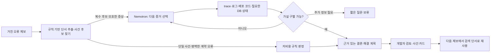

# TraceBridge 최종 설계: 증거를 찾아 반증하는 사건 조사 에이전트

> 과거 기록입니다. 당시 계획·검사·제약을 보존하며, 현재 상태는 [구현 상태](../../current-state.md)를 기준으로 확인하세요.

작성: 2026-09-28. 이 문서는 당시의 단일 사건 조사 중심 설계다. **제품 전체의 최신 목표·권한·자동화·라우팅은 [docs/README.md](../../README.md)와 연결된 문서를 우선한다.** 아래 `목표`는 현재 구현 완료를 뜻하지 않는다. 현재 동작 범위는 [README.md](../../../README.md)를 따른다.

## 1. 결정

**제품 한 문장:** 프론트엔드 개발자나 PM이 거친 문장으로 오류를 제보하면, TraceBridge가 해당 요청을 식별하고 로그·계약·배포 코드·필요한 DB 상태를 좁혀 조회한다. 여러 원인 후보 중 무엇이 맞는지 확인·반증한 뒤, 해결/검증 계획과 짧은 사건 기록을 백엔드 개발자에게 전달한다. 재현 가능한 결함에서만 격리된 수정안 생성으로 확장한다.

**차별점:** 답변을 잘 쓰는 모델이 아니라, 제보자가 자료를 찾아 붙여넣지 않아도 사건을 자동으로 특정하고, 조사 결정의 근거를 남기며, 검토한 과거 사건을 다음 조사의 검색 단서로 재사용하는 업무 흐름이다. 같은 로그·코드 접근 권한을 가진 코딩 에이전트와 비교해서 시간·정확도 이점이 확인되지 않으면 독립 서비스로서의 가치가 입증되지 않은 것이다.

**범위:** 첫 시연은 승인된 서비스 1개, 관측 가능한 오류 유형 2개(잘못된 제보/요청과 실제 백엔드 결함), 모호해서 보류해야 하는 사례 1개다. 전체 API·취약점 스캔, 범용 자동 수정, 운영 DB 변경은 별도 후속 과제다.

## 2. 에이전트가 맡는 판단과 파이프라인이 맡는 판단

사건 후보 찾기와 입력 오류 판정은 에이전트만 할 수 있는 작업이 **아니다**. 요청 ID 일치, HTTP 상태 비교, OpenAPI 필수 필드 확인, 과거 사건의 오류 코드 검색은 규칙 코드가 더 빠르고 일관되며 모델 토큰도 쓰지 않는다. 에이전트는 **확인해야 할 대상과 다음 조회가 사건마다 달라지는 부분**을 맡는다.

| 상황 | 실행 주체 | 이유 |
| --- | --- | --- |
| 요청 ID·서비스·시간으로 사건 후보 검색 | 인덱스/규칙 | 정확 일치와 범위 조회에 모델이 필요 없음 |
| 422 응답, 누락 필드, 계약 일치 여부 | 규칙 검사기 | 관측값과 명세를 기계적으로 대조 가능. 4xx라고 무조건 사용자 실수로 결론 내리지 않음 |
| 제보가 모호하고 후보가 여러 서비스·요청에 걸침 | Nemotron 조사 에이전트 | 후보를 구별할 추가 증거 또는 제보자에게 물을 최소 질문을 선택 |
| 500 로그에서 코드·배포·DB 원인 후보가 갈림 | Nemotron 조사 에이전트 | 각 가설을 반박할 조회를 선택하고 새 결과에 따라 조사 계획을 수정 |
| 원인 확정·수정 검증 상태 | 규칙/실행 결과 | 인용 근거가 실제 존재하는지, 재현 검사가 수정 전 실패·수정 후 통과하는지 프로그램이 검증 |
| 짧은 사건 카드·유사 사례 검색 | 템플릿 + 인덱스 | 승인된 사실만 저장. 과거 원인은 새 사건의 증거로 자동 승격하지 않음 |

**에이전트성의 기준:** 첫 가설을 말하는 데서 끝나지 않는다. `가설 → 이를 구별할 다음 관측 선택 → 읽기 전용 도구 실행 → 지지/반박 갱신 → 충분하면 결론, 부족하면 질문 또는 보류`를 최소 한 사례에서 실제로 수행한다. 도구 조회 결과가 달라지면 다음 행동도 달라져야 한다.

## 3. 사용자 경험과 실행 흐름

1. **제보:** 자연어 한 문장이 필수다. 가능하면 프론트 화면 또는 API 응답 헤더에서 최근 실패 요청의 `request_id`, 시각, 환경, 메서드, 경로, HTTP 상태, 프론트 빌드 버전을 자동 첨부한다. 본문·토큰·개인정보는 기본 첨부 대상이 아니다. 자동 첨부가 없다면 제보에서 단서를 추출해 후보를 찾되, 식별에 필요한 정보가 없으면 질문한다.
2. **사건 후보:** 요청 ID 정확 일치가 최우선이다. 없으면 환경·시각 범위·메서드/경로·오류 문자열로 조회한다. 후보 0개는 `사건 미식별`, 2개 이상은 후보 목록과 구별 질문, 1개면 선택한다. 비슷한 로그 문구만으로 같은 요청이라 하지 않는다.
3. **기본 대조:** 제보의 HTTP 상태·API 작업명·경로·원인 추측을 항목별로 분리한다. 실제 trace/응답과 모순되면 먼저 정정한다. 400/401/403/422도 각각 계약·인증·권한·입력 검증과 대조하기 전에는 `사용자 실수`라고 부르지 않는다.
4. **적응형 조사:** 원인 가설은 최대 3개로 제한하고 각 가설에 지지 근거, 반대 근거, 아직 필요한 증거를 붙인다. 다음 조회는 한 가설을 확인하는 동시에 대안을 배제할 수 있는 것을 우선한다. 예: 500과 `no column named phone` 로그를 확인했다면 관련 배포 SHA와 적용 마이그레이션 버전을 조회한다. DB 상태가 일치하면 마이그레이션 가설을 폐기하고 다른 원인을 찾는다.
5. **종료:** `관측된 결함`, `계약/입력 사용 불일치`, `기대된 응답`, `제보와 관측 불일치`, `사건 미식별`, `원인 미확정`을 구분한다. 결과에는 다음 조치와 그 조치가 왜 필요한지 쓴다. 증거가 부족한데도 수정을 제안하는 성공 화면을 만들지 않는다.
6. **검토와 재사용:** 백엔드 개발자가 근거·결론·조치를 승인/반려한다. 승인된 사실과 미확정 사항을 짧은 사건 카드로 저장한다. 후속 제보에서 유사 카드를 찾아 첫 조회를 좁히되 이번 요청의 로그·배포 버전을 다시 확인한다.

## 4. 증거 도구와 권한 경계

에이전트가 호출할 도구는 사건 ID와 프로젝트 설정에 묶인 읽기 전용 인터페이스로 제공한다.

| 도구 | 반환값 | 제약 |
| --- | --- | --- |
| `find_events` / `get_event` | 후보 요청, 실제 응답, trace/request ID | 프로젝트·환경·시간 범위 필수; 반환 상한 |
| `get_related_logs` | 해당 ID의 오류·스택 일부 | 원본 로그 보관 시스템의 참조와 비식별화한 제한된 줄만 반환 |
| `get_deployment` | 실행된 서비스 버전·커밋 | 로컬 HEAD와 배포 SHA를 혼동하지 않음 |
| `get_contract` | 해당 엔드포인트 OpenAPI/DTO | 범위 밖 API는 반환하지 않음 |
| `search_code` / `read_file` | 배포 커밋의 관련 코드 위치 | 선택된 저장소·허용 소스 경로·파일 길이 제한 |
| `get_db_state` | 스키마·마이그레이션·등록된 진단 조회 | 읽기 전용 계정, 매개변수화한 허용 쿼리, 결과 행/컬럼 제한. 임의 SQL 금지 |
| `get_prior_incidents` | 과거 카드 최대 3개 | 과거 결론은 조사 단서로만 표시 |

사용자 제보·로그·코드의 문자열은 모두 **데이터**이며 도구 권한을 바꾸는 지시가 아니다. 도구 인자, 증거 ID, 파일 경로, 출력 길이를 프로그램이 검증한다. 외부 NIM으로 보내는 것은 프로젝트에서 전송을 허용한 비식별화 자료의 제한된 발췌본뿐이다. 허가되지 않은 실제 코드·로그는 로컬에서만 조회하고 외부 모델에 전달하지 않는다. 실제 코드를 실행하는 후속 단계는 격리 작업 공간과 허용된 테스트 명령만 사용한다. 운영 DB 쓰기·운영 API 능동 스캔은 이 경로에 없다.

## 5. 사건 기억: RAG보다 먼저 필요한 것

기본 저장소는 SQLite다. `incidents`, `evidence_refs`, `decisions`, `review_feedback`을 저장하고 짧은 요약에 FTS5 전문 검색을 붙인다. 사람이 읽고 수정하기 좋은 Markdown 내보내기도 제공한다. 벡터 DB와 그래프 DB는 초기 구현에 필요하지 않다. 표현 차이 때문에 FTS 검색 누락이 실제로 관측될 때 임베딩 검색을 평가한다.

사건 카드는 `project/service/environment`, `route`, `observed_status`, `error_code`, `정규화한 예외/스택 지문`, `deployed_sha`, `증상 한 줄`, `확인된 원인과 미확정 사항`, `근거 참조`, `조치·수정 커밋`, `검증 결과`, `검토 상태`로 구성한다. 원본 로그·개인정보를 카드에 복사하지 않는다. 새로운 사건에서는 정확 단서와 FTS로 과거 카드를 찾고, 코드/배포 버전이 달라졌다면 검색 순위를 낮춘다. **이전 해결법을 이번 사건의 결론으로 복사하지 않는 테스트**를 반드시 포함한다.

## 6. 토큰 비용 설계와 검증

**토큰 절감은 보장되지 않는다.** 후보 찾기와 4xx 대조를 모두 모델에 시키면 토큰 낭비다. 반대로 에이전트가 로그·코드 전체를 프롬프트에 넣지 않고 필요한 일부만 조회하면 입력 토큰을 줄일 수 있다. 모호한 사건에서는 추가 모델 호출이 들어가므로 총 토큰은 늘 수 있지만 잘못된 수정과 사람의 조사 시간을 줄일 수 있다. 따라서 비용은 토큰뿐 아니라 성공률·조사 시간과 함께 판단한다.

초기 예산은 **사건별** `모델 호출 최대 3회(제보 해석 필요 시 1, 조사 최대 2)`, `읽기 도구 최대 8회`, `가설 최대 3개`, `모델에 제공하는 로그 최대 20줄·코드 조각 최대 6개·과거 카드 최대 2개`로 한다. 명백한 요청 ID+계약 불일치의 빠른 경로는 모델 호출 없이 끝낼 수 있다. 한도에 닿으면 `원인 미확정`과 확인한 범위를 반환한다. 실제 지연·실패율을 보고 예산을 조정한다.

비교는 같은 사건과 같은 자료 접근 권한으로 수행한다: (A) 현재처럼 사람이 코딩 AI에 제보·자료를 전달, (B) 규칙 파이프라인만, (C) TraceBridge 적응형 조사. 각 경우의 `입력/출력 토큰`, `모델/도구 호출 수`, `소요 시간`, `정확한 사건 식별`, `잘못된 원인 확정`, `추가 질문 수`, `개발자가 수용한 조치`를 기록한다. 메모리 유무 비교에서는 첫 사건과 **다른 request ID**를 가진 유사 사건을 사용한다.

## 7. NVIDIA 기술과 이미지의 대회 조건

사용자가 제공한 `Creative Use-Case` 이미지에는 `NeMo Framework 또는 NeMo Microservices 활용`과 `재현 가능한 코드·작동하는 데모`가 전체 조건으로 적혀 있다. 공개 [패스트캠퍼스 안내](https://fastcampus.co.kr/NVIDIA_hackathon)는 에이전트의 목표·계획·도구 호출을 강조하지만, 이미지의 세부 조건이 온라인 예선에 적용되는지는 텍스트에서 확인되지 않는다. 다음 표는 **목표 설계**이며 현재 충족 상태가 아니다.

| 구성 | 제품에서 맡는 역할 | 완료 증거 |
| --- | --- | --- |
| Nemotron on NVIDIA NIM | 모호한 사건의 가설·반증 조회 선택 | 실프로젝트 자료에서 모델이 선택한 도구·결과·토큰 기록 |
| NeMo Agent Toolkit | 사건 조사 도구를 묶고 반복 조회 실행 | 현재 합성 전용 `nat_workflow.yml`을 실사건 흐름으로 연결한 실행 기록 |
| **NeMo Evaluator Microservice** | 재생 사건의 도구 선택·원인 판정·보류 품질을 평가해 에이전트 변경을 검증 | 실제 Microservice 평가 job ID, 입력 세트, 결과. Agent Toolkit의 `nat eval`만 실행한 것은 대체 증거가 아님 |
| Skill + SkillSpector | 저장소별 조사 규칙과 정적 검사 | 현재 스킬·스캔 보고서 유지, 변경 후 재검사 |
| OpenShell | 코드 재현·수정 검증을 확장할 때 격리 실행 | 실제 실행 환경과 적용 정책을 보여줄 수 있을 때만 사용 기술로 기재 |

[NVIDIA NeMo 문서](https://docs.nvidia.com/nemo/)는 NeMo Agent Toolkit과 NeMo Framework/Microservices를 별도로 분류한다. 이 제품에는 모델 학습용 Framework보다 평가용 Microservice가 자연스럽다. [NeMo Evaluator의 Agentic 평가 흐름](https://docs.nvidia.com/nemo/microservices/25.10.0/evaluate/flows/agentic.html)은 도구 호출 정확도와 목표 달성을 평가할 수 있지만, 사용자 데이터셋을 쓰려면 Data Store·Entity Store·평가 대상 설정이 필요하다. **실제 평가 서비스를 실행할 수 있는지 먼저 확인한다.** 불가능하면 현재 구현은 이미지의 기술 조건을 충족했다고 표시하지 않는다. NeMo Retriever를 카드 검색에 추가하는 대안은 있으나 RAG만 붙여 에이전트 기능을 대신하지 않는다.

작동 데모의 완료 조건은 `설치/설정 → 한 명령 또는 UI에서 사건 재생 → 실제 Nemotron/NAT 도구 선택 확인 → 다른 증거에 따라 다른 종료 결과 → 사건 카드·검토 화면 → Microservice 평가 결과`가 재현되는 것이다. 외부 서비스 지연 시 오프라인 재생은 표시할 수 있지만 라이브 NVIDIA 호출 성공의 증거로 쓰지 않는다.

## 8. 이 저장소에서 구현할 순서

| 단계 | 수정·추가 위치 | 통과 기준 |
| --- | --- | --- |
| 0. 기술·사건 게이트 | 프로젝트 설정과 테스트 자료 | 허가된 저장소의 재생 가능한 사건 1건, 반례 1건, NeMo Evaluator 실제 접속/실행 가능성을 확인. 둘 중 하나라도 없으면 목표 범위를 낮춰 설명 |
| 1. 사건 후보 | `tracebridge/evidence.py` 확장, `incident_matcher.py` 추가 | 요청 ID 정확 일치, 후보 0/1/복수에서 올바른 종료. 입력에 ID가 없어도 후보를 좁힐 수 있음 |
| 2. 규칙 빠른 경로 | `claims.py`, `triage.py` 재사용 | 422 계약 오류/잘못된 500 제보를 모델 없이 처리하고 근거 없는 백엔드 패치를 금지 |
| 3. 조사 루프 | `agent.py`와 `nat_plugin.py`의 실제 프로젝트 어댑터, 새 NAT 설정 | 로그/배포/코드/DB 중 다음 조회가 결과에 따라 바뀌고, 가설 반증·보류가 작동 |
| 4. 사건 카드 | `incident_store.py`, `incident_memory.py`, Streamlit 제보/검토 페이지 | 개발자가 검토한 카드 저장, 새 요청에서 유사 카드 검색 후 현재 증거 재확인 |
| 5. 평가 | 재생 사례와 NeMo Evaluator 연결 | 실제 Microservice 평가 결과와 도구·토큰·시간 지표 표시 |
| 6. 수정 확장 | 격리 저장소·허용 검사 러너 | 수정 전 관련 실패/수정 후 같은 검사 통과가 입증된 경우에만 검토 가능한 diff 제공 |

**대회 시연의 우선순위는 0→1→2→3→4→5다.** 6은 작동과 검증을 끝낸 경우에만 보여준다. 전체 보안 검사나 범용 스택 인식은 이번 흐름에서 제외한다. 기존 합성 데모는 회귀 시험으로 남기고, 실사건 성능의 증거로 계산하지 않는다.

## 9. 최소 평가 세트와 정직한 종료 조건

1. **잘못된 제보:** “회원가입 500”이라 했지만 같은 요청의 실제 응답은 422이고 계약 필드가 잘못됐다. 결과는 제보 모순/요청 계약 문제이며 백엔드 수정안은 없어야 한다.
2. **진짜 500:** 같은 ID의 DB 오류 로그와 배포 버전·마이그레이션 상태를 차례로 확인한다. DB 상태가 일치하는 변형에서는 처음 가설을 폐기해야 한다.
3. **사건 모호:** 같은 시간대에 후보 요청 두 개가 있다. 임의로 하나를 확정하지 않고 필요한 정보를 묻는다.
4. **유사 사건:** 과거 카드가 검색돼도 이번 배포 버전/로그가 다르면 옛 원인을 확정하지 않는다.
5. **모델 실패:** 시간 초과·잘못된 도구 인자·가짜 근거 ID에서도 확인된 사실만 표시하고 보류한다.

이 다섯 사례에서 **같은 입력이 다른 증거를 만나면 조사 경로와 결과가 실제로 바뀌는지**가 에이전트 데모의 핵심 검증이다. 모든 사례를 성공적인 자동 수정으로 끝내려 하지 않는다. 현재 구현은 이 설계의 일부인 합성 판정·읽기 전용 검색만 수행하며, NeMo Microservice 연결·실사건 자동 상관·사건 기억·실프로젝트 수정은 아직 구현되지 않았다.
