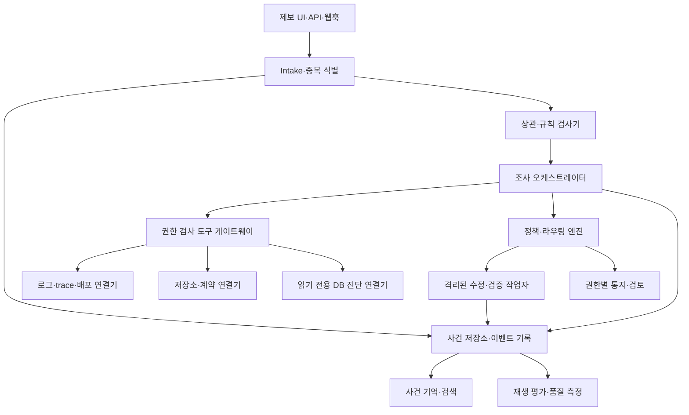

# 시스템 구조와 에이전트 실행 계약

> 목표 설계와 계약입니다. 현재 구현 완료 여부는 [구현 상태](../current-state.md)에서 확인하세요.

첫 배포의 실제 배치는 [클라우드·로컬 운영 개선안](cloud-local-operations.md)을 따른다. 아래 조사 오케스트레이터는 로컬 실행기에 두고, 서버는 사건·작업·기억·NVIDIA 모델/OCR 호출을 관리한다. 구성 요소의 논리적 책임과 실행 위치를 구분한다.

## 논리 구성

처음에는 Python 백엔드와 SQLite·로컬 실행으로 구현할 수 있다. UI는 현재 Streamlit에서 시작해도 되지만 다중 사용자 서비스에서는 인증·권한·비동기 작업·웹훅을 갖춘 API와 별도 UI가 필요하다. 이 그림의 구성 요소는 **논리적 책임**이며 처음부터 각각 독립 마이크로서비스로 배포할 필요는 없다.

## 외부 계약과 비동기 처리

초기 API 계약은 `POST /projects/{project_id}/reports`(제보), `GET /reports/{report_id}`(제보자 상태), `GET /incidents/{incident_id}`(권한별 사건), `POST /incidents/{id}/feedback`(검토), `POST /integrations/events`(관측·CI·알림), `PUT /projects/{id}/policy`(관리자 설정)으로 정의한다. 실제 URL과 인증 방식은 구현 단계에서 확정한다. `POST`는 빠르게 접수 ID를 돌려주고 긴 조사·수정은 작업 큐에서 진행한다. 클라이언트 재시도에는 idempotency key를 적용하고, 같은 외부 알림의 재전송이 중복 사건을 만들지 않게 한다.

각 조직/프로젝트의 연결기 자격 증명은 분리한다. 프로젝트 ID는 모든 도구 호출·저장 레코드·검색 쿼리에 포함되고 서버에서 검증된다. 외부 제보자는 내부 도구를 직접 호출할 수 없다. 공유 인프라의 테넌트 격리는 이후 [권한과 자동화 정책](policy-security.md)의 검사로 증명한다.

## 빠른 경로와 에이전트 경로

현재 로컬 구현은 [report_contract.py](../../tracebridge/report_contract.py)의 입력/결과를 [report_intake.py](../../tracebridge/report_intake.py)와 [report_agent.py](../../tracebridge/report_agent.py)가 공유한다. `triage.analyze/route_verdict`가 공통 판정·라우팅을 수행하고 등록 파일/선택 Docker는 조회 전에 범위를 검사한다. [incident_memory.py](../../tracebridge/incident_memory.py)가 사건·실행·카드와 FTS5로 최소 기록/검토/검색을 연결하며 4단계에서 최소 `change_jobs` 테이블 1개를 추가했다. 현재 소스를 읽은 뒤 최대 2개 과거 카드를 별도 단서로 제공하고 기존 근거·도구·라우팅 경계를 유지한다. 검색/저장 실패는 조사 결과와 별도로 표시하며 저장만 재시도한다. 내부용 CLI 재시작 답변은 자료 연결 해시와 답변 한도를 검사한다. [작은 A2 작업자](../../tracebridge/change_worker.py)는 등록된 씨드 1개의 검증된 키 리터럴 변경만 별도 사본에서 실행한다. 새 서버·작업 큐·다중 조직 인증·범용 수정 작업자는 없다. [4단계 보장 범위](../archive/stages/stage-4-change.md), [3단계 기록](../archive/stages/stage-3-memory.md), [2단계 실자료 게이트](../archive/stages/stage-2-integration.md)를 구분한다.

1. `Intake`가 크기·형식·중복·남용을 검사하고 원문을 보존한다.
2. `Correlator`가 ID 정확 일치, 시간/환경/경로 제한 검색, 기존 사건과의 중복을 처리한다. 명시된 HTTP 사실과 계약의 단순 비교는 규칙 코드가 수행한다.
3. 증거가 모순되거나 후보가 여럿이면 조사 오케스트레이터가 Nemotron에게 **가설과 다음 구별 조회**를 요청한다. 모델 출력은 스키마와 도구 허용 목록으로 검증한다.
4. 도구 게이트웨이는 사건·프로젝트·역할·시간 범위·반환량을 검사해 실제 연결기를 호출한다. 모델은 URL, 임의 SQL, 임의 쉘 명령, 자격 증명을 생성해 실행시킬 수 없다.
5. 새 근거가 오면 가설의 지지/반박 상태를 갱신한다. 충분한 근거, 최소 질문 필요, 예산/시간 소진, 또는 접근 거절 중 하나가 종료 조건이다. 모델 답변은 검증된 사실과 분리해 저장한다.
6. 정책 엔진이 중요도, 책임자, 허용 가능한 조치 수준을 결정한다. 작업자 실행은 이 결정을 따른다.

호출 예산은 프로젝트별 설정이다. 초기 목표는 단순 경로에서 LLM 0회, 적응형 조사에서 최대 4회·읽기 도구 최대 6회, 로그 20줄·코드 조각 6개·과거 카드 2개만 모델에 제공하는 것이다. 현재 [자연어·사진 조사](../archive/stages/multimodal-intake.md)의 4회 한도에는 사진 시각 해석이 포함되며 OCR 서비스는 사진당 한 번 호출한다. 이는 품질 보장이 아니라 비용·지연 상한이며 [평가](evaluation-operations.md) 결과로 조정한다. 모델 시간 초과는 원인 미확정으로 종료하고 확인된 관측과 실패 상태를 남긴다.

## 연결기 계약

모든 연결기는 `project_id`, `incident_id`, `scope`, `requested_at`, `actor`를 받고 출처·수집 시각·민감도·환경·서비스·버전이 붙은 증거를 반환한다. 초기 인터페이스는 `find_events`, `get_event`, `get_related_logs`, `get_deployment`, `get_contract`, `search_code`, `read_code`, `get_db_state`다. 운영 도구별 어댑터를 추가하더라도 사건 모델과 정책 검사 결과는 같다.

- **관측:** 요청 ID/trace ID가 있으면 정확 상관. 없으면 제한된 시간·환경·경로 검색과 후보 목록. OpenTelemetry의 [로그·trace 상관](https://opentelemetry.io/docs/specs/otel/logs/)을 권장하지만 특정 공급자에 종속되지 않는다.
- **저장소:** 로컬 HEAD와 실제 배포 커밋을 구분한다. 배포 커밋을 모르면 코드 검색 결과를 실행 원인의 확정 근거로 사용하지 않는다. 파일 경로·크기·비밀 파일 제한을 적용한다.
- **DB:** 기본은 스키마·마이그레이션 상태. 데이터 행은 등록된 매개변수화 진단 조회에 한해 읽고 행/컬럼/시간을 제한한다. 운영 DB 변경 명령은 도구 목록에 없다.
- **유사 사건:** 프로젝트 범위의 사건 카드에 정확 필드와 전문 검색을 먼저 적용한다. 오래된 카드의 원인을 새 사건에 자동 복사하지 않는다.

## 수정·검증·배포의 분리

조사 오케스트레이터는 원본 프로젝트를 수정하지 않는다. `RemediationWorker`는 승인된 저장소·기준 커밋으로 격리 작업 공간을 만들고 허용된 경로만 편집한다. 검사 명령은 프로젝트 설정의 ID로 선택하고, 모델이 쉘 문자열을 만들지 않는다. 수정 전 동일 증상이 실패하고 수정 후 동일 검사와 회귀 검사가 통과해야 검증된 후보가 된다. 배포 작업자는 별도 자격 증명과 정책을 가진다. 자동 배포가 허용된 프로젝트에서는 CI/배포 상태와 배포 후 텔레메트리를 확인하며 실패 시 복구 정책을 실행한다.

[NVIDIA OpenShell의 파일·네트워크 정책](https://docs.nvidia.com/openshell/reference/policy-schema)은 격리 실행의 후보지만, 현재 데모에 연결되어 있지 않다. 실제 연결 전에는 임의 프로젝트 코드 실행을 구현 완료로 표시하지 않는다.

## 장애·비용·확장

모델·로그 플랫폼·DB·SCM·CI·통지 채널은 각각 실패할 수 있다. 도구 실패는 사건 이벤트에 남기고, 중요한 근거가 빠지면 판정을 보류한다. 조회 재시도는 시간·호출량 상한과 idempotency를 갖는다. 알림 실패는 사건 판정과 분리해 재전송하며 중복 알림 키를 사용한다. 프로젝트별 조회량·토큰·실행 시간·동시 작업 수를 제한한다. 사건 상태와 외부 작업의 결과를 별도 기록해 재시작 후 이어서 처리하거나 안전하게 중단한다.
