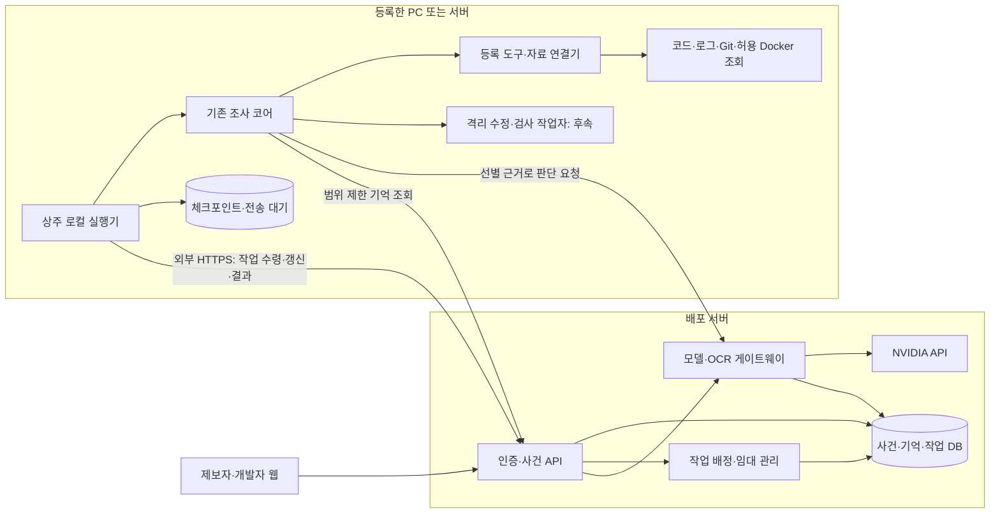

# 배포 웹과 로컬 조사 실행기의 운영 설계

2026-09-29. 현재 소스를 확인해 작성한 **개선안**이다. 아래 API, 명령, 설정 v2와 새 모듈은 구현 예정 계약이며 현재 실행 가능한 기능이 아니다. 현재 사실은 [구현 상태](../current-state.md), 기존 사용법은 [연결 가이드](../guides/cloud-and-local.md)를 따른다.

후속 작업에서 소유자 전용 control API·PC 실행기·서버 모델/기억 연결·서비스별 등록·일반 후보 검사와 검토 후 적용을 구현했다. 이 문서의 전체 계획·API URL·프로필 v2와 같은 계약이 모두 구현된 것은 아니다. 실행 가능한 현재 기능은 [실제 운영 사용법](../guides/real-projects.md), 수행 증거는 [GUI 최종 검증](../validation/local-gui-final.md)과 [운영 연결 검증](../validation/real-project-operations.md)을 따른다.

## 1. 결정과 첫 운영 범위

**서버는 사건·작업·권한·기억·AI 호출을 관리하고, 로컬 실행기는 기존 조사 흐름과 프로젝트 접근을 실행한다.** 조사 오케스트레이션은 첫 버전에서 로컬에 둔다. 서버가 매번 도구를 선택하는 원격 도구 RPC는 이후 선택지다.

첫 목표는 로그인한 프로젝트 소유자가 한 PC에 프론트·백엔드·로그 경로를 연결하고, 배포 웹의 제보를 실제 서비스 관측과 연결해 결과와 후속 질문을 받는 것이다. 그다음 실제 프로젝트의 격리된 수정 후보와 등록 검사를 연결한다. 운영 서버의 관측을 조사하려면 해당 관측에 접근 가능한 실행기를 별도로 등록해야 한다.

| 결정 | 이유와 범위 |
| --- | --- |
| 기존 Python 조사 코어 재사용 | 규칙 판정·근거 검사·가설 재검토를 다시 구현하지 않는다. 외부 의존성 경계를 먼저 분리한다. |
| 서버가 작업 단위로 전달 | `investigate`, `follow_up`, 이후 `prepare_change`를 전달한다. 조사 중 조회 선택은 로컬 코어가 수행한다. |
| 로컬에서 외부 HTTPS 연결 | 개발 PC에 공개 수신 포트를 열지 않는다. 처음에는 제한 시간 폴링으로 충분하다. |
| 웹에는 논리 ID와 연결 상태 | 실제 경로·로컬 명령·Docker 접속 정보·환경 자격 증명은 로컬 등록부에 둔다. |
| 사건의 기준 기록은 서버 | 로컬 SQLite는 실행 체크포인트와 전송 대기 기록이다. 양쪽에서 같은 카드를 독립적으로 검토하지 않는다. |
| 첫 운영은 인증된 내부 시범 | 단일 소유자여도 사용자 인증, 프로젝트 인가, 실행기 폐기, 자료 전송 정책은 처음부터 넣는다. |
| 배포·복구는 후속 단계 | 후보 검사 통과와 원본 적용·배포·서비스 회복 상태를 분리한다. |

[기존 시스템 구조](architecture.md)는 논리적 책임을 설명한다. 이 문서는 그 책임의 실제 배치와 구현 순서를 정하며, 기존 연결 가이드의 서버 조사 루프 우선 순서를 대체한다.

## 2. 현재 코드에서 확인한 간격

| 현재 구현 | 실제 운영에서 생기는 문제 | 변경 방향 |
| --- | --- | --- |
| [웹 페이지](../../pages/2_Report_Agent.py)가 `investigate_submission()`과 수정 작업자를 직접 호출 | 클라우드 프로세스에서 개발자 PC를 읽을 수 없고, 페이지 재실행과 긴 작업의 수명이 섞인다. | 페이지는 접수·조회 API만 호출한다. 조사는 상주 실행기의 작업 프로세스에서 실행한다. |
| [report_agent.py](../../tracebridge/report_agent.py)의 한 함수에 접수·로컬 조회·NVIDIA/OCR·기억 조회·저장 결합 | 로컬에 키가 필요하고, 서버의 기록/비용 관리와 작업 복구를 끼워 넣기 어렵다. | 조사 엔진에 모델·사진 처리·기억·저장·진행 이벤트 인터페이스를 주입한다. |
| `ProjectTools`와 여러 저장소 등록 | 실제 다중 경로 조회는 재사용 가능하다. 그러나 프로필의 대표 `service/environment`, 계약·버전 설정은 단일 관측 범위에 가깝다. | 프로젝트 아래 서비스별 로그·계약·버전과 환경별 실행기 연결을 추가한다. |
| [project_profile.py](../../tracebridge/project_profile.py)의 JSON 로그 필터 | 프로필의 service와 다른 명시적 service를 제외한다. 한 등록으로 프론트와 백엔드 로그를 모두 조사하는 구조가 아니다. | 로그 출처마다 service/environment를 선언하고, 조사 대상 서비스 집합 안에서 각각 조회한다. |
| 메시지 시각을 조사 함수 시작 시 새로 생성 | PC가 늦게 작업을 받으면 “방금/어제”가 웹 접수 시각과 달라진다. 최근 로그 조회도 사건 시점에서 벗어날 수 있다. | 서버의 각 메시지 접수 시각·시간대와 사건 조회 구간을 고정 입력으로 전달한다. |
| [incident_memory.py](../../tracebridge/incident_memory.py)의 최소 SQLite 기록 | 근거 내용과 원문을 대부분 생략하고 종료 결과를 저장한다. 실행 중 모델 대화·도구 결과를 복원하는 체크포인트가 아니다. | 완료 기록과 재개용 체크포인트를 별도 모델로 만든다. 원문·첨부의 보관 정책도 별도로 정한다. |
| `source_binding` 해시로 후속 답변의 자료 연결 검사 | 다른 PC·경로로 옮기면 같은 사건을 이어가기 어렵다. 반대로 서비스 배포 버전 변화는 경로 해시만으로 설명할 수 없다. | 공개 `binding_id/revision`과 로컬 등록 해시를 구분하고, 재연결·소스 변경을 사건 이벤트로 남긴다. |
| [report_service.py](../../tracebridge/report_service.py)와 [change_policy.py](../../tracebridge/change_policy.py)의 씨드 한정 정책 | 일반 프로젝트는 경로를 등록해도 수정 작업자가 허용되지 않는다. 검사는 가입 씨드의 고정 Python argv다. | 씨드 규칙은 보존하고 별도의 일반 프로젝트 작업자·명령 등록·격리 실행 계약을 추가한다. |
| 환경 변수와 Agolive 기본값, 고정 소스 확장자 | 여러 프로젝트를 한 프로세스에서 실행할 때 설정이 섞이거나 JS/Vue 등 소스가 검색에서 빠질 수 있다. | 작업별 설정 객체를 사용한다. 서비스 별칭·검색 루트·확장자·제외 경로를 로컬 프로필에 둔다. |

기존 사건 연결·충돌 보류·근거 ID 검증·과거 카드 재확인·저장만 재시도하는 규칙은 유지한다. 설계 당시의 515개 로컬 검사 기록은 원격 연결·실서비스 수정 성공의 증거가 아니다. 후속 원격·GUI 검증은 위 실행 기록에서 별도로 확인한다.

## 3. 배치 구조



처음에는 서버 API 하나, 소형 작업 관리 프로세스 하나, DB 하나와 PC 실행기 하나로 배포한다. 서버에 프로젝트 코드를 체크아웃하거나 GPU를 설치할 필요는 없다. 공개 서비스에는 Python ASGI API를 추가하고, 기존 Streamlit은 API를 사용하는 시범 UI로 유지할 수 있다. 별도 UI로 바꾸는 작업이 원격 조사 구현의 선행 조건은 아니다.

시범 배포는 HTTPS 진입점 뒤에 웹/API를 두고, DB/첨부의 영속 저장과 백업, 서버 secret, 작업 만료·사진 처리 프로세스를 연결하는 구성이다. 웹/API가 재시작돼도 PC 작업과 기록이 살아 있어야 한다. 로그인은 검증된 인증 제공자/OIDC 또는 호스팅의 인증 기능에 연결하고, 사용자 세션을 프로젝트 membership과 대조한다. Streamlit을 유지해도 서버 API에 전역 관리자 토큰을 공유하지 않고 사용자별 인증 주체를 전달한다. 쿠키 세션에는 HTTPS·HttpOnly·SameSite와 변경 요청의 CSRF 검사를 적용한다.

단일 서버·영속 로컬 디스크·작은 내부 시범은 SQLite 어댑터로 시작할 수 있다. 일회성 파일시스템의 호스팅이나 여러 서버 인스턴스를 쓴다면 서버 DB는 PostgreSQL로 시작한다. API와 실행기가 하나의 SQLite 파일을 네트워크로 공유하지 않는다. SQLite WAL은 같은 호스트의 프로세스가 전제다. [SQLite 공식 제약](https://www.sqlite.org/wal.html)

작업 큐는 DB 테이블과 원자적 임대 처리로 구현한다. 메시지 브로커·벡터 DB·마이크로서비스 분리는 첫 운영의 필수 구성에 포함하지 않는다.

## 4. 프로젝트 등록을 운영 연결 정보로 확장

### 4.1 공개 정보와 로컬 정보

| 객체 | 저장 위치 | 핵심 정보 |
| --- | --- | --- |
| `Project` | 서버 | 조직/소유자, 프로젝트 ID, 이름, 사용자 역할, 보관·AI 전송 정책 |
| `Runner` | 서버 | 실행기 ID, 소유자, 토큰 폐기 상태, 버전, 마지막 연결, 지원 기능 |
| `TargetBinding` | 서버 | 프로젝트+환경+실행기, 연결 ID/버전, 서비스/저장소 ID, 허용 기능과 정책 해시 |
| `LocalProjectRegistration` | 로컬 | 연결 ID와 대응하는 실제 저장소·로그 경로, 서비스별 계약·버전 출처 |
| `LocalExecutionPolicy` | 로컬 | 편집 경로, 검사 ID→고정 argv, 실행 이미지/도구, 자원·네트워크 제한 |

서버에 등록 경로 JSON 전체를 업로드하지 않는다. 실행기가 공개 manifest를 별도로 만들고 허용 필드만 전송한다. 웹은 `repository_id=frontend`를 사용하고 로컬 등록부가 경로를 해석한다. 웹에서 `C:/...`, Docker 인자, 검사 셸 문자열을 받지 않는다.

환경마다 연결을 나눈다. 같은 프로젝트의 `dev`와 `prod`는 다른 binding이고, 같은 저장소가 여러 서비스에 사용되어도 서비스별 실제 실행 버전을 보존한다. PC의 dev 로그를 운영 사건 근거로 대체하지 않는다. 첫 버전은 binding마다 실행기 하나를 명시적으로 선택한다.

### 4.2 로컬 프로필 v2 예시

아래는 **제안 스키마**다. 기존 `load_project_profile()`에 그대로 넣을 수 없다. v1은 단일 서비스 binding으로 변환하는 어댑터를 제공한다.

```json
{
  "schema_version": 2,
  "project_id": "prj_shop",
  "binding_id": "bind_shop_dev_pc1",
  "environment": "dev",
  "repositories": [
    {"id": "frontend", "root": "C:/work/shop-web", "code_roots": ["src"]},
    {"id": "backend", "root": "D:/work/shop-api", "code_roots": ["app"]},
    {"id": "logs", "root": "D:/service-logs/shop", "code_roots": []}
  ],
  "services": [
    {"id": "web", "repository_ids": ["frontend"], "log_source_ids": ["web-console"]},
    {"id": "api", "repository_ids": ["backend"], "log_source_ids": ["api-requests"],
      "openapi_ref": {"repository": "backend", "path": "openapi.json"},
      "version_source_id": "api-runtime"}
  ],
  "log_sources": [
    {"id": "web-console", "service": "web", "repository": "logs", "path": "web.jsonl", "format": "jsonl", "timezone": "+09:00"},
    {"id": "api-requests", "service": "api", "repository": "logs", "path": "api.jsonl", "format": "jsonl", "timezone": "+09:00"}
  ],
  "version_sources": [
    {"id": "api-runtime", "service": "api", "method": "log_field", "field": "git_sha"}
  ],
  "capabilities": ["read_code", "read_logs", "read_contract", "read_version"],
  "local_policy_id": "readonly-v1"
}
```

출처 등록의 service/environment는 조회 범위다. 내용에 명시된 다른 scope와 충돌하면 근거를 기각한다. 등록값을 관측된 service/environment로 자동 승격하지 않는다. 서비스 간 상관은 동일 trace 또는 등록된 부모/자식 요청 관계로 확인하고, 비슷한 시각만으로 같은 요청이라고 확정하지 않는다.

`doctor`는 경로 접근, 로그 형식·시간대·최근성, 요청 식별자 제공 여부, 계약 연결, 버전 출처, Git 상태, 데이터 전송 제한을 검사한다. 기능별 상태를 `READY/DEGRADED/UNAVAILABLE`로 공개한다. 코드만 연결돼 있으면 “코드 검색 가능, 서비스 사건 연결 미확인”으로 표시한다.

## 5. 조사 코어의 최소 분리

`investigate_submission()`을 곧바로 서버 API로 감싸지 않는다. 기존 함수는 로컬 CLI/데모 호환 래퍼로 남기고 내부 엔진을 다음 인터페이스에 의존하게 한다.

| 인터페이스 | 로컬/기존 어댑터 | 배포 연결 어댑터 |
| --- | --- | --- |
| `ToolProvider.call()` | 현재 `ProjectTools` | 로컬 정책을 검사하는 등록 프로젝트 도구 |
| `ModelGateway.decide()` | 기존 NVIDIA 직접 호출 | 작업 ID·단계 ID를 포함한 서버 게이트웨이 요청 |
| `PhotoAnalyzer.analyze()` | 현재 OCR/시각 모델 | 서버 첨부 ID로 OCR/시각 해석 결과 조회 |
| `MemoryRepository.search()` | 현재 SQLite/FTS5 | 서버의 프로젝트 범위 검색; 현재 근거 재검토는 코어 수행 |
| `RunRepository.save()` | 현재 `IncidentStore` | 로컬 전송 대기에 기록 후 서버에 완료 결과 전송 |
| `RunJournal.checkpoint()` | 새 로컬 저널 | 단계 시작/완료·도구 결과·모델 결과의 원자적 저장 |
| `ProgressSink.emit()` | CLI/NAT 계측 | 순서와 해시가 있는 사건 진행 이벤트 |

엔진 입력은 `InvestigationRequest(project_id, incident_id, run_id, message_id, message_received_at, reporter_timezone, input_revision, binding_id, binding_revision, scope, budget, attachment_clues, previous_run)`다. ID·메시지 시각은 서버에서 발급한다. 로컬 직접 실행은 래퍼가 발급한다. 사용자가 제보에서 입력한 ID를 프로젝트나 권한 ID로 취급하지 않는다.

`scope`에는 서비스/환경과 UTC `window_start/window_end`를 넣는다. 기존 `since_minutes`는 로컬 CLI 호환 옵션으로만 남기고 등록 로그·Docker 연결기는 사건 시각에 묶인 절대 구간을 조회한다. Docker도 소유자가 등록한 compose 대상/서비스만 읽으며 프로필의 일반 파일 경로가 Docker 실행 권한을 만들지 않는다.

추출 순서는 모델/사진 처리 → 기억/저장 → 진행 이벤트와 실행 ID/시각 → 체크포인트다. 이 순서로 기존 규칙 경로를 유지하면서 변경을 검증한다. `client`를 주입해도 현재 코드는 키를 조회하는 경로가 남아 있으므로 배포 어댑터에서는 `.env/NVIDIA_API_KEY`를 전혀 참조하지 않는 계약을 검사한다.

새 디렉터리를 먼저 대량 생성하기보다 아래 책임만 구현 순서에 맞춰 추가한다.

```text
tracebridge/
  investigation_engine.py     # 기존 조사 규칙과 루프; 외부 서비스 인터페이스 주입
  runtime_contracts.py        # 요청·도구·결과·체크포인트의 버전 있는 계약
  server/
    api.py                   # 접수·조회·후속 답변·실행기 API
    auth.py                  # 사용자/실행기 분리, 프로젝트 인가
    job_store.py             # DB 임대·재시도·이벤트·최신 버전 검사
    model_gateway.py         # NVIDIA/OCR 호출과 비용 원장
  runner/
    cli.py                   # pair/register/doctor/run/revoke
    daemon.py                # 폴링·갱신·작업 프로세스 관리
    registration.py          # 로컬 manifest·서비스/환경 연결
    journal.py               # 작업 재개·중복 방지·전송 대기
    adapters.py              # 엔진과 서버/로컬 자료 연결
  remediation/               # 일반 프로젝트 후보 작업자: 후속 단계
```

## 6. 페어링·접수·후속 답변 API

URL은 구현용 초안이다. 모든 서버 요청은 인증 주체에서 접근 가능한 조직/프로젝트를 결정한다. URL/본문의 project ID만으로 접근을 허용하지 않는다.

| API | 호출자 | 계약 |
| --- | --- | --- |
| `POST /v1/projects/{id}/runner-pairings` | 프로젝트 관리자 | 프로젝트·환경이 묶인 5분 유효 일회용 코드 생성 |
| `POST /v1/runner-pairings/consume` | 로컬 실행기 | 코드·기기 식별 정보 교환, 사용 시 원자적 소비·시도 제한 |
| `POST /v1/runners/token/refresh` | 등록 실행기 | 회전 가능한 refresh credential로 단기 토큰 갱신 |
| `PUT /v1/runners/{id}/bindings/{binding_id}` | 등록 실행기 | 허용된 공개 manifest와 revision 등록 |
| `POST /v1/runners/{id}/heartbeat` | 등록 실행기 | 상태·용량·프로토콜 버전 전송; 새 권한은 생성하지 않음 |
| `DELETE /v1/projects/{id}/runners/{runner_id}` | 관리자 | 연결 폐기·토큰 무효화·진행 작업 취소 요청 |
| `POST /v1/projects/{id}/attachments` | 제보자 | 크기·형식 검사, 해당 제보에 연결 가능한 첨부 ID 반환 |
| `POST /v1/projects/{id}/reports` | 제보자 | 접수와 작업 생성 후 `202` + report/incident/job ID 즉시 반환 |
| `GET /v1/reports/{id}` | 해당 제보자/담당자 | 역할별 공개 필드, 작업 상태와 짧은 진행 설명 |
| `GET /v1/incidents/{id}/events?after_seq=...` | 담당자 | 재연결 가능한 진행 조회; UI는 최초에 폴링 사용 |
| `POST /v1/incidents/{id}/answers` | 해당 제보자 | `expected_input_revision` 검사 후 메시지 저장·새 조사 작업 생성 |
| `POST /v1/incidents/{id}/candidate-selection` | 해당 제보자/담당자 | 서버가 제시한 후보만 선택, 새 관측으로 다시 대조 |
| `POST /v1/incidents/{id}/changes` | 개발 담당자 | 정책이 허용한 후보 준비 작업 생성; 적용·배포 권한과 별개 |
| `POST /v1/jobs/{id}/cancel` | 해당 프로젝트 담당자 | 취소 요청 기록·새 단계 금지, 실행기 종료 확인 후 취소 완료 |
| `POST /v1/projects/{id}/memory/search` | 담당자/배정 실행기 | 승인/정정 카드만 최대 2개, 실행기는 활성 작업 범위만 조회 |
| `POST /v1/memory/{card_id}/reviews` | 검토 담당자 | 로그인 계정을 검토자로 기록; 실행기 토큰으로 검토 불가 |

제보와 후속 답변은 `Idempotency-Key`를 필수로 받는다. 키는 조직·프로젝트·행위자·API 범위에 속하며 같은 키의 다른 본문은 `409`다. 같은 사건의 활성 조사는 처음에 하나만 허용한다. 조사 중 새 답변은 저장하고 다음 input revision으로 묶는다. 이전 입력으로 실행한 결과가 최신 답변을 덮어쓰지 않게 하고, 다음 조사는 직전 작업이 종료·중단된 뒤 시작한다.

첫 단계에서 공개 익명 접수는 열지 않는다. 외부 제보를 추가할 때는 프로젝트가 제한된 초대/제보 토큰과 사건별 조회 권한을 사용한다. 내부 코드·로그·diff·기억 카드는 담당자만 열람한다. 현재 UI의 검토자 텍스트 입력과 로컬 경로 등록 UI는 배포 화면에서 제거한다.

## 7. 작업 전달·재연결·중복 방지

### 7.1 작업 레코드와 실행기 API

`jobs`의 핵심 필드는 `job_id, project_id, incident_id, active_run_id, kind, input_revision, expected_incident_revision, binding_id/revision, policy_version/hash, runner_id, state, active_attempt_id, lease_epoch, lease_until, not_after, budget, result_digest`다. 새로 조사를 시작하는 attempt마다 서버가 `attempt_id/run_id`를 발급한다. 유효한 체크포인트로 같은 실행을 재개하면 그 ID는 유지하고 임대 epoch만 갱신한다.

`POST /v1/runners/{id}/jobs/claim`은 최대 20초 기다리는 폴링으로 등록 binding의 작업만 반환한다. 한 트랜잭션에서 조건부 갱신해 작업을 임대한다. 성공 응답은 아래와 같다.

```json
{
  "protocol_version": 1,
  "job_id": "job_101",
  "kind": "investigate",
  "project_id": "prj_shop",
  "incident_id": "inc_42",
  "attempt_id": "attempt_1",
  "run_id": "run_7",
  "input_revision": 2,
  "binding_id": "bind_shop_dev_pc1",
  "binding_revision": 3,
  "policy_version": 1,
  "lease_epoch": 1,
  "lease_until": "2026-09-29T02:31:00Z",
  "not_after": "2026-09-30T02:00:00Z",
  "budget": {"active_seconds": 90, "model_calls": 4, "tool_calls": 6},
  "input_ref": "msg_12"
}
```

실행기는 활성 임대의 `GET /v1/jobs/{id}/input`으로 해당 입력·후속 답변·사진 단서만 받는다. 원문은 일반 조회 API와 분리한다. 갱신은 `POST /v1/jobs/{id}/renew`, 진행은 `POST /v1/jobs/{id}/events`, 완료는 `POST /v1/jobs/{id}/result`로 전송한다. 각 요청은 `runner_id + job_id + lease_epoch`와 토큰 scope를 검증한다.

초기 제안값은 heartbeat 15초, 임대 60초, 갱신 15초, 실행기 45초 미응답 시 오프라인 표시다. 값은 환경별 설정이며 서비스 보장 수치가 아니다. 작업 프로세스가 모델 호출 중이어도 상주 프로세스가 갱신한다. 폴링 오류에는 상한 있는 지수 backoff와 jitter를 쓴다.

### 7.2 작업 상태와 사건 판정 분리

```text
QUEUED → LEASED → RUNNING → SUCCEEDED
                       ↘ FAILED / TIMED_OUT / CANCELLED
                       ↘ RECOVERY_REQUIRED
QUEUED → EXPIRED
```

`runner_offline`, `retry_at`, `lease_expired`는 대기·복구 이유다. `SUCCEEDED`는 결과 저장·전송이 끝났다는 뜻이다. 조사 결과의 `WAITING_CONTEXT/PARTIAL_FAILURE`, 판정의 `UNDETERMINED` 또는 규칙 `REQUEST_CONTEXT`를 그대로 표시하고 사건 해결로 바꾸지 않는다. 후보 검사 통과도 `CHANGE_PREPARED/WAITING_REVIEW`다. `cancel_requested`와 실제 프로세스 종료 확인을 구분하며 PC가 응답하지 않으면 중단 확인 대기로 남긴다.

큐 대기는 90초 조사 예산에 넣지 않는다. 절대 만료 `not_after`는 별도다. 조사 시작 전 오래된 제보를 확인하고 사건 발생 시각을 기준으로 로그 구간을 정한다. 각 후속 답변의 상대 날짜는 그 답변의 서버 접수 시각을 사용한다.

### 7.3 실행 절차와 실패 처리

1. 작업·임대·입력을 로컬 저널에 기록하고 binding/policy revision을 확인한다. 불일치면 `REGISTRATION_CHANGED`로 중단한다. 서버 배정이 로컬 권한을 확대하지 않는다.
2. 체크포인트를 쓴 뒤 단계별로 자료를 조회한다. 도구 출력·근거 해시·모델 응답을 기록한 다음 다음 단계로 이동한다.
3. 진행 이벤트는 `(job_id, attempt_id, producer_seq)`로 중복 제거하고 서버 사건 순번을 별도로 발급한다. 동일 키·동일 해시는 ACK를 재전송하고, 동일 키·다른 내용은 충돌 처리한다. 오래된 임대의 새로운 이벤트/완료는 거절한다.
4. 완료 결과를 로컬 전송 대기에 먼저 저장한다. 서버는 결과·실행 기록·사건 projection·PENDING 카드를 한 트랜잭션으로 반영한다. ACK를 받기 전 로컬 결과를 지우지 않는다.
5. 응답만 유실되면 동일 결과를 재전송한다. 모델·검사를 다시 실행하지 않는다. 서버의 완료 digest를 조회해 ACK 유실 여부도 확인한다.

전달은 **중복될 수 있는 전달 + 멱등 반영**이다. 네트워크와 외부 API를 포함한 정확히 한 번 실행은 보장하지 않는다. `lease_epoch`은 새 배정마다 증가하는 fencing 값이다. 서버가 임대 만료를 처리해도 이전 PC 프로세스가 물리적으로 멈췄다는 뜻은 아니다.

| 장애 | 처리 |
| --- | --- |
| PC가 꺼짐 | 큐에 보관하고 제보 화면에 연결 대기·최근 연결 시각 표시. 만료되면 자동 성공 처리하지 않는다. |
| 조사 도중 통신 끊김 | 추가 모델 호출과 새 검사 시작 중지. 이미 읽은 결과를 로컬 저장하고 재연결 후 임대·상태 확인. |
| 실행기 재시작 | 같은 binding의 저널과 서버 상태를 대조한다. 유효한 완료 단계만 재사용하며 미완료 조회는 새 관측임을 기록한다. |
| 읽기 작업 임대 만료 | 같은 실행기의 복구를 우선한다. 체크포인트가 없으면 새 attempt/run ID로 읽기 조사를 다시 시작할 수 있다. 재시도도 원래 작업의 예산에 누적한다. |
| 검사 도중 강제 종료·임대 상실 | 프로세스 트리를 정리하고 `RECOVERY_REQUIRED`. 실패/성공 여부가 모호하면 자동 재실행하지 않는다. |
| 후속 답변과 오래된 완료 충돌 | input revision과 사건 revision을 검사한다. 오래된 결과는 해당 run 기록으로 남기되 최신 상태를 덮어쓰지 않는다. |
| 다른 실행기로 조사 이전 | 자동 승계하지 않는다. 관리자가 같은 서비스/환경을 확인해 재배정하고 새 run과 binding 출처를 기록한다. |

처음은 실행기당 작업 하나다. 이후 동시 실행을 늘려도 수정/검사는 **실제 저장소 루트별 잠금**을 잡는다. 서로 다른 프로젝트 ID가 같은 저장소를 가리키는 경우도 같은 잠금을 사용한다.

## 8. NVIDIA 모델·OCR 게이트웨이

`POST /v1/jobs/{job_id}/model-steps`는 범용 프록시가 아니라 `investigate/describe_screen/propose_change` 목적이 정해진 호출이다. 입력은 `step_id, attempt_id, lease_epoch, engine_version, prompt_version, current_scope, selected_evidence, prior_model_steps` 등의 제한된 구조다. `step_id`는 작업 안에서 고유하며 checkpoint에 보존한다. 서버가 시스템 프롬프트·도구 스키마·모델·반환 한도와 endpoint를 선택한다. 모델이 제안한 조회는 로컬의 기존 도구 허용 목록과 정책으로 검증한다.

현재 `nvidia/nemotron-3-super-120b-a12b` 설정은 서버 모델 카탈로그의 초기 후보로 유지한다. 모델 교체는 도구 호출·최종 스키마·실모델 실패 사례를 검사한 뒤 정책 버전으로 배포한다. NVIDIA의 hosted LLM 호출은 `/v1/chat/completions`로 연결한다. [NVIDIA LLM API](https://docs.api.nvidia.com/nim/reference/llm-apis)

- NVIDIA/OCR 키는 서버 secret에만 둔다. 로컬 실행기와 브라우저에는 실행기/사용자 토큰만 제공한다.
- 작업별 호출 수·입출력 토큰·시간, 프로젝트별 일일 예산·동시 호출 수를 서버가 제한한다. 현재 4회 모델/6회 조회 한도는 초기값으로 재사용하되 재시도와 사진 시각 호출도 누적한다.
- `(job_id, step_id, request_hash)`로 응답을 저장해 연결 실패 후 같은 요청을 재사용한다. 같은 step ID의 다른 요청은 거절한다.
- 외부 호출의 응답이 유실돼 성공 여부를 모르면 `OUTCOME_UNKNOWN`을 기록한다. 제공자 멱등성이 검증되지 않은 호출을 무조건 반복하지 않는다. 제한된 새 attempt를 허용할 때 비용도 추가 가능 상태로 남긴다.
- 모델/API의 429·5xx·timeout과 스키마 오류를 구분하고 상한 있는 재시도·서킷 차단을 적용한다. 실패 시 확인한 로컬 사실과 부분 실패를 보고한다.
- 서버도 egress 전 마스킹과 크기를 검사한다. 원문 코드/전체 로그를 모델 요청 로그에 남기지 않는다.

이미 시작한 외부 호출은 임대가 만료돼도 비용·응답 원장을 기록한다. 새 호출 허용과 기존 호출 결과 조회를 구분해 응답 유실이 추가 과금으로 이어지지 않게 한다. 서버의 모델 예산 예약·갱신은 원자적으로 처리하고, DB 트랜잭션 안에서 외부 모델 응답을 기다리지 않는다.

사진은 웹 업로드 후 서버의 사진 처리 작업이 OCR·필요한 시각 해석을 수행한다. 첨부 해시·정책/분석기 버전별로 결과를 보관하고 로컬에는 제한된 단서와 출처를 전달한다. OCR 처리와 로컬 조사 시작은 독립적으로 대기할 수 있으며, 사진이 유일한 입력이면 처리 결과 또는 실패 상태를 받은 뒤 조사한다. 시각 모델 호출은 해당 조사 예산에서 차감한다. [NVIDIA OCR API](https://docs.nvidia.com/nim/ingestion/image-ocr/latest/api-reference.html)

원본 사진의 서버 보관과 NVIDIA 전송은 프로젝트 정책·제보 화면의 안내로 구분한다. 사진 속 식별자는 현재와 같이 제보 단서이며 실제 로그와 연결되기 전 관측 근거로 승격하지 않는다. 검사 stdout·diff·코드·로그·웹 제보에도 로컬 마스킹과 제한을 적용한다. 정규식 마스킹으로 모든 민감 자료가 제거된다고 주장하지 않으며 전송 금지 파일·필드와 검증용 민감값 사례를 둔다.

## 9. 실제 프로젝트에서 사건을 식별하기

경로 등록만으로 “가입이 안 돼요”를 특정 요청과 자동 연결할 수는 없다. 최소한 다음 관측 계약을 실제 애플리케이션에 넣어야 한다.

1. 백엔드는 request ID를 생성/수용하고 응답에도 제공한다. 구조화 로그에 `occurred_at, service, environment, request_id/trace_id, operation, method, route, response_status, runtime_revision`을 남긴다. 요청 본문 전체는 기본 수집하지 않는다.
2. 프론트의 오류/제보 위젯은 사용자 동작명·오류 시각·환경·응답 request ID를 제보에 연결한다. 토큰·쿠키·비밀번호는 제외하고 사용자가 상황을 보완할 수 있게 한다.
3. 배포/기동 시 실제 실행 SHA·이미지 digest를 관측할 수 있게 한다. 로컬 HEAD·dirty diff·수동 설정 SHA와 구분하고 서비스/인스턴스별로 보존한다.
4. 여러 후보만 찾았으면 화면·동작·대략 시각으로 후보 확인을 요청한다. 운영 로그가 없거나 버전이 불명확하면 확인한 범위와 다음 필요한 연결을 보고한다.

OpenTelemetry의 로그 `TraceId/SpanId`는 서비스 간 상관을 위한 확장 방식이다. 첫 단계부터 전체 수집 플랫폼을 설치할 필요는 없고 요청 식별자와 위 필드부터 연결한다. [OpenTelemetry 로그 상관](https://opentelemetry.io/docs/specs/otel/logs/)

로컬 dev 서버가 dirty 작업 트리로 실행되면 SHA 일치만으로 동일 코드를 주장하지 않는다. 런타임 관측과 파일 snapshot hash를 함께 남긴다. 운영 서비스는 로그 접근 가능 위치에 읽기 실행기를 설치하거나 등록된 외부 관측 연결기를 통해 조사한다. 개발 PC의 코드는 참고 가설로 사용할 수 있지만 운영 실행의 증거가 되려면 실제 버전 대응을 확인한다.

## 10. 씨드 작업자에서 일반 프로젝트 후보 작업자로

현재 씨드의 AST/키 리터럴 제한과 고정 digest 검사는 유지한다. 프로젝트 ID 차단을 지우거나 검사 명령을 임의 문자열로 바꾸는 방식으로 범용화하지 않는다.

일반 작업자는 `ChangeRequest(repository_id, base_revision, source_run_id, proposed_diff, policy_version, check_ids)`를 받고 다음 순서로 진행한다.

1. 최신 사건 근거, 역할·환경, 서버 허용 정책과 로컬 허용 정책의 교집합, 실제 등록 저장소를 검사한다. 조사 결과의 작업 후보 판정 자체가 실행 권한은 아니다.
2. 기준 커밋을 고정해 별도 Git worktree 또는 독립 clone을 만든다. 원본의 미커밋 변경을 보존한다. 초기 후보 준비는 clean 기준 커밋만 지원하고 dirty 기준은 `BASELINE_DIRTY`로 보류한다.
3. 등록된 재현 검사를 후보와 동일한 격리 환경의 기준 코드에서 실행한다. 환경 실패나 재현 불가를 버그 재현으로 계산하지 않는다.
4. 파일·라인·바이트 한도와 편집 경로를 검사해 patch를 적용한다. 링크·등록 밖 경로·검사 정책/입력의 몰래 변경을 거절한다.
5. 동일 재현 검사와 등록 회귀 검사를 실행한다. 검사 정의/입력/실행 설정 해시를 비교하고 stdout/stderr를 제한·마스킹한다.
6. diff·기준/후보 SHA·전후 결과·검사 범위를 웹 내부 화면에 제시해 검토 대기로 남긴다. 재현을 확보하지 못한 patch는 제안으로 저장할 수 있으나 검증된 후보로 표시하지 않는다.

로컬 명령 등록 예시는 `backend-contract → [python, -m, pytest, tests/test_signup.py]`, `frontend-regression → [등록된 node 실행파일, 등록된 테스트 진입점]` 형태다. 모델과 웹은 검사 ID만 선택한다. shell 없이 argv로 호출하더라도 프로젝트 코드/패키지 스크립트는 실행 권한을 가지므로 실행 격리가 별도로 필요하다.

첫 일반 작업자의 격리 목표는 폐기 가능한 컨테이너/VM, 비특권 사용자, 후보 디렉터리만 쓰기 허용, 원본/홈/자격 증명/Docker socket 미마운트, 제한된 또는 차단된 네트워크, CPU·메모리·시간/출력 제한, 프로세스 트리 종료다. 컨테이너는 소유자가 신뢰하는 개발 프로젝트에 한해 사용하고, 적대적 코드까지 받는 서비스는 VM 등 더 강한 경계를 검증한다. Windows는 Docker/VM 지원을 `doctor`로 확인하고 조건 미충족 시 코드 조사·patch 제안까지만 제공한다.

의존성 설치·이미지 pull은 소유자가 설정한 준비 단계다. 잠금 파일·도구 버전을 기록하고 캐시는 읽기 전용으로 재사용한다. 테스트 DB·메일·결제 등은 별도 테스트 자원만 사용한다. production credentials를 후보 검사에 주입하지 않는다. 수정이 여러 저장소를 요구하면 하나의 change group에 묶고 조합 회귀가 있어야 전체 검증을 주장한다. 초기에는 저장소 하나의 patch만 실행한다.

원본 적용은 기준 SHA·dirty 상태·승인 대상 diff hash를 다시 확인한다. merge/PR 생성, CI, 배포, 사후 검증·복구는 별도 작업 종류로 추가한다. `candidate_fix_verified`, `original_applied`, `deployment_status`, `service_recovery`를 합치지 않는다.

## 11. 서버 저장 모델과 기록 복구

기존 실행·카드 형식은 버전 있는 payload로 재사용한다. 서버 저장소 인터페이스를 만들고 다음 객체를 필요한 단계에서 추가한다. [기존 자료 모델](data-model.md)의 모든 객체를 첫 배포부터 테이블로 만들 필요는 없다.

| 묶음 | 서버의 추가 기록 |
| --- | --- |
| 권한·연결 | projects, memberships, runners, runner_credentials, target_bindings, policy_versions |
| 접수 | reports, report_messages, attachments; 각 메시지 시각·입력 revision·정책과 보관 만료 |
| 실행 | jobs, job_attempts, job_events; 임대·fencing·단계·복구 사유 |
| 조사 | incidents, runs, evidence_artifacts; 원 실행과 선별 발췌/내용 해시를 구분 |
| AI | model_steps, budget_ledger; 요청 hash·결과·제공자 usage·불명확한 호출 비용 |
| 지식·변경 | cards/reviews, change_jobs, verification_records; 검토와 검증 상태 분리 |

로컬에는 등록부, 인증 credential, journal, bounded outbox, 후보 작업 디렉터리만 둔다. 운영 OS 사용자별 application data 디렉터리를 사용하고 설치 소스 트리에 `.env`와 작업 결과를 섞지 않는다. 소유자 계정 권한으로 실행하며 관리자 권한이 기본값이 되지 않게 한다.

현재 최소 SQLite 결과만 서버로 복사하면 사건 원문·사진 단서·조사 중 근거를 복원할 수 없다. 원문 메시지와 첨부는 별도 보호 저장소에, 재개용 대화·선별 근거는 짧게 보관하는 로컬 checkpoint와 서버 model step에 둔다. 기존 `minimal_record()`는 검토/검색용 최소 기록으로 유지한다. checkpoint 저장 전에 마스킹하고, 내용 hash만으로 원문을 복원할 수 있다고 가정하지 않는다.

보관기간은 프로젝트 정책으로 결정한다. 시범 기본안은 사진·원문·진단 발췌·checkpoint 7일, 완료 사건의 구조화 기록·감사·검토 카드 90일이다. 이는 제안값이며 조직 정책에 맞춰 확정한다. 삭제하면 재개 불가 범위와 출처 만료를 표시하고 서버 첨부·로컬 outbox·검색 인덱스·백업의 삭제/만료 경로를 함께 설계한다.

기존 로컬 사건 DB는 자동 업로드하지 않는다. 소유자가 내보낼 프로젝트를 선택하고 최소 기록만 가져오되 원래 ID/검토 상태·근거 생략 사실·`legacy_local` 출처를 보존한다. 프로젝트 매핑과 소유권을 확인하고 dry run으로 충돌을 확인한다. 서버 import idempotency로 중복 카드 생성을 막는다.

## 12. 권한과 운영 지원

사용자 역할은 제보자·개발 담당자·검토자·관리자로 나눈다. 실행기 credential은 배정된 작업의 자료 수령·진행/결과·AI·기억 조회에만 사용하고 관리자/검토 권한을 주지 않는다. 서버와 로컬은 서로 권한을 확대할 수 없으며, 실제 실행은 양쪽 정책의 교집합에서만 허용한다.

서버는 결과의 프로젝트/사건/run 관계, 근거 ID·schema·policy·입력 revision을 검증한다. 파일을 직접 읽지 않는 서버가 PC의 관측 사실 자체를 독립 검증하는 것은 아니다. 첫 운영의 신뢰 경계는 소유자가 관리하는 등록 실행기이며, 근거 해시는 자료 일관성 확인에 사용한다. 중앙 서버의 검증을 거친 실행이라는 표현으로 로컬 관측의 진위를 과장하지 않는다.

페어링 코드가 사용되면 폐기하고 장기 credential을 회전·철회할 수 있게 한다. 서버는 credential 검증값을 보호 저장하고 로컬은 OS 자격 증명 저장소를 사용한다. 사용자 비밀번호·NVIDIA 키를 페어링 수단으로 쓰지 않는다. 토큰/코드가 URL·로그·모델 입력에 들어가지 않게 한다. 서버 원문 접근·모델 전송·검토·권한 변경은 행위자와 정책 버전을 감사 기록에 남긴다.

연결 방식의 참고는 GitHub self-hosted runner의 외부 HTTPS 통신이다. 해당 제품의 작업/보안 보장을 이 구현에 그대로 적용했다고 주장하지 않는다. [GitHub 통신 요구 사항](https://docs.github.com/en/actions/reference/runners/self-hosted-runners#communication)

설치 후 제안 CLI 흐름은 `tracebridge-runner pair → register → doctor → run`이다. 최초에는 콘솔 실행으로 실제 연결을 확인하고 이후 사용자 계정의 자동 시작 작업/서비스로 전환한다. `pause`는 새 작업 수령만 중지하고, 실행 중 작업 중단은 명시적 cancel로 처리한다. `revoke`는 서버 credential을 폐기한다. 프로토콜/엔진/프로필 버전 불일치는 업데이트 필요로 표시하고 작업을 받지 않는다.

서버/실행기 로그는 `project_id, incident_id, job_id, run_id, step_id`로 연결하고 원문 자료를 운영 로그에 남기지 않는다. 연결률, 큐 대기, 작업 소요, timeout, 근거 부족/충돌, 모델 호출·usage, 결과 전송 실패, 후보 검사 실패를 계측한다. 서버 DB/첨부 백업과 복원, 실행기 재설치 후 페어링, 디스크 부족·outbox 한도·토큰 폐기 절차를 시범 운영 전에 확인한다.

웹에 보일 핵심 흐름은 다음이다.

```text
프로젝트 연결 상태 확인 → 제보 접수 → 실행기 연결/조사 대기
→ 관측 조회 중 → 조사 결과 또는 추가 답변 요청
→ 담당자 patch·검사 검토 → 별도 적용/배포 상태
```

제보자 화면은 짧은 상황 설명과 질문을 보여주고, 개발자 화면은 서비스/환경·실행 버전·근거·조회 실패·diff·검사 범위를 보여준다. PC 오프라인, 로그 미연결, 모델 장애를 구분해서 표시한다.

## 13. 구현 순서와 완료 조건

| 단계 | 구현 묶음 | 완료 조건 |
| --- | --- | --- |
| P0. 코어 경계 | 모델/사진·기억/저장 인터페이스, 서버 발급 ID·접수 시각, 기존 래퍼 유지 | 기존 로컬 규칙/후속 답변/기억/씨드 검증 회귀 통과. 가짜 게이트웨이로 키 없는 로컬 조사 경로 확인 |
| P1. 원격 읽기 조사 | 인증/페어링, 서버 접수·jobs·gateway, 로컬 daemon/journal/outbox, 웹 API 전환, v1 binding 지원 | 배포 웹 제보 → 실제 PC 코드·로그 → 서버 NVIDIA 판단 → 웹 결과/후속 답변을 한 사건으로 완료 |
| P2. 실제 운영 연결 | 프로필 v2, 서비스/환경별 관측, frontend request ID 캡처, 런타임 버전, 내부 검토·기억 | 하나의 실제 프론트/백엔드 사건을 로그 복붙 없이 연결. 다른 환경/서비스·0/복수 후보·버전 불일치는 보류 |
| P3. 일반 후보 수정 | 로컬 검사 정책, clean 기준 worktree/clone, 실행 격리, 전후/회귀, diff 화면 | 허가된 비씨드 프로젝트에서 기준 실패 → 후보 통과 → 회귀 통과. 원본 미변경·격리 제한·중단/복구 검증 |
| P4. 프로젝트별 적용·확장 | PR/CI·선택 적용, 접근 가능한 서버 실행기, 운영 관측, 선택적 배포·사후 검증 | 승인 hash·기준 버전 재검사, 외부 작업 중복/실패, 배포 후 관측과 복구 절차 검증 |

**P1+P2가 첫 실제 운영 출시 범위**다. P1 시범은 기존 단일 관측 서비스부터 시작할 수 있지만, 사용자의 프론트/백엔드 프로젝트 운영에 필요한 P2까지 완료해야 여러 경로 등록을 운영 연결로 설명할 수 있다. P3 전까지는 원격 조사·담당자 수정 제안 제품이다.

처음 구현할 수직 작업은 v1 등록 프로젝트 하나, 텍스트 제보 하나, 읽기 조사 하나다. 코어 분리 후 페어링→접수/큐→실행기→모델 게이트웨이→결과/후속 답변을 연결하고, 이 경로가 작동한 뒤 OCR·v2 서비스 연결·수정 작업자를 순차 추가한다.

필수 종단/실패 검증은 다음과 같다.

- 실제 API 실패와 정상 사용법 오류를 각각 제보해 라우팅/근거를 확인하고, 운영 SHA 미관측을 해결로 표시하지 않는다.
- PC 종료/재시작, 서버 재시작, ACK 유실, 임대 만료·오래된 결과, 같은 접수/모델 단계 중복, 활성 조사 중 후속 답변을 재생한다.
- 다음 날 받은 “방금”과 자정 전후 후속 답변이 원래 웹 메시지 시각으로 조회되는지 확인한다.
- 다른 사용자의 프로젝트 ID, 다른 binding/환경, 다른 사건 첨부·카드·작업, 폐기 토큰을 모두 거절한다.
- 마스킹 대상의 제보·코드·로그·diff·검사 출력·사진 처리 정보가 금지된 전송/운영 로그에 남지 않는지 확인한다.
- 후보 검사에서 원본/홈/비밀·네트워크 접근, 정책 파일 변경, 테스트 결과 위조, 시간 초과 후 자식 프로세스 잔존을 검증한다.

이 문서 작성에서는 실행 로직·새 API를 구현하거나 실모델/원격 종단 검사를 수행하지 않았다. 첫 운영 완료 판단은 위 실제 연결과 실패 처리 증거로 갱신한다.
