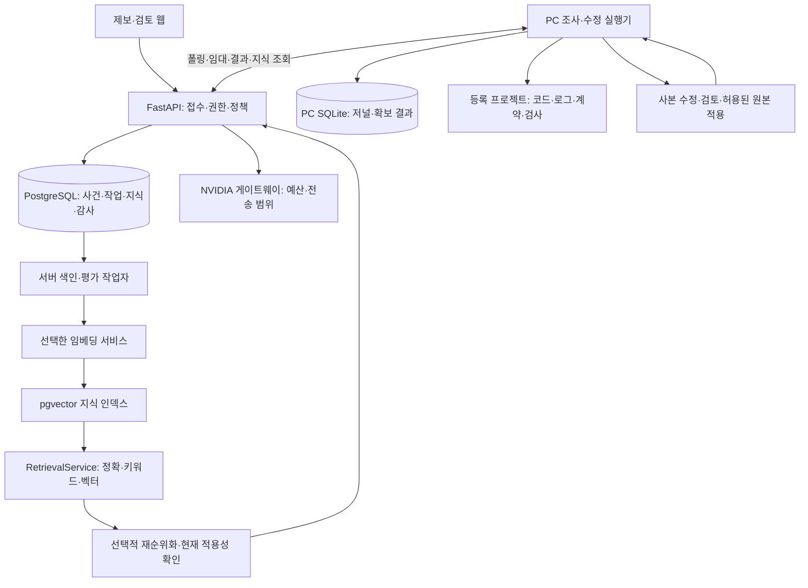
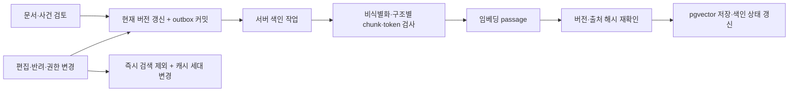

# PostgreSQL·RAG·지속 개선 통합 설계

2026-09-29. **전체 개선 설계와 단계별 완료 조건.** 후속 구현으로 PostgreSQL/pgvector·통합 커밋·이전/역방향 복구·검토 카드 색인 작업·검색 캐시/예산을 추가했고 **595개 회귀**를 통과했다. [운영 명령](../guides/postgres-rag.md), [검증과 남은 조건](../validation/postgres-rag.md)을 확인한다. 2절은 설계 당시 SQLite 기준의 간격이다. 운영 연결 전환·실사건 평가·팀 운영·자동 배포는 별도 단계다.

## 1. 권장 결정과 적용 범위

TraceBridge의 **서버 중앙 저장소는 PostgreSQL + pgvector**, PC 실행기의 **오프라인 저널·결과 재전송은 SQLite**로 둔다. 먼저 소유자의 실제 프로젝트에서 반복 사용할 수 있는 내부 운영 도구를 완성하고, 팀 인증·담당자 기능을 붙인다.

PostgreSQL을 권장하는 주된 이유는 사건·작업·검토·정책·검색을 함께 관리할 수 있기 때문이다. 벡터 검색뿐 아니라 서버 결과 저장의 원자성, 여러 실행기의 작업 배분, 권한, 백업·복원이 필요하다. pgvector는 PostgreSQL 내부의 정확/근사 벡터 검색과 SQL 필터·JOIN을 지원한다. [pgvector 공식 문서](https://github.com/pgvector/pgvector)

| 선택 | 적합한 단계 | 이번 결정 |
| --- | --- | --- |
| 서버 SQLite 유지 | 단일 PC·소유자 시범, 운영 DB를 관리하기 어려운 환경 | 현재 동작과 로컬 호환 경로 유지 |
| 서버 PostgreSQL + pgvector | 중앙 사건·작업·권한·지식 운영, 여러 PC 연결 | 구현한 선택 저장소. 이전/비교 후 운영 연결 전환 |
| PostgreSQL + 전용 Vector DB | 검색 부하를 별도 확장해야 하거나 PostgreSQL의 측정된 한계를 넘는 경우 | 검색 저장소 인터페이스를 확보하고 필요성 측정 후 검토 |

벡터 수 하나로 전용 DB 도입 시점을 정하지 않는다. 대표적인 프로젝트/환경 필터 아래의 검색 p95·Recall, 동시 조사 시 작업 DB 지연, 인덱스 메모리·복구 시간, 운영 비용으로 판단한다. 전용 검색 서비스를 추가해도 사건·검토·권한의 원본은 PostgreSQL에 남긴다.

이전 대상은 TraceBridge의 운영 데이터다. 조사 대상인 daily의 서비스 DB는 별도 연결기·별도 읽기 권한을 사용한다. 같은 PostgreSQL 인스턴스를 활용한다면 TraceBridge 전용 DB와 역할을 분리하고 자원 여유를 검증한다.

## 2. 설계 시점의 기반과 간격

| 현재 코드 | 제공하는 기반 | 다음 간격 |
| --- | --- | --- |
| [control_plane.py](../../tracebridge/control_plane.py) | 소유자 인증, PC 페어링·범위 토큰, 임대·epoch, 모델 단계 캐시 | PostgreSQL 저장소, 조직/프로젝트 사용자 권한, 통합 트랜잭션 |
| [incident_memory.py](../../tracebridge/incident_memory.py) | 불변 실행·검토 카드·수정 기록, 정확/FTS5 검색, 최소 영속 기록 | SQL 의존 분리, 문서 버전·수명 관리, 검색 품질 평가 |
| [semantic_memory.py](../../tracebridge/semantic_memory.py) | 선택적 NIM 어댑터, 범위 제한·코사인·RRF, 검토 변경 시 벡터 무효화 | 실제 한국어 모델 평가, 비동기 색인·검색 예산·캐시·리랭커 |
| [work_management.py](../../tracebridge/work_management.py) | 소유자 중요도·난이도·위험, 큐·조사 예산·상태/모델 이력 | 관측된 영향의 자동 제안, 책임자·에스컬레이션·평가 이력 |
| [local_runner.py](../../tracebridge/local_runner.py) | PC 자료 조회·사본 검사·로컬 확보 결과·재전송 | 적용/서비스 확인 회신, 프로젝트 연결 진단과 서비스 실행 버전 |
| [project_repair.py](../../tracebridge/project_repair.py) | 등록 파일·고정 검사·전후/회귀·검토한 원본 적용 | 실제 증상의 회귀 검사와 적용 후 서비스 확인, 별도 배포 정책 |

특히 서버의 작업 DB와 `server-incidents.sqlite3`는 별도 파일이다. 현재 `complete()`는 사건 저장 후 작업 완료를 다른 트랜잭션에서 저장한다. 중복 저장 보호는 있으나 두 DB의 커밋은 하나가 아니다. PostgreSQL에서는 사건 실행·수정 후보·작업 결과·감사 이벤트를 한 Unit of Work로 커밋한다.

기존 `runs.content_hash`는 영속화에서 제외한 입력까지 포함할 수 있다. 따라서 최소 `record_json`에서 기존 해시를 다시 계산해 덮어쓰면 안 된다. 이 사실을 이전 계약의 불변 조건으로 둔다.

## 3. 목표 배치

FastAPI는 기능별 모듈을 가진 하나의 서비스로 시작한다. 별도 프로세스의 색인/평가 작업자는 같은 이미지·도메인 계약을 사용한다. PC 조사 오케스트레이터와 사본 검사 위치는 유지한다. PC에 서버 DB·NVIDIA 키를 주지 않고 API를 통해 범위와 예산을 검사한다.

초기 구성은 웹, API, PostgreSQL, 서버 작업자, PC 실행기다. 작업 저장은 PostgreSQL을 사용하고, 부하가 입증되면 브로커/별도 검색 서비스를 추가한다. 큰 로그·사진·소스 사본은 등록된 파일/관측 저장소에 두고 DB에는 권한이 있는 참조·해시·최소 발췌를 보관한다. 파일 참조는 초기 영속 볼륨, 확장 시 객체 저장소로 바꿀 수 있게 한다.

## 4. 저장소와 도메인 경계

### 4.1 구현 방식

`IncidentRepository`, `JobRepository`, `KnowledgeRepository`, `ArtifactStore`, `UnitOfWork`를 정의한다. 현 `IncidentStore`의 로컬 SQLite 인터페이스는 호환 파사드로 남긴다. SQLite 구현과 PostgreSQL 구현이 동일한 계약 검사에 참여한다.

ID·해시·검토·중복 저장 같은 공통 계약과 저장소의 원자성 능력을 구분한다. PC의 단일 SQLite 저장은 그 범위에서 검증하고, 기존 서버의 두 SQLite 파일 모드는 다중 aggregate 원자 커밋을 제공한다고 표시하지 않는다. 통합 결과 커밋과 동시 작업 배분의 운영 게이트는 실제 PostgreSQL 구현에서 통과해야 한다.

PostgreSQL 어댑터는 SQLAlchemy Core + psycopg, 스키마 변경은 Alembic을 후보로 둔다. 현재 FastAPI 동기 핸들러에 맞춰 동기 드라이버·제한된 연결 풀부터 사용하고, 구현 시 호환 버전을 고정한다. 새 의존성은 이번 설계에서 설치하지 않는다. [SQLAlchemy psycopg 지원](https://docs.sqlalchemy.org/en/20/dialects/postgresql.html#module-sqlalchemy.dialects.postgresql.psycopg), [Alembic](https://alembic.sqlalchemy.org/en/latest/)

`sqlite3.Connection`, `json_extract`, `json_each`, FTS5와 SQLite trigger를 서비스 로직에서 분리한다. API·판정·수정 정책은 저장소별 SQL을 알지 않게 한다. 실제 애플리케이션 DB 진단 연결기는 운영 저장소와 독립이다.

### 4.2 주요 데이터

| 영역 | 목표 테이블/객체 | 핵심 계약 |
| --- | --- | --- |
| 접근 | organizations, projects, project_members, runners, bindings, policy_versions | 조직/프로젝트 범위, 서비스 계정·정책 버전 |
| 접수·사건 | reports, incidents, incident_reports, observations | 원 제보·관측·중복 묶음 분리, 제보자별 공개 범위 |
| 조사 | runs, evidence_refs, hypothesis_updates | 불변 실행, 근거는 실행 ID에 귀속, 미확인 가설 보존 |
| 작업 | jobs, job_events, provider_calls, assessments | 임대·epoch·중복 키, 평가 제안과 최종 평가 분리 |
| 수정·검증 | change_jobs, applications, verifications | 후보 검증·원본 적용·배포·회복을 별도 사실로 보관 |
| 지식 | knowledge_documents, document_versions, chunks, embedding_profiles, embeddings | 출처·검토·현재 버전·검색 적용 조건 |
| 파생 작업 | outbox_events, index_jobs, retrieval_runs, feedback, evaluation_cases | 비동기 색인·전송·평가, 사건별 재사용 결과 |

처음에는 기존 incidents/runs/cards/change_jobs/jobs를 호환 형태로 가져오고 필요한 typed column을 추가한다. 위 전체 모델을 한 번에 재작성하지 않는다. 조회·권한·정렬에 필요한 `organization_id/project_id/service/environment/status/revision`은 열로 두고, 확장 메타데이터는 JSONB로 보관한다.

기존 ID·revision·opaque 입력 해시·원 `record_json`·검토 이력·모델 상태를 보존한다. 원 JSON과 기존 해시는 불변 데이터로 두며, JSONB는 조회용 투영으로 사용한다. 원 JSON 자체의 체크섬은 별도 필드로 추가한다. 기존 `minimal_sqlite_v1` 같은 레코드 표식도 역사 데이터에서 바꾸지 않는다. 신규 레코드부터 저장소와 무관한 버전 계약을 사용한다.

검색 벡터는 재생성 가능한 파생 데이터다. 실행 기록·검토 결정·정책·검증 이력은 원본이며 인덱스 재생성으로 덮어쓰지 않는다.

### 4.3 원자성과 작업 배분

- 결과 접수는 실행/후보 기록, 사건의 최신 투영, 작업 완료, 감사 이벤트를 한 트랜잭션에서 저장한다. 같은 결과 재전송은 같은 해시를 확인하고 기존 완료를 반환한다.
- 지식 승인·편집·폐기는 현재 문서 버전과 `knowledge_generation`을 갱신하고 outbox를 같은 트랜잭션에 넣는다. 네트워크 임베딩 호출은 커밋 후 작업자가 수행한다.
- 작업 claim은 먼저 runner 행을 잠그고 활성/취소 대기/복구 미확인 작업을 검사한 뒤, 권한이 있는 대기 작업을 중요도·접수 시각 순으로 `FOR UPDATE SKIP LOCKED` 조회한다. 상태·epoch·임대와 이벤트를 같은 트랜잭션에 갱신한다.
- runner별 활성 작업 제한은 코드 검사와 DB 제약으로 함께 보장한다. `SKIP LOCKED`만으로 같은 runner의 두 작업 실행을 막았다고 보지 않는다. 서버 색인 작업과 PC 작업은 `worker_kind`·능력/대상 범위를 분리한다.
- 임대 갱신·완료에는 runner ID, 현재 epoch, 미만료 임대가 모두 필요하다. 취소/연결 중단은 기존 복구 확인 게이트를 유지한다. 외부 작업의 exactly-once 실행을 약속하지 않고 중복 키·fencing·확보 결과 재전송으로 처리한다.

PostgreSQL은 `SKIP LOCKED`를 큐 같은 소비자 경쟁에 사용할 수 있다고 설명한다. 사건 사실을 읽는 일반 조회에는 일관된 읽기 계약을 사용한다. [SELECT 잠금 문서](https://www.postgresql.org/docs/current/sql-select.html#SQL-FOR-UPDATE-SHARE)

## 5. RAG 지식의 구성

RAG의 역할은 다음 확인에 필요한 과거 지식·공식 계약·절차를 찾아 주는 것이다. 원인 확정은 현재 요청·로그·실행 버전·재현 검사로 한다.

| 지식 종류 | 처음 도입할 자료 | 조건 |
| --- | --- | --- |
| 사건 카드 | 검토한 안내, 확인된 원인/수정, 실패·반증·보류 사례 | 승인과 원인/수정 검증은 별도 필드. 실패 사례를 해결책으로 표시하지 않음 |
| 운영 절차 | 프로젝트별 조사 순서, 실행/확인/복구 runbook | 관리자가 등록한 출처·환경·버전·소유자 |
| API 계약 | 등록한 OpenAPI/DTO/입력 규칙·문서 | 자료 버전과 실제 runtime SHA의 관계 확인 |
| 변경 지식 | 검토된 변경 요약·diff 참조·재현/회귀 결과 | 소유자 허용 범위, 기준 SHA와 적용 결과 구분 |

전체 저장소를 벡터화하는 작업은 뒤에 둔다. 코드 조사는 현재 PC의 등록 경로·SHA로 검색하고, 원본 로그는 제한된 사건 조회로 읽는다. RAG에는 승인한 요약·문서·계약만 넣어 변경 추적과 출처 확인을 가능하게 한다.

문서마다 `source_type/source_id/source_revision/content_hash/owner/sensitivity/review_status/service/environment/runtime_condition/valid_from/retired_at`를 기록한다. 검토는 문서 버전에 귀속하며 `APPROVED`는 사실 검증의 대체가 아니다. 원인 미확인 문서의 상태도 검색 결과와 모델 입력에 전달한다.

짧은 사건 카드는 사건 단위로 유지한다. 긴 매뉴얼은 제목·절차·API operation을 경계로 나누고, 초기 후보는 chunk당 300~600 token·필요한 절차만 제한적 overlap이다. 토큰 수는 선택한 모델의 tokenizer로 측정한다. 분할 크기는 평가 후 확정하며 3,000자 잘라내기를 토큰 정책으로 간주하지 않는다.

## 6. 색인 생명주기와 임베딩

색인은 API의 긴 동기 작업에서 `202 + index_job_id`를 반환하는 서버 작업으로 옮긴다. 기존 동기 endpoint는 전환 동안 호환 경로로 남기고 UI는 비동기 상태·실패·남은 문서 수를 표시한다.

색인 중 문서/검토/전송 정책이 바뀌면 결과를 저장하지 않는다. 검색은 current version·검토·권한을 JOIN해 확인하므로 오래된 벡터 삭제가 늦어도 사용하지 않는다. 동일 `(chunk_version, embedding_profile, content_hash)`는 재전송에서 재사용한다. 삭제·반려·보관 만료는 검색 제외가 먼저이며 파생 데이터 삭제는 감사 가능한 작업으로 진행한다.

기본은 현재 NVIDIA 경로와 호환되는 어댑터로 시작하고 한국어·영어·코드 혼합 사건으로 모델을 비교한다. 문서는 `passage`, 질의는 `query`로 만들며, 모델·차원·정밀도·전처리·chunk 버전·거리 함수를 하나의 `embedding_profile`로 고정한다. [NIM 임베딩 API](https://docs.nvidia.com/nim/nemo-retriever/text-embedding/1.12.0/reference.html)

차원은 실모델 검증 뒤 스키마에 고정한다. 1024차원 프로필을 초기 후보로 볼 수 있지만 모델의 실제 지원을 먼저 확인한다. pgvector의 HNSW `vector` 인덱스는 최대 2,000차원, `halfvec`는 최대 4,000차원이므로 2048/4096차원 모델을 그대로 인덱스에 넣는 설계를 피한다. 지원하는 동적 차원을 선택하거나 정확 검색/halfvec을 평가한다. 벡터 배열을 임의로 잘라 차원을 맞추지 않는다. [pgvector 인덱스 타입](https://github.com/pgvector/pgvector#hnsw), [NIM 모델 지원표](https://docs.nvidia.com/nim/nemo-retriever/text-embedding/1.12.0/support-matrix.html)

모델/차원을 바꾸면 새 프로필·새 인덱스에 병행 색인하고 holdout 평가 후 활성 프로필 포인터를 전환한다. 서로 다른 공간의 벡터를 섞어 비교하지 않는다. 초기에는 PostgreSQL의 범위 제한 정확 검색으로 시작하고, 목표 검색 지연을 넘으면 HNSW를 추가한다.

## 7. 온라인 검색·판단 흐름

1. **현재 사건 식별:** request/trace ID, 서비스·환경·시각·실행 버전을 수집한다. 모호하면 가장 작은 추가 질문을 한다.
2. **검색 범위 확정:** 서버가 사용자 권한에서 조직/프로젝트를 정하고, 사건에서 서비스·환경을 정한다. 모델이 필터를 넓히거나 다른 프로젝트를 고를 수 없다.
3. **정확 단서 조회:** 오류 코드·API operation·경로·스택 지문으로 찾는다. 정확 지문도 원인 동일성의 증명은 아니며, 충돌하는 버전/가설을 표시한다.
4. **하이브리드 후보 조회:** PostgreSQL 전문 검색·필요한 문자열/alias 검색과 pgvector를 각각 상위 20개 수준으로 조회한다. 이는 초기 조정값이다.
5. **중복 제거·순위 결합:** RRF로 합치고 같은 원 사건/문서의 chunk가 결과를 독점하지 않게 한다. 현재 사건과 평가 정답의 동일 원 사건은 제외한다.
6. **선택적 rerank:** 모호한 후보만 제한된 후보 수로 재정렬한다. 초기 후보 최대 10~20개, 호출 1회이며 지연/비용 대비 효과가 있을 때 활성화한다.
7. **현재 적용성 확인:** 검토·출처 버전·현재 policy·runtime 조건을 다시 확인하고 최대 2개 사건 카드와 필요한 문서 근거만 조사에 제공한다. 관련 자료가 없으면 0개를 반환한다.
8. **조사와 실행:** 조회 가설·반증·안내/질문/수정 후보를 현재 근거에 묶는다. 인용은 문서 ID·버전·출처를 포함하며 과거 카드 ID를 현재 evidence ID로 바꾸지 않는다.

PostgreSQL의 기본 `ts_rank/ts_rank_cd`는 SQLite FTS5의 BM25와 같은 알고리즘이 아니다. 순위 숫자를 그대로 이전하지 않고 동일 사건 질의로 비교한다. 한국어는 영어 stemming을 적용하지 않고 정규화·등록 operation alias·접두어/필요한 trigram을 평가한다. 짧은 한국어 질의나 형태소 변화는 별도 holdout에 넣고, 누락이 크면 애플리케이션 tokenizer를 추가한다. 추출할 trigram이 없는 패턴은 전체 인덱스 스캔이 될 수 있으므로 짧은 질의를 무제한 부분 문자열 검색으로 보내지 않는다. [전문 검색 ranking](https://www.postgresql.org/docs/current/textsearch-controls.html#TEXTSEARCH-RANKING), [pg_trgm](https://www.postgresql.org/docs/current/pgtrgm.html)

ANN 인덱스는 필터와 함께 사용할 때 결과 수·Recall이 줄어들 수 있다. 필터 열 인덱스, 지원되는 iterative scan, 필요 시 프로젝트 파티션을 검증하고, 엄격한 필터의 기준 결과는 정확 검색으로 비교한다. RLS/WHERE가 최종 권한을 강제하며 ANN 조회 후 애플리케이션에서만 권한 필터를 적용하지 않는다. 공유 ANN 인덱스의 물리적 탐색과 SQL의 결과 접근 통제도 구분한다. [pgvector 필터·iterative scan](https://github.com/pgvector/pgvector#iterative-index-scans)

현재의 고정 코사인 0.45를 모든 모델의 '같은 사건 확률'로 쓰지 않는다. 임계값·rerank 활성 조건은 모델별 검증 자료로 정하고 미확인 상태를 유지한다. NIM reranker는 query와 passage 텍스트의 관련성을 다시 계산하며 인덱스의 원 점수나 원인 동일성을 검증하는 서비스가 아니다. [NIM reranking](https://docs.nvidia.com/nim/nemo-retriever/text-reranking/latest/using-reranking.html)

## 8. 검색·모델 예산과 실패 처리

| 경계 | 설계 |
| --- | --- |
| 전송 정책 | 프로젝트의 LOCAL_ONLY/허용된 비식별 외부 전송, 자료 종류·목적·endpoint 제한. 질의/문서 전송 권한 별도 |
| retrieval 예산 | 사건 실행당 질의 임베딩과 rerank 호출 상한, 후보/문서 token 한도, 단계별 timeout과 비용 예약 |
| query cache | 정제 질의 해시 + embedding profile + 조직/프로젝트/서비스/환경 + knowledge_generation + 정책/권한 버전 |
| cache hit | 검색 결과를 반환하기 전에 현재 검토·ACL·source version 확인. 질의 벡터 캐시와 문서 결과 캐시를 구분 |
| provider call | purpose별 request hash·시도·응답/결과 미확인·사용량 저장. 반복 요청은 기존 결과/확인 상태 반환 |
| 장애 | embedding 실패는 키워드 경로, rerank 실패는 RRF, 지식 저장소 장애는 현재 관측 조사/명시적 보류 |
| budget 초과 | 추가 호출을 중단하고 확보한 자료·누락·다음 최소 조치를 기록. 모델이 정책을 올릴 수 없음 |

색인 worker의 제한된 배치·동시 호출 수와 재시도는 서버 정책이다. 외부 호출과 파일 검사는 DB 트랜잭션 밖에서 수행한다. 기록·outbox·현재 결과 포인터의 갱신만 짧은 트랜잭션으로 처리한다. 임베딩은 파생 작업으로서 제한된 재시도·실제 시도 비용을 기록하고, 수정 제안의 결과 미확인은 기존 무조건 재실행 금지 계약을 유지한다.

## 9. 실제 제보에서 해결까지의 개선

### 9.1 관측 연결

daily부터 frontend/backend의 request ID, 지속 요청/오류 로그, 환경, 실제 runtime SHA, OpenAPI/DTO·호출자 자료와 서비스 health를 등록한다. UI에서 코드 조회 가능·자료 연결 상태·서비스 정상 상태를 각각 표시한다. 프론트 실패 캡처는 operation·시각·request ID·빌드 버전을 자동 첨부하고 요청 본문·쿠키·자격 증명은 최소화한다.

### 9.2 판정과 중요도

판정은 `사용법/입력 문제`, `UI/문서 혼동`, `호출자-서버 계약 오류`, `코드 결함`, `인프라 문제`, `보안 의심`, `판단 불가`를 구분한다. 4xx/5xx 하나로 책임·원인을 확정하지 않는다. 입력 안내가 맞아도 UI가 혼동을 유발하면 개선 작업을 별도로 만든다.

중요도는 관측된 영향·핵심 기능 중단·데이터/보안 위험·반복 빈도·환경으로 제안한다. 난이도는 재현성, 변경 파일/컴포넌트, 테스트와 의존 범위, 미확인 사항으로 제안한다. 각각 근거·신뢰 수준·정책 버전을 저장하고 소유자의 최종 평가/수정 이유와 구분한다.

중요도는 작업 순서, 난이도는 조사 예산/작업 분할, 변경 위험은 허용 조치/검토 수준에 사용한다. 긴급도가 높다고 원본 적용 권한이 늘어나지 않는다. 정보 부족 사건은 영향 파악 작업을 먼저 만들고, 범용 P0나 '쉬운 변경'을 제보 문구만으로 확정하지 않는다. 프로젝트별 업무 중요도 정책과 starvation 방지 대기 시간 정책을 명시한다.

### 9.3 수정·적용 후 확인

`사건 연결 → 재현 → 사본 수정 전후 검사 → 회귀 → diff 검토 → 허용된 원본 적용 → 서비스 검증`을 각각 상태로 기록한다. 등록된 테스트/정책을 모델이 바꿔 자기 변경을 통과시킬 수 없게 한다.

PC의 원본 적용 결과도 새 idempotent 회신 계약으로 서버에 전달한다. 후보 ID·검토한 diff hash·기준/적용 SHA·원본 검사·정책 버전·실행 주체를 검사하며 서버의 후보 검증 사실을 원본 적용/회복으로 승격하지 않는다. 현재 PC에만 있는 application 기록은 이전/회신 목록에 포함한다.

서비스 완료 조건은 동일 사용자 여정/API의 기대 결과, 실제 배포 SHA, 필요한 관측 구간의 장애 해소다. 실패하면 사건을 다시 열고 다음 확인을 기록한다. 자동 배포는 CI·점진 적용·중단 조건·복구를 따로 검증한 프로젝트 정책에만 추가한다. 데이터 변경은 코드 되돌리기와 다른 복구 계약을 갖는다.

## 10. 계속 개선되는 구조

`실제 사건 → 담당자 피드백 → 검토된 지식 버전 → 재현/회귀 검사 제안 → 평가셋 → 변경 후보 평가 → 검토한 출시 → 사후 지표`를 연결한다.

피드백은 원인 오판, 잘못된 사용자 책임, 오래된 지식, 잘못된 담당자, 유용한 조사 순서, 수정 실패/성공, 서비스 미회복을 구분한다. 원 실행·검사 결과는 불변으로 두고 정정 이벤트/새 지식 버전을 추가한다. 검토 승인·검색 hit가 원인 확인이나 학습 성공을 뜻하지 않는다.

사건별 재현 테스트 생성은 별도 `TestCaseProposal` 작업으로 한다. 먼저 독립 제안 산출물에 저장하고 담당자가 기대 동작·실패 시그니처를 검토해 프로젝트의 승인된 검사에 편입한다. 현재 수정 작업자의 테스트 편집 금지와 자기 검증 경계는 유지한다. 모델이 테스트를 쉽게 바꿔 통과시키는 흐름을 만들지 않는다.

retrieval profile·프롬프트·규칙·예산·모델 변경을 버전 관리하고, 같은 holdout 자료로 평가한 뒤 활성 버전을 바꾼다. 회귀하면 직전 검증 버전으로 되돌린다. 모델 자체의 자동 재학습은 별도의 연구 과제로 두고, 먼저 검토된 지식·테스트·판정 규칙의 개선을 측정한다.

## 11. 인증·보관·운영

초기 내부 소유자 사용을 먼저 완성한다. 팀 확장 전에는 OIDC 같은 검증된 사용자 인증과 `reporter/triager/reviewer/project_admin` 역할, runner 서비스 계정, 제보자 본인 결과 접근을 구현한다. 내부 로그·코드·다른 사건을 제보자 화면에서 보여주지 않는다.

모든 주요 관계에는 organization/project 범위와 복합 FK를 둔다. PostgreSQL RLS를 방어 계층으로 사용하고 런타임 DB 역할은 테이블 소유자·superuser·BYPASSRLS 역할과 분리한다. transaction-local 권한 문맥과 풀 반환 시 초기화를 검증한다. RLS가 있다고 API 인증·권한 검사가 완성된 것은 아니다. [PostgreSQL row security](https://www.postgresql.org/docs/current/ddl-rowsecurity.html)

정책은 원본 첨부·최소 관측·지식·감사·평가셋의 보관 기간을 나눈다. 삭제는 원본·벡터·검색/모델 캐시·평가셋으로 전파하며 감사 기록은 필요한 최소 정보로 보존한다. 원본 로그 링크 만료와 실제 관측 누락도 재생 기록에 표시한다.

DB 백업과 artifact 참조/파일 백업을 함께 계획한다. 작은 내부 운영은 정기 dump·서버 밖 보관·복원 리허설, 허용 손실 시간이 짧아지면 WAL 보관/PITR로 확장한다. RPO/RTO는 소유자 운영 요구로 정하고 측정한다. 벡터 재생성 시간도 복구 시험에 포함한다. [PostgreSQL PITR](https://www.postgresql.org/docs/current/continuous-archiving.html)

현재 1~2 GB 시범 설정에 API·웹·PostgreSQL·색인을 그대로 모두 넣으면 자원 여유를 보장할 수 없다. 배포 환경별 RSS·connection pool·DB cache·인덱스 크기를 측정한다. CPU 서버에는 API/DB/작업자를 두고 임베딩/Nemotron은 선택한 외부 NIM 또는 별도 추론 호스트를 사용한다. DB 포트는 공개하지 않는다.

PostgreSQL 장애 중 PC는 확보 결과를 저널에 보존하고 복구 후 재전송한다. 서버가 임의로 로컬 SQLite 쓰기로 바뀌어 두 원본을 만드는 자동 fallback은 제공하지 않는다. 상태 화면은 작업·runner·service·자료 연결·모델·색인을 분리해 표시한다.

## 12. 단계별 이전과 되돌리기

| 단계 | 작업 | 완료 조건 |
| --- | --- | --- |
| A: 기준 고정 | DB/파일 목록, 실제 사건 기준셋, SQLite 계약 검사·불변 해시 확인 | 어떤 DB가 원본/캐시인지 식별, 중복·충돌·누락 목록 확보 |
| B: 저장소 분리 | repository/UoW 도입, SQLite 어댑터, API와 기존 CLI 호환 | 기존 579개에 새 저장소 계약 검사를 추가해 기능 경계 유지 |
| C: PostgreSQL 어댑터 | schema/Alembic·원자적 결과 저장·claim·RLS 경계·백업 복원 | 실제 PostgreSQL에서 병렬 claim·취소·임대·중복 결과·실패 주입 검사 |
| D: 시험 이전 | 읽기 전용 SQLite snapshot → 별도 PostgreSQL → 검증/재생 | ID·해시·revision·검토·모델 상태·참조·같은 사건 답변의 동등성 |
| E: 검색 이전 | 문서/버전·키워드·pgvector·색인 outbox·검색 평가 | 한국어와 범위 필터의 품질 확인, 인덱스 장애 시에도 사건 조회 유지 |
| F: 운영 전환 | 접수/claim 중단 → 실행/재전송 drain → 일관 백업 → 최종 import → writer 전환 | 하나의 writer, runner 재연결, 핵심 여정·복원·전환 후 데이터 검증 |

초기에는 짧은 유지보수 전환을 권장한다. 중단 없는 이중 쓰기는 이 규모의 첫 이전보다 동기화 복잡성이 크다. 시험 중 SQLite가 writer이고 PostgreSQL은 같은 snapshot의 비교 대상이다. 운영 전환 시 writer를 하나로 정한다.

접수/claim 중단 단계에서도 이미 실행 중인 결과·heartbeat는 받아 drain한다. 최종 snapshot 전에는 상태 조회의 만료 갱신 등 모든 writer를 중지하고, API는 유지보수 상태와 재시도 안내를 반환한다. 실행/취소/복구 미확인 작업은 소유자가 종료/결과를 확인한 뒤 처리하며 유효 임대를 다른 서버에서 자동 재생하지 않는다.

**이전 데이터의 범위:** 서버 control DB와 server-incidents DB가 1차 원본이다. 로컬 단독 UI 사건 DB·PC application 기록은 소유자가 지정한 프로젝트 매핑으로 별도 import한다. runner cache의 동일 run을 더 최신 원본으로 자동 승격하지 않는다. 중복 ID의 동일 기록은 합치고, 내용/해시가 다른 기록은 별도 conflict 보고서에서 해결한다. 실제 artifact는 PC/server 위치·권한·해시를 매핑하고 존재하지 않는 참조는 미확인으로 남긴다.

기존 credential digest·폐기 상태·만료 시각을 보존하고, 이관 때문에 토큰을 무기한 연장하지 않는다. 모델 `REQUESTED/OUTCOME_UNKNOWN`은 그대로 두며 import나 검색 재생이 새 수정 제안/외부 모델 호출을 만들지 않는다. source SHA·상대 날짜의 메시지 도착 시각·idempotency key도 보존한다.

되돌리기는 시점에 따라 다르다. PostgreSQL 쓰기 활성화 전에는 보존한 SQLite writer로 돌아갈 수 있다. 새 쓰기가 발생한 후에는 PostgreSQL 호환 이전 앱으로 roll-forward/rollback하거나, 쓰기를 다시 멈추고 신규 사건·이력·검토·임대 상태를 검증된 역변환으로 반영한 뒤 SQLite로 돌아간다. 오래된 SQLite 백업만 다시 켜서 전환 후 결과를 잃는 절차는 허용하지 않는다.

## 13. 품질 평가와 출시 게이트

초기 사례는 실제 허가된 사건과 합성 실패 주입을 구분해 50~100건 규모의 담당자 라벨 세트로 시작한다. 숫자는 데이터 수집 계획이며 품질 보장이나 통계적 입증이 아니다. 같은 원 사건의 후속 메시지·중복 제보·수정 파생 사례는 같은 그룹으로 나눠 평가 누출을 막는다.

비교는 같은 자료·권한·실행/토큰 예산 아래에서 (A) 기억 끔, (B) 키워드/정확, (C) 하이브리드, (D) 하이브리드+rerank로 한다. 검색 top-K와 모델에 실제 전달할 카드 수를 각각 평가한다. 모델/네트워크 실패도 분모와 지연·비용에 포함한다.

| 영역 | 측정/게이트 |
| --- | --- |
| 저장 | 불변 ID·원 해시·revision·참조 일치, 새 결과와 job 완료의 부분 커밋 없음 |
| 실행 | 두 claim·만료·취소·중복 완료·프로세스 중단·복구에서 중복 변경/모델 무조건 재호출 없음 |
| 권한 | 조직/프로젝트/환경 위반 결과 0, 승인 취소·권한 변경 직후 캐시/벡터 재사용 거부 |
| retrieval | Recall@10·MRR@5·관련 사례 없음의 잘못된 재사용, 한국어/버전 불일치/동일 오류 다른 원인별 결과 |
| 진단 | 잘못된 원인·사용자 책임 확정, 적절한 질문/보류, 현재 근거 없는 확정이 baseline보다 증가하지 않음 |
| 수정 | 같은 실패의 전후 검사·기존 회귀·원본 보존·허용 diff·적용 후 핵심 여정 성공 |
| 효율 | 사건당 사람 왕복·검토 시간·도구/모델/임베딩/rerank 호출·token·실제 계측 비용 |
| 운영 | backup 복원·artifact 회복, DB/NIM/runner 장애, 메모리·DB 지연·인덱스 복구 시간 |

초기 성능 목표 후보는 접수 API p95 300ms, DB 검색 p95 200ms, 외부 임베딩/rerank를 포함한 RAG 단계 총 예산 3초다. 목표이며 현재 측정값이 아니다. 대표 자료·동시 사용량·호스트를 정해 실측하고 변경한다. 전체 조사 45/90/180초 상한과 별개로 측정한다. 검색 품질 목표는 라벨을 수집해 정하고, rerank는 유의한 품질 개선과 추가 비용을 확인한 뒤 켠다.

## 14. 실행할 작업 목록과 우선순위

난이도 S/M/L은 상대적인 구현 범위이며 일정·모델 성공률 추정이 아니다. 기존의 운영 중요도 P0~P3와 아래 구축 순서를 구분한다.

| ID | 작업/산출물 | 의존 | 난이도 | 완료 기준 |
| --- | --- | --- | --- | --- |
| F0 | daily 자료 연결·실제 사건 한 건의 전체 재생 | 등록 프로젝트 접근/허가된 사건 | M | 제보→request/log/SHA→분류→재현의 근거를 저장 |
| D1 | DB/파일 inventory와 storage 계약·SQLite 어댑터 | 현재 기준 | M | 기존 동작·hash/idempotency 보존 |
| D2 | PostgreSQL schema·adapter·UoW·migration | D1 | L | 원자성·동시 claim·취소·임대·실패 주입 통과 |
| D3 | import/검증/되돌리기·복원 도구 | D2 | L | 별도 사본의 전체 재생·전환 후 쓰기 복구 통과 |
| R1 | 검토 지식/문서 버전·outbox·비동기 색인 | D2 | M | 폐기 즉시 제외·색인 중 변경·재시도/중복 검증 |
| R2 | pgvector + 한국어 lexical/alias + RRF | R1 | M | 같은 corpus의 baseline·범위별 Recall·지연 비교 |
| R3 | 모델/차원 비교·rerank·호출 예산·query cache | R2 | M | 실모델 시험·cache/권한 invalidation·품질/비용 비교 |
| W1 | 관측 기반 중요도/난이도/위험 제안·담당자 | F0, D2 | M | 제안 근거와 소유자 정정·미정 상태 보존 |
| V1 | 적용 회신·사용자 여정 검사·재발 시 사건 재열기 | F0, D2 | L | 후보/적용/회복 상태 분리와 미회복 시험 |
| E1 | 실제 라벨·피드백·회귀 제안·평가/출시 버전 | F0, R2, V1 | L | 같은 조건의 비교, 정답 누출 방지, 품질 회귀 차단 |
| O1 | 계정/프로젝트 권한·RLS·보관·비용·backup 복원 | D2, D3 | L | 팀 공개 전 접근 경계·삭제 전파·복원 검증 |
| O2 | 제한된 staging 적용/배포·사후 검증·복구 | V1, E1, O1 | L | 검증한 프로젝트 정책의 실패/복구까지 재생 |

F0와 D1은 서로 의존하지 않아 각각 진행할 수 있다. 첫 운영 묶음은 **F0 + D1~D3 + R1/R2 + 예산/기본 평가**다. 그 뒤 자동 제안·적용 후 확인을 완성하고, 팀 기능과 자동 배포는 별도의 출시 게이트를 통과한다.

## 15. 예상 코드 변경 위치

| 위치 | 변경 |
| --- | --- |
| 새 `tracebridge/storage/` | base contracts, sqlite/postgres adapters, UoW |
| control_plane.py / scripts.serve_control | backend DI, 통합 transaction, scoped claim, maintenance/drain |
| incident_memory.py / work_management.py | 도메인 불변 검사와 저장소 SQL/trigger 분리 |
| semantic_memory.py | provider/profile/벡터 저장소 어댑터, query cache·budget |
| 새 knowledge/indexing/retrieval 모듈 | 문서 version·chunk·outbox·검색/재순위화 |
| local_runner.py / project_repair.py | 로컬 SQLite 유지, 적용/확인 회신과 outbox |
| pages/3_Remote_Projects.py | 연결/자료/서비스 상태, 비동기 색인·근거·평가·복구 UI |
| scripts/ + 새 migrations/ | inventory/import/verify/export/restore·Alembic |
| deploy/ | PostgreSQL/worker 배치, 영속 볼륨·비공개 네트워크·resource/backup |
| tests/ + 실제 라벨 세트 | storage 계약, 실제 PG 통합, 장애·권한·검색·회복 평가 |

위 경로는 전체 목표의 위치다. 구현한 Alembic 파일은 wheel에 포함되는 `tracebridge/storage/alembic/`에 있다. 현 SQLite CLI·PC 저널과 기존 API 결과는 호환한다. 서버 저장소 전환과 사용자 판정/수정 정책의 변경을 하나의 검증되지 않은 출시로 묶지 않는다.
