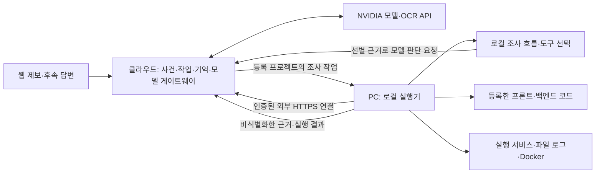

# 클라우드 웹과 로컬 실행기

2026-09-29 사용자 선택: 웹은 배포하고, 실제 프로젝트 코드·실행 서비스·로그는 각 개발자의 PC에 둔다.

현재 코드에 맞춘 [실제 운영 개선안](../design/cloud-local-operations.md)은 **서버의 사건·작업·AI 관리 + 로컬의 조사 흐름 실행**으로 배치를 정했다. 소유자 전용 원격 시범과 일반 프로젝트 후보 검사를 구현했다. 지금 실행할 명령과 실제 daily 연결은 [실제 운영 사용법](real-projects.md)을 따른다.

## 역할



웹은 제보, 추가 질문, 사건 상태, 작업 전달, 기억과 모델 호출을 맡는다. 로컬 실행기는 기존 조사 흐름을 실행하면서 서버를 통해 모델의 다음 조회 선택을 받고, 실제 파일·로그·Git·허용 Docker 조회와 검사를 수행한다. 코드와 실제 서비스는 PC에서 실행된다. 조사에 필요한 선별된 코드·로그 발췌는 웹/모델로 전달되므로 데이터 전송 범위를 구분해야 한다.

클라우드 서버의 `C:/project`는 접속한 사용자의 PC 경로가 아니다. 웹브라우저만으로 로컬 Docker·Git·검사 프로세스를 제어할 수 없으므로 작은 로컬 프로그램을 설치·실행해야 한다. 로컬 실행기가 클라우드로 먼저 HTTPS 연결을 만들면 PC의 수신 포트를 공개할 필요가 없다.

## 현재 구현과 후속 운영 범위

현재는 **로컬 운영과 소유자 전용 원격 시범**이다. 코드/로그의 실제 읽기, 모델 API 경로, 관측 대조, SQLite 사건 기록·검토·검색과 일반 등록 프로젝트의 후보 검사·검토 후 적용을 제공한다. 로컬 신뢰 코드 실행은 OS 격리와 구분하며 실서비스 원인·배포·회복은 별도다.

이번 보완은 독립 저장소의 경로 등록, 해당 실제 파일의 검색/변경 재조회, 분리된 로그 경로와 plain text 로그, 등록 저장소의 호출자 파일 연결, 저장소별 근거 ID·버전 보존이다. 저장소별 실제 배포 대응을 확인하지 않았으면 코드 가설을 확정하지 않는다.

[기존 로컬 검증](../validation/multi-repository.md)은 신규 16개를 포함한 당시 전체 515개 통과다. [실제 운영 검증](../validation/real-project-operations.md)은 daily 사본의 프론트 검사, HTTP 작업 전달과 실제 NVIDIA 게이트웨이의 공개 합성 후보 검증을 구분해 기록한다. 최신 [GUI 최종 검증](../validation/local-gui-final.md)은 실제 화면 등록·제보·후속 답변·실모델 후보·검토 후 적용·재열기·실행기 재연결과 전체 회귀 551개 통과를 기록한다.

**소유자 API·페어링·작업 전달·서버 모델 게이트웨이·PC 실행기를 구현했다.** Streamlit만 배포하는 구성과 달리 control API와 PC 실행기를 함께 연결한다. 공개 다중 사용자 인증·인가, 원격 사진 처리, 자동 배포·회복은 미구현이다. HTTPS 실배포와 Docker 격리의 악성 코드 차단은 별도 검증이다.

## 로컬에서 여러 경로 등록하고 확인하기

```powershell
cd C:\Users\freetime\Desktop\nvidiatest
$env:TRACEBRIDGE_ALLOW_PROJECT_REGISTRATION="1"
.\.venv\Scripts\python.exe -m streamlit run app.py
```

사이드바의 **프로젝트 경로 등록**에 프로젝트 ID, 관측 대상 서비스/환경, 기준 저장소와 독립 경로들을 입력한다. 예를 들어 기준은 `D:/work/backend`, 추가 저장소는 `C:/work/frontend`와 `D:/work/backend`다. 각 저장소의 코드 하위 경로는 `src`, `app` 등 실제 디렉터리로 입력하고 여러 개면 쉼표로 구분한다. 로그 전용 루트는 코드 하위 경로를 비워 둔다.

로그 행의 `repository`는 등록한 저장소 ID이고, `path`는 그 루트 안의 파일 경로다. `format`은 `text/jsonl/json`이며, 시간대 없는 일반 콘솔 로그에는 실제 시간대 `+09:00` 또는 `UTC`를 등록한다. JSON 로그의 실제 service/environment는 등록한 관측 대상과 맞아야 한다. 입력·코드·로그 경로는 실행 권한을 주지 않는다.

설정은 `output/project-profiles/<project_id>.json`에 저장하고 재시작 후 선택 목록에서 읽는다. CLI는 같은 JSON을 `scripts.investigate_report --profile ...`로 사용한다. 등록 UI는 기본적으로 꺼져 있으며 소유자의 로컬/비공개 실행 환경에서만 켠다.

## 구현한 경로와 후속 범위

1. 서버 모델 클라이언트·기억 검색, 서버 발급 ID·접수 시각을 기존 조사에 주입한다. 조사 규칙·CLI·씨드 정책은 유지한다.
2. 소유자 token과 프로젝트 범위 실행기 credential, DB 작업 임대, Windows DPAPI, 완료 결과의 outbox 재전송을 제공한다. 모호한 중단은 자동 재실행하지 않는다. 단계별 완전한 checkpoint 재개는 후속이다.
3. 등록된 서비스의 로그/계약/버전과 제한된 파일 탐색을 제공한다. 실제 사건의 request ID·시간·환경·런타임 버전 연결은 해당 프로젝트에 관측을 갖춘 뒤 검증한다. daily는 현재 코드/검사 연결이며 콘솔 로그 파일과 실행 SHA는 미관측이다.
4. 일반 프로젝트 사본, 허용된 편집, 재현·성공 출력·전후/회귀 검증, 검토 후 원본 적용을 제공한다. 서비스 재기동·배포·회복과 공개 조직 권한은 후속이다.

첫 원격 운영은 비공개 소유자와 등록한 PC의 텍스트 제보부터 시작한다. 작은 HTTP API·SQLite 큐·기존 사건 저장소를 사용하며 별도 메시지 브로커나 벡터 DB는 추가하지 않았다. 원래 목표/후속 계약은 [상세 운영 설계](../design/cloud-local-operations.md), 실행 가능한 현재 계약은 [사용법](real-projects.md)을 따른다.
