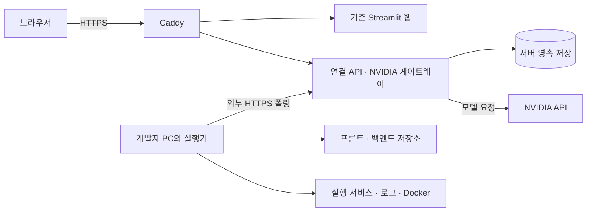

# 배포 가이드: 배포 웹과 개발자 PC 연결

작성 기준: 2026-09-29. 소유자 전용 배포 웹·control API와 개발자 PC 실행기의 운영 절차다. 실제 공인 HTTPS 배포는 아직 수행하지 않았다.

## 1. 추천안과 현재 범위

**현재는 [신규 AWS 계정 배포 기반](new-aws.md)을 우선한다.** 무료 후보 비교는 [무료 배포 가이드](free-deployment.md)에 있다. 아래 4 GB 유료 사양은 여유 있는 기본 예시이며 무료 체험 대상으로 가정하지 않는다. 서버 준비 이후의 Docker·HTTPS·저장·백업 절차는 공통이다.

**Ubuntu CPU 서버 한 대에 Docker Compose로 기존 Python·Streamlit을 배포한다. HTTPS는 Caddy, 사건 DB와 산출물은 서버의 영속 디렉터리를 사용한다. 실제 개발 프로젝트는 개발자 PC에 두고, 로컬 실행기가 서버로 먼저 HTTPS 연결을 만든다.**

첫 서버는 **AWS Lightsail, Ubuntu 24.04 LTS, x86_64, 2 vCPU / 4 GB RAM / 공인 IPv4**를 권한다. 국내 사용자는 서울 리전에서 해당 구성이 제공되는지 생성 화면에서 확인한다. 현재 공식 일반 Linux 요금은 이 사양이 월 **$24**, 2 GB 사양은 **$12**다. 이 수치는 서버 요금이며 도메인·백업·추가 전송량·NVIDIA 사용 비용·세금은 별도다. 4 GB 추천은 초기 빌드와 Python 의존성, 이후 연결 API에 여유를 두려는 판단이며 실제 부하 측정 결과는 아니다. GPU 서버는 필요하지 않다. [Lightsail 가격](https://aws.amazon.com/lightsail/pricing/)

이미 다른 업체의 Ubuntu 서버가 있으면 그대로 사용해도 된다. 배포 파일은 AWS 전용 API에 의존하지 않는다.

| 선택지 | 이번 프로젝트에서의 판단 |
| --- | --- |
| **서버 한 대 + Compose** | 현재 Python, 파일 산출물, SQLite를 유지하기 쉽고 연결 API 추가도 단순하다. 서버 업데이트와 백업은 직접 관리한다. |
| Railway + Docker + 영속 볼륨 | 서버 관리 시간을 줄이는 대안이다. 볼륨 사용 서비스는 복제본을 사용할 수 없고 재배포 중 짧은 중단이 있다. 현재 SQLite와도 한 인스턴스로 운영해야 한다. |
| 함수 단위 서버리스에 조사 앱 이식 | 현재 앱의 파일 접근·프로세스·상태 유지 방식을 바꾸는 작업이 필요하다. 지금 배포 목표에는 이식 비용이 크다. |

Railway는 Hobby 최소 월 $5에 실제 자원 사용량이 추가되는 방식이며, $5가 사용료에 포함된다. 항상 $5만 청구되는 상품으로 계산하면 안 된다. [요금](https://docs.railway.com/pricing), [볼륨 제한](https://docs.railway.com/volumes/reference)

### 두 번의 완료 기준

| 구간 | 완료 기준 | 현재 준비 범위 |
| --- | --- | --- |
| **비공개 웹 배포** | HTTPS·접근 암호·화면·저장·재시작 후 조회가 작동 | Linux 이미지·오프라인 저장/재조회·초기 화면·Caddy 설정 확인 완료. 실제 서버 DNS·HTTPS·브라우저 확인은 남음. |
| **웹에서 내 PC 조사** | 웹 제보가 로컬 실행기로 전달되고 실제 로컬 자료의 결과가 웹에 돌아옴 | 소유자 API·페어링·작업 전달·모델 게이트웨이·PC 실행기 구현, localhost 실제 GUI 연결·재연결 확인. 공인 HTTPS의 최종 이미지·실사건 검증은 남음. |

기본 `compose.yaml`은 서버에 포함된 씨드로 확인하는 비공개 미리보기다. 실제 PC 프로젝트를 연결할 때는 `control-plane.compose.yaml`을 추가하고 PC에서 프로젝트를 등록·페어링한다. 웹의 **연결된 프로젝트 제보**는 접수·상태·후속 답변을 API로 전달하며, 조사 흐름과 파일 접근은 PC 실행기에서 수행한다. [실제 운영 사용법](real-projects.md), [최종 GUI 검증](../validation/local-gui-final.md)을 따른다.

실제 경로는 PC 등록부에 남고 서버에는 저장소·서비스 ID와 연결 상태를 보낸다. 모델이 판단할 선별 코드·로그는 서버로 전달된다. NVIDIA 키는 서버에 두며 PC 실행기에는 전달하지 않는다.

## 2. 목표 배치



기본 템플릿은 Caddy와 Streamlit을 실행하며, control overlay는 API 컨테이너와 `/v1/*` 라우트를 추가한다. 원격 제보는 현재 텍스트만 지원한다.

- 개발자 PC: 실제 경로·Git·Docker·조사 도구·기존 조사 루프를 둔다. PC에 모델을 설치할 필요는 없다.
- 서버: 제보 화면, HTTPS, 사건 저장, 연결 API와 모델 게이트웨이를 둔다.
- 로컬 실행기의 연결은 외부 HTTPS 443으로 시작한다. PC의 수신 포트·Docker API를 인터넷에 공개하지 않는다.
- 모델 판단에 필요한 코드·로그 발췌는 서버 및 NVIDIA로 전달된다. 원격 사진 처리는 후속 범위다.

첫 운영은 한 소유자와 허가된 시연 사용자로 제한한다. 앞단 접근 암호는 사용자별 프로젝트 인가를 구현한 것이 아니다.

## 3. 제공한 배포 파일

| 파일 | 역할 |
| --- | --- |
| `deploy/Dockerfile` | Python 3.12 Linux 이미지, 현재 프로젝트 설치, FTS5 확인, 기존 Streamlit 실행 |
| `deploy/compose.yaml` | 웹·HTTPS 프록시, 영속 디렉터리, 내부 8501 포트, 자원·로그 제한 |
| `deploy/Caddyfile` | HTTPS와 비공개 접근 암호, Streamlit WebSocket 전달 |
| `deploy/control-plane.compose.yaml` | 소유자 API·PC 연결·작업·모델 게이트웨이 추가, 웹의 API 환경 연결 |
| `deploy/Caddyfile.control-plane` | `/v1/*`는 API 자체 bearer 인가, 나머지는 비공개 웹 접근 암호 |
| `deploy/.env.example` | 도메인·인증 해시·쿠키 비밀값·서버 데이터 위치 |
| `deploy/app.env.example` | 웹과 선택적 control 컨테이너의 NVIDIA 설정; PC에는 전달하지 않음 |
| `.dockerignore` | 빌드에 필요한 소스만 포함하고 `.env`·DB·로컬 경로 설정·첨부 자료 제외 |
| `deploy/.gitignore` | 서버의 실제 비밀 설정과 임시 오버라이드 제외 |

**현재 `requirements.txt`는 Windows 전용 잠금 파일을 참조한다. Linux 이미지에서는 이를 설치하지 않고 `pyproject.toml`의 직접 의존성을 설치한다.** Dockerfile은 합성 데모 검사와 control API에 필요한 `.[test,service]`를 설치한다.

직접 의존성 버전은 프로젝트에 고정되어 있다. 이전 로컬 Linux 빌드의 이미지 ID·작업 사본 해시·`pip freeze --all`은 [당시 Linux 확인](../validation/linux-deployment.md)에 기록했다. 이후 API·GUI 변경이 포함된 최종 릴리스는 다시 빌드·확인해야 한다. 최신 Windows 회귀 551개 및 실제 브라우저 검증은 [별도 기록](../validation/local-gui-final.md)이다. 전체 간접 의존성 잠금이 없는 만큼 배포에는 해당 릴리스에서 확인한 이미지를 보존해 사용한다.

웹 프로세스는 UID/GID 10001로 실행한다. 앱 소스는 읽기 전용이며 `/app/output`과 임시 디렉터리만 쓰게 구성했다. 이것은 웹 컨테이너의 배포 설정이다. 일반 프로젝트 수정 작업자의 OS/OpenShell 격리 검증을 대신하지 않는다.

## 4. 먼저 확정할 값

준비할 것은 다음 여섯 가지다.

1. AWS 계정 또는 기존 Ubuntu 서버 접근 권한.
2. 소유한 도메인의 하위 이름: 예를 들어 `tracebridge.your-domain.com`.
3. 서버의 고정 공인 IP.
4. HTTPS 인증서 알림을 받을 이메일.
5. 시연 접근 암호와 NVIDIA 키. 키가 없으면 첫 확인은 오프라인으로 한다.
6. **배포 파일과 필요한 로직 변경이 포함된 검증된 Git 커밋 SHA**.

배포할 소스는 아래 배포 파일과 control API·PC 실행기를 포함한 Git 릴리스 SHA로 고정한다. 서버에서 `git rev-parse HEAD`를 기록하고 같은 SHA로 이미지를 빌드한다. 로컬 검증에 사용했던 미커밋 사본 이미지를 최종 Git 릴리스 이미지로 간주하지 않는다.

현재 제출 ZIP 빌더는 `deploy/`와 `.dockerignore`를 수집하지 않는다. 이번 배포 원본은 배포 파일이 포함된 Git 커밋을 기준으로 한다. 제출 ZIP만 서버에 풀고 같은 절차가 된다고 가정하지 않는다.

## 5. 서버·도메인 준비

### 5.1 Lightsail 생성

1. Linux/Unix → **OS만 설치된 Ubuntu 24.04 LTS**, x86_64, 권장 4 GB 사양을 선택한다.
2. 고정 IP를 생성해 인스턴스에 연결한다. 정지/재시작 후에도 DNS가 같은 서버를 가리키게 한다. [고정 IP 설명](https://docs.aws.amazon.com/lightsail/latest/userguide/understanding-public-ip-and-private-ip-addresses-in-amazon-lightsail.html)
3. 네트워크 방화벽에서 TCP **80, 443**을 허용한다. SSH **22**는 관리자의 IP 또는 Lightsail 브라우저 SSH 허용 범위로 제한한다. IPv6도 사용한다면 그 방화벽을 함께 확인한다. [방화벽 설정](https://docs.aws.amazon.com/lightsail/latest/userguide/understanding-firewall-and-port-mappings-in-amazon-lightsail.html)
4. 8501, 이후 API 8000, Docker 2375/2376은 공인 포트로 열지 않는다.
5. 예산 알림과 정기 인스턴스 스냅샷을 설정한다. 별도 비용과 보관 범위를 생성 화면에서 확인한다.

### 5.2 DNS

도메인 관리 화면에서 `tracebridge`의 A 레코드를 고정 IPv4로 설정한다. 실제 IPv6를 제공하지 않으면 해당 이름에 잘못된 AAAA 레코드를 남기지 않는다. 첫 확인은 DNS가 원본 서버 IP를 직접 가리키게 한다.

Caddy는 공개 도메인, 올바른 DNS, 접근 가능한 80/443, 쓰기 가능한 인증서 저장소가 있으면 인증서를 발급·갱신한다. 이번 Compose는 인증서 저장소도 영속 볼륨으로 둔다. [자동 HTTPS 조건](https://caddyserver.com/docs/automatic-https)

도메인 준비 전에는 아래의 SSH 터널로 화면만 확인할 수 있다. 공인 IP의 평문 HTTP에서 NVIDIA 키가 설정된 앱을 공개하지 않는다.

### 5.3 Docker 설치

서버에 SSH로 접속한다. 아래 서버 명령은 **Linux bash**용이다.

```bash
sudo apt-get update
sudo apt-get install -y git openssl
```

[Docker의 Ubuntu 설치 문서](https://docs.docker.com/engine/install/ubuntu/)에서 **공식 apt 저장소 설치** 절차를 따라 Docker Engine, Buildx, Compose plugin을 설치한다. 설치 후 확인한다.

```bash
sudo systemctl enable --now docker
sudo docker version
sudo docker compose version
sudo docker run --rm hello-world
```

Docker가 공개한 컨테이너 포트는 UFW 규칙을 우회할 수 있으므로, 이번 구성은 웹 8501을 호스트에 공개하지 않고 Lightsail 방화벽도 80/443만 허용한다. [Docker 방화벽 설명](https://docs.docker.com/engine/install/ubuntu/#firewall-limitations)

## 6. 코드·설정 배치

### 6.1 릴리스 코드 가져오기

서버의 Ubuntu 사용자로 실행한다. 이미 사용 중인 디렉터리가 있다면 새 빈 배포 디렉터리를 선택한다.

```bash
mkdir -p "$HOME/services"
cd "$HOME/services"
git clone https://github.com/chan808/nvidia0927.git tracebridge
cd tracebridge

release_ref='REPLACE_WITH_REVIEWED_COMMIT_SHA'
git checkout --detach "$release_ref"
test -f deploy/compose.yaml
git rev-parse HEAD
```

`release_ref`를 실제 SHA로 교체한다. detached HEAD로 검증된 버전을 운영하면 다른 세션의 중간 커밋을 자동으로 따라가지 않는다.

### 6.2 서버 데이터 디렉터리

```bash
sudo install -d -o 10001 -g 10001 -m 0700 /srv/tracebridge/data
sudo install -d -o root -g root -m 0700 /srv/tracebridge/backups

cp deploy/.env.example deploy/.env
cp deploy/app.env.example deploy/app.env
chmod 600 deploy/.env deploy/app.env
```

`/srv/tracebridge/data`는 clone한 코드 디렉터리 밖에 둔다. 재빌드나 코드 교체로 사건 DB·카드·씨드 관측·수정 후보·메트릭이 사라지지 않게 `/app/output` 전체를 여기에 연결한다. 개발자 PC의 기존 DB·프로젝트 프로필은 자동 업로드하지 않는다.

### 6.3 비밀값 생성과 입력

접근 암호는 대화형으로 해시를 생성한다. 명령 인자로 원문 암호를 넣지 않는다.

```bash
sudo docker run --rm -it caddy:2-alpine caddy hash-password
openssl rand -hex 32
nano deploy/.env
nano deploy/app.env
```

`deploy/.env`에서 다음 값을 교체한다.

```dotenv
TRACEBRIDGE_DOMAIN=tracebridge.your-domain.com
ACME_EMAIL=your-email@example.com
CADDY_USERNAME=reviewer
CADDY_PASSWORD_HASH='$2a$...생성한 전체 해시...'
STREAMLIT_SERVER_COOKIE_SECRET=생성한_64자리_랜덤_16진수
TRACEBRIDGE_DATA_DIR=/srv/tracebridge/data
TRACEBRIDGE_IMAGE=tracebridge:실제_커밋_SHA
TRACEBRIDGE_REVISION=실제_커밋_SHA
```

해시의 `$`를 Compose가 바꾸지 않도록 **작은따옴표로 전체 해시를 감싼다**. 예시의 생략된 해시를 그대로 사용하면 안 된다. Caddy는 평문 암호 대신 해시를 받는다. [암호 해시](https://caddyserver.com/docs/caddyfile/directives/basic_auth), [Compose 작은따옴표 처리](https://docs.docker.com/compose/how-tos/environment-variables/variable-interpolation/)

`deploy/app.env`에는 서버에서 사용할 NVIDIA 키를 입력한다. 비공개 오프라인 확인은 빈 값으로 진행할 수 있다. 현재 코드가 직접 NVIDIA를 호출하기 때문에 이 단계에서는 키를 웹 컨테이너에 전달한다. 다른 세션이 프록시를 구현한 뒤에는 키를 **프록시 API 컨테이너에만** 전달하도록 옮긴다.

서버의 키·프로필·DB·설정을 Git 또는 Docker 이미지에 넣지 않는다. 설정 확인은 `docker compose config --quiet`를 사용한다. `config` 전체 출력과 `docker inspect` 전체 출력에는 환경 변수의 키가 포함될 수 있다.

## 7. 빌드와 비공개 웹 시작

매번 저장소 루트에서 아래 함수를 정의한다. `deploy/.env`를 명시해 실행 위치에 따른 설정 차이를 없앤다.

```bash
dc() {
  sudo docker compose --env-file deploy/.env -f deploy/compose.yaml "$@"
}

dc config --quiet
dc build web
dc run --rm --no-deps web python -m pip check
dc run --rm --no-deps web python -c "import sqlite3; c=sqlite3.connect(':memory:'); c.execute('CREATE VIRTUAL TABLE smoke USING fts5(body)'); import tracebridge.report_agent; print('imports and FTS5 OK')"
dc up -d
dc ps
dc logs --tail=80 web proxy
```

**Linux 빌드가 첫 배포의 필수 확인이다.** 이후 로컬 Docker에서 이미지와 1 GB·읽기 전용 실행을 확인하고 전송용 압축 파일을 준비했다. 최종 소스가 바뀌면 새 버전으로 다시 빌드·확인한다. 의존성 설치 실패, 읽기 전용 파일시스템 오류, 컨테이너 재시작이 생기면 배포 완료로 기록하지 않는다.

첫 서버에서 수 분 이상 빌드될 수 있다. 빌드 실패 시 `pyproject.toml`의 버전을 임의로 낮추거나 Windows 잠금 파일로 우회하지 말고 실패 패키지·플랫폼·출력을 기록해 해결한다.

내부 상태 확인:

```bash
dc exec -T web python -c "import urllib.request; print(urllib.request.urlopen('http://127.0.0.1:8501/_stcore/health', timeout=5).read().decode())"
```

Streamlit 공식 Docker 안내도 이 상태 확인 경로를 사용한다. 다만 이것은 웹 프로세스 확인이며 로컬 연결·모델 호출·사건 해결 확인은 아니다. [Streamlit Docker](https://docs.streamlit.io/deploy/tutorials/docker)

외부 확인:

```bash
curl -I https://tracebridge.your-domain.com/
curl --user reviewer -I https://tracebridge.your-domain.com/
```

첫 요청은 인증 전 **401**, 두 번째 요청은 암호를 대화형 입력한 뒤 정상 응답이어야 한다. 브라우저에서 접속해 화면과 클릭 반응도 확인한다. Caddy의 역방향 프록시는 Streamlit WebSocket 연결을 전달한다. [Caddy WebSocket](https://caddyserver.com/docs/caddyfile/directives/reverse_proxy#streaming)

인증 암호를 공유한 사용자는 현재 한 내부 앱의 사건·카드·산출물에 접근한다. 실제 고객을 받기 전에는 사용자별 로그인과 프로젝트 membership 인가가 필요하다.

### 도메인 준비 전: SSH 터널 미리보기

서버의 `deploy/local-preview.override.yaml`에 다음을 저장한다. 기본 설정의 웹 포트 비공개 원칙을 유지하면서 서버 루프백에만 연결한다.

```yaml
services:
  web:
    ports:
      - "127.0.0.1:8501:8501"
    environment:
      STREAMLIT_BROWSER_SERVER_ADDRESS: localhost
      STREAMLIT_BROWSER_SERVER_PORT: "8501"
```

서버:

```bash
sudo docker compose --env-file deploy/.env -f deploy/compose.yaml -f deploy/local-preview.override.yaml up -d web
```

Windows PC의 PowerShell:

```powershell
ssh -i 'C:\path\lightsail.pem' -N -L 8501:127.0.0.1:8501 ubuntu@서버_고정_IP
```

브라우저에서 `http://localhost:8501`을 연다. 터널의 로컬 포트도 기본적으로 자기 PC에만 바인딩된다. 이 미리보기는 Caddy 인증을 거치지 않으므로 SSH 접근 소유자만 사용한다. HTTPS 전환 시 오버라이드 없이 `dc up -d --force-recreate web`을 실행해 루프백 포트 매핑을 제거하고 `dc up -d proxy`로 프록시를 시작한다.

## 8. 지금 가능한 동작 확인

외부 모델 호출 없이 먼저 확인한다.

1. 로그인 후 기본 화면에서 **등록된 개발 가입 사례 (씨드)**를 선택한다.
2. NVIDIA 전송과 자동 수정안 옵션을 꺼 둔다.
3. 개발 가입 동작 확인에서 현재 관측을 생성한다.
4. “방금 가입이 안 돼요”처럼 제보하고 결과와 저장 상태를 확인한다.
5. 저장된 사건 ID를 기록한다. 페이지 새로고침 뒤 사건을 조회해 표시되는지 확인한다.
6. 서버에서 `dc restart web`을 실행하고 같은 사건 ID를 다시 조회한다.
7. 카드 검토·검색을 확인한다. 현재 실행 로그·상충 근거를 근거로 보류하는 동작도 유지되는지 확인한다.

이 검사는 **서버의 번들 씨드와 저장**에 대한 것이다. 일반 개발 프로젝트 수정이나 개발자 PC 접근을 검증한 것이 아니다.

NVIDIA 키가 있더라도 실제 호출은 사용자에게 별도 확인받은 시점에 한다. 모델을 사용하지 않는 경로를 실모델 조사 성공으로 기록하지 않는다. 서버에서는 `integrate.api.nvidia.com`과 `ai.api.nvidia.com`에 외부 HTTPS가 가능해야 한다. 자기 서버에 OCR을 띄우지 않았다면 `TRACEBRIDGE_OCR_URL=http://localhost:8000/...`를 설정하지 않는다.

## 9. 구현된 소유자 API와 PC 연결

현재 실행 가능한 계약이다. 최초 설계의 전체 API·다중 사용자 계약은 [운영 설계](../design/cloud-local-operations.md)와 구분한다.

| 항목 | 현재 동작과 배포 조건 |
| --- | --- |
| 실행 | `python -m scripts.serve_control --host 0.0.0.0 --port 8765`; 컨테이너 내부 `/health` 상태 확인 |
| 웹 환경 | `TRACEBRIDGE_CONTROL_URL=http://control:8765`, `TRACEBRIDGE_OPERATOR_TOKEN_FILE=/app/output/control-plane/operator-token` |
| 저장 환경 | `TRACEBRIDGE_CONTROL_DB=/app/output/control-plane/state.sqlite3`; 서버의 `/app/output` 영속 bind |
| 페어링 | 웹에서 프로젝트 ID를 지정해 5분 일회용 코드 생성, PC의 `scripts.local_runner pair`에서 소비 |
| 장치 인가 | 등록 프로젝트 범위의 30일 credential, Windows DPAPI, 웹에서 실행기 폐기 |
| 작업 | 서버 ID·접수 시각·SQLite 큐·임대 epoch. 완료 결과 ACK 유실은 재전송만 수행. 모호한 실행 중단은 `RECOVERY_REQUIRED` |
| 오프라인 | PC가 꺼져 있으면 연결 끊김과 `QUEUED`; 서버 씨드로 대체하지 않음 |
| 모델 | 서버의 NVIDIA 키와 목적별 허용 모델·단계 예산·응답 보존. PC에는 키 없음 |
| 포트 | 8765와 8501은 내부 포트. Caddy의 80/443만 공개. PC 코드·Docker socket은 서버에 마운트하지 않음 |

소유자 한 명의 비공개 시범이며 공개 다중 사용자 로그인·프로젝트 membership 인가는 후속이다. **연결된 프로젝트 제보**의 모델 선택은 API에 전달되고, 서버에 NVIDIA 키가 없으면 모델 요청이 명시적으로 실패한다. 같은 PC의 **제보 에이전트** 직접 호출 경로는 해당 프로세스의 모델 설정을 사용한다.

### 서버 기동과 PC 페어링

앞선 데이터 디렉터리·UID 10001 권한·`deploy/.env`·`deploy/app.env` 준비 후 다음 helper를 사용한다. 첫 토큰 생성은 기존 파일이 없을 때만 실행한다. 토큰은 출력·Git 등록하지 않는다.

```bash
dc() {
  sudo docker compose --env-file deploy/.env \
    -f deploy/compose.yaml -f deploy/control-plane.compose.yaml "$@"
}
dc config --quiet
dc build
dc run --rm --no-deps control python -m scripts.serve_control \
  --init-token-file /app/output/control-plane/operator-token
dc up -d
dc ps
```

웹에서 PC 연결 관리로 페어링 코드를 만든 뒤, 프로젝트를 등록한 PC에서 실행한다. 명령이 코드를 묻는 입력창에 일회용 코드를 입력한다.

```powershell
.\.venv\Scripts\python.exe -m scripts.local_runner --config output/local-runner/config.json pair --url https://YOUR_DOMAIN
.\.venv\Scripts\python.exe -m scripts.local_runner --config output/local-runner/config.json run
```

원격 웹은 후보 준비·검사·diff 검토까지 제공한다. 원본 적용은 PC의 소유자 화면/CLI에서 해당 diff 해시와 `allow_apply` 정책을 확인해 수행한다. [전체 등록·정책·검사·적용 명령](real-projects.md)을 따른다.

첫 운영은 같은 서버·같은 영속 파일시스템·단일 소유자로 시작한다. 서버 control API가 원격 사건의 기준 기록을 보존한다. 여러 서버/복제본이 필요해지면 SQLite와 산출물 저장 구조를 먼저 바꾼다.

## 10. 실제 로컬 연결 완료 판정

localhost에서 확인한 연결을 공인 HTTPS 배포에서도 다음 조건으로 재검증한다.

- PC에서 프론트·백엔드의 서로 다른 로컬 경로를 등록한다. 웹에는 저장소 ID와 연결 상태가 보인다.
- 프론트·백엔드·필요한 Docker 서비스를 PC에서 실행하고 실제 증상을 만든다.
- 웹에서 텍스트로 제보한다. 웹의 사건/작업 ID와 PC 실행의 ID가 연결된다. 원격 사진은 현재 범위에 포함하지 않는다.
- 조사 근거가 PC의 현재 코드·로그에서 왔음을 확인한다. 실행 SHA를 관측하지 못했으면 미확인 상태를 유지한다.
- 추가 질문과 답변이 같은 사건으로 이어지고 새로고침·서버 재시작 후 조회된다.
- PC 실행기를 중단하면 웹에서 연결 끊김/대기가 표시된다. 다시 시작해도 완료된 작업을 중복 실행하지 않는다.
- 허가되지 않은 장치·다른 프로젝트의 토큰은 자료 조회와 모델 호출을 할 수 없다.
- 자료 충돌·부족은 보류로 표시된다. 과거 기억 검색만으로 해결 완료를 확정하지 않는다.
- 수정안을 제공했다면 등록한 허용 정책·사본·검사 범위를 따른다. 실제 서비스의 원인·원본 적용·배포·회복을 후보 검사와 분리한다.

localhost의 한 PC·다중 경로·실행기 재연결과 공개 예시의 검토 후 원본 적용은 확인했다. 배포에서의 첫 완료 목표는 **한 PC, 여러 저장소, 한 실제 사건**이다. 실제 daily 제보 해결과 공인 HTTPS 성공을 기존 공개 예시 검증으로 대체하지 않는다.

## 11. 버전 기록·업데이트·백업

### 11.1 확인한 이미지 보존

성공한 이미지의 소스 버전과 실제 의존성을 기록한다. 아래 출력에는 API 키를 포함시키지 않는다.

```bash
mkdir -p output/deployment
git rev-parse HEAD > output/deployment/source-commit.txt
dc images > output/deployment/images.txt
dc exec -T web python -m pip freeze --all > output/deployment/linux-python-freeze.txt
dc exec -T web python --version > output/deployment/python-version.txt
dc config --images > output/deployment/image-tags.txt
```

첫 확인은 Python 3.12와 Caddy 2 계열 태그로 시작하지만 이 태그는 움직인다. 성공 시 실제 베이스/프록시 이미지를 digest로 지정하거나 검증한 빌드 이미지를 레지스트리에 보존한다. 이후 재현 기준은 소스 SHA뿐 아니라 **검증한 이미지와 데이터/스키마 버전**이다. 같은 태그를 재빌드한 것을 같은 릴리스로 취급하지 않는다.

### 11.2 간단하고 일관된 전체 데이터 백업

첫 운영은 짧은 유지보수 시간에 쓰는 프로세스를 멈추고 `/srv/tracebridge/data` 전체를 백업한다. 아래는 기본 웹 구성의 서버 bash 예시다. control overlay를 사용하면 `dc stop web control`로 두 프로세스를 중지하고 백업 완료 후 `dc start control web`으로 시작한다.

```bash
backup_name="data-$(date -u +%Y%m%dT%H%M%SZ).tar.gz"
dc stop web
if sudo tar --numeric-owner -C /srv/tracebridge/data -czf "/srv/tracebridge/backups/$backup_name" .; then
  printf 'Backup saved: %s\n' "$backup_name"
else
  printf 'Backup failed; do not use this archive.\n' >&2
fi
dc start web
```

쓰기를 멈춘 상태에서 DB·WAL·연결 산출물을 함께 보존한다. 실행 중인 SQLite의 본체 파일만 `cp`하는 방식은 사용하지 않는다. 무중단 DB 백업이 필요하면 SQLite backup API와 별도 산출물 백업 절차로 바꾼다. [SQLite backup API](https://www.sqlite.org/backup.html)

서버 디스크의 백업만으로 서버 자체의 손실에 대비할 수는 없다. 정기 서버 스냅샷과 서버 밖 백업을 함께 두고, 실제 복원을 한 번 확인한다. Caddy 인증서 볼륨과 서버 비밀 설정도 별도로 복구할 수 있게 소유자가 보관한다.

### 11.3 업데이트

1. 진행 중인 작업이 끝나거나 명시적으로 보류됐는지 확인한다.
2. 기존 소스 SHA·이미지 태그를 기록하고 데이터를 백업한다.
3. `git fetch origin` 후 통합된 새 SHA로 이동한다. 이전 릴리스 이미지를 삭제하지 않는다.
4. `deploy/.env`의 이미지 태그와 revision을 새 SHA로 바꾼다. 데이터 경로와 쿠키 비밀값은 유지한다.
5. `dc build web`, 의존성·상태 확인을 진행하고 `dc up -d`한다.
6. HTTPS·기존 사건 조회·로컬 연결을 확인한다.

Streamlit 재시작은 열려 있던 WebSocket과 화면 세션을 끊을 수 있다. 재배포 중 계속 실행되는 백그라운드 작업은 현재 기능으로 보장되지 않는다. 사건 DB의 저장과 활성 조사 작업의 재개는 별개다.

### 11.4 롤백

이전 검증 이미지 태그로 복귀하고 `dc up -d --no-build`로 기동한다. 새로운 코드가 DB 스키마를 바꿨다면 **이전 이미지와 호환되는 백업 데이터**를 함께 복원해야 한다. 최신 DB를 이전 코드에 무조건 연결하지 않는다.

복원 시 쓰는 프로세스를 모두 중지하고, `/srv/tracebridge/data`의 현재 내용을 별도 디렉터리에 보존한 다음 **비어 있는 복원 디렉터리**에 백업을 푼다. 최신 데이터 위에 덮어쓰면 이전 WAL이나 후보 파일이 남을 수 있다. DB 조회·카드·수정안 참조를 실제로 열어 복원을 확인한다.

## 12. 자주 막히는 부분

| 증상 | 먼저 볼 항목 |
| --- | --- |
| Linux 설치 실패 | Windows 잠금 파일 사용 여부, Python 3.12, 실패한 패키지의 Linux 지원, 서버 메모리/디스크 |
| 웹 unhealthy / 재시작 반복 | `dc logs --tail=80 web`, 읽기 전용 경로 오류, SQLite/FTS5, 프로세스 메모리 제한 |
| SQLite readonly / 저장 실패 | `/srv/tracebridge/data` 소유 UID/GID 10001, 디렉터리 쓰기 권한, 디스크 여유 |
| HTTPS 발급 실패 | A/AAAA, 고정 IP, 외부 80/443, Caddy 로그, 인증서 영속 볼륨 |
| HTML은 보이는데 화면 반응 없음 | WebSocket 연결 상태, proxy 로그, 실제 도메인과 Streamlit browser.serverAddress 일치 |
| NVIDIA 401/403/429 | 서버 키·계정·할당량·모델 접근. 키를 로그로 출력하지 않음 |
| 사진만 처리되지 않음 | 실제 OCR 호출 활성화/키, hosted OCR 외부 HTTPS, 8 MB 제한, 잘못된 localhost OCR URL |
| 웹에서 PC 경로를 찾지 못함 | 로컬 실행기 연결 기능이 구현·페어링되어 있는지. 서버 경로 입력으로 해결되지 않음 |
| 재시작 후 사건이 없음 | 서버 데이터 마운트와 DB 경로, 서버/PC 사건 저장 위치가 분리됐는지 |

## 이번에 실제로 확인한 범위

배포 파일은 기존 조사 코드를 변경하지 않고 작성했다. 설정 확인 이후 **실제 Linux 이미지·1 GB/읽기 전용 실행·SQLite 저장/재조회·초기 화면·Caddy 설정**을 확인했다. 실제 서버 HTTPS·NVIDIA 호출·원격 PC 연결은 아직 확인하지 않았다. [배포 기반 검증](../validation/deployment-foundation.md), [Linux 실행 기록](../validation/linux-deployment.md)을 참고한다.
