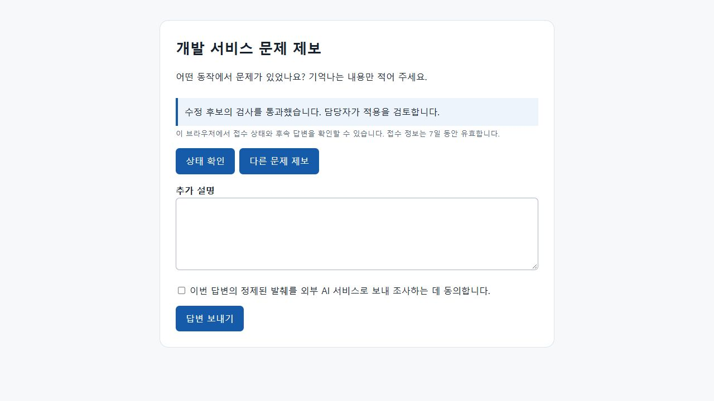

# 공개 제보·자동 처리 검증

2026-09-29. 소유자가 허용한 프로젝트의 공개 접수, 현재 관측 기반 작업 판단, 수정 후보·선택적 비운영 적용·회복·지식 재사용을 연결했다.

## 결과

- 재검토 최종 전체 회귀 **731개 통과, 358.68초**, 실제 테스트 PostgreSQL 포함, 실패·오류·건너뛴 검사 0개. 초기 구현의 전체 결과는 716개 통과, 247.80초였다.
- 임대 검사 보완 직후 공개 처리와 PostgreSQL 경계의 전용 **42개 통과, 53.25초**. 이후 답변 폼 동기화까지 포함한 최종 전체에는 공개 처리 33개와 기존 control-plane 17개가 포함된다. 회복/권한/중단/임대의 새 회귀 15개를 추가했다.
- 공개 입력의 메타데이터까지 비밀 정제를 확인했다. 전체 회귀에 이 검사도 포함한다.
- 운영자 화면의 공개 설정 불러오기·서비스 선택·표시 이름·저장과 공개 endpoint 활성화를 Streamlit AppTest로 확인했다.
- 실제 브라우저에서 대충 한 제보 → 추가 질문 → 발생 시각/요청 ID의 후속 답변 → 동의한 외부 분석의 테스트 모델 → 수정 후보 검사 통과/검토 대기를 확인했다. 성공 후 다음 답변의 동의는 체크되지 않는다.
- 최신 코드로 별도 합성 프로젝트를 다시 기동해 같은 브라우저 흐름을 확인했다. 화면 오류·콘솔 경고/오류는 없었고 실제 외부 호출 0회, 테스트 모델 호출 2회였다.
- 로컬 Markdown 72개 문서의 링크 451개와 Python 124개 파일 문법, pip check, git diff --check를 확인했다. 네트워크 없이 wheel을 빌드해 Python 소스 58개와 마이그레이션 4개의 현재 바이트 일치를 확인했다.

## 재검토에서 수정한 문제

| 재현한 문제 | 수정과 확인 |
| --- | --- |
| 앞선 이벤트 200개 뒤 자동 판단이 있으면 결과 재전송 때 감사 기록이 중복됨 | 화면 페이지와 별도로 종류별 최신 이벤트를 전체 이력에서 조회. 자동 판단·적용·회복의 멱등 감사에 적용. 250개 이력과 재전송을 SQLite/PostgreSQL에서 확인 |
| 과거 회복 성공 이후 새 후속 조사가 실패해도 공개 상태가 RESOLVED로 표시됨 | 현재 성공 작업과 해당 실행·후보의 적용 근거만 반영. 새 실패는 UNRESOLVED. 실제 합성 파일 적용/HTTP 회복 후 새 실패를 두 DB에서 확인 |
| 후보가 대기한 뒤 공개 정책을 꺼도 후보 코드 실행이 시작됨 | PC가 후보 실행 전에 서버의 현재 정책·revision·등록 격리를 확인. 철회된 작업은 실행·추가 모델 호출 전에 실패 기록 |
| 이미 배정된 공개 작업이 소유자 외부 분석 철회 후에도 예전 동의로 모델을 호출함 | 서버의 모델·임베딩 경로에 현재 공개 권한을 적용. 모델 403, 키워드 검색 유지, 추가 외부 호출 0회를 두 DB에서 확인 |
| 중단된 실행기가 작업 재개 후 이전 임대 번호로 실행·자동 적용 허가를 조회함 | 두 허가 API에 배정된 epoch를 요구. 이전 번호는 409, 현재 번호만 허용하는 것을 두 DB에서 확인 |

후속 답변 가능 여부도 API와 화면을 맞췄다. 실제 실패한 작업·철회된 공개 정책에서는 답변 폼을 숨기고 기존 기록과 새 제보 동작을 유지한다.

자동 적용 직전·직후의 실행기 중단도 두 DB에서 검사했다. 적용 전 중단은 확보 후보를 검토 대기로 재전송한다. 적용 후 중단은 영속 적용 영수증으로 회복 검사를 이어가고 원본·모델 제안을 반복하지 않는다.

## 확인한 경계

- 기본 공개 비활성, 운영자 API 접근 차단, 다른 토큰·접수·프로젝트·만료의 404, 입력으로 환경/정책/모델/테스트 공급자를 선택하지 못함.
- 동일 입력·키 재전송과 동일 입력의 별도 접수 토큰/작업 재사용, 공유 사건의 후속 답변 동기화, 한도와 정책 revision.
- 현재 완전한 관측·정확 요청 연결·입력 주체 확인을 통한 안내, 불완전/충돌 자료의 질문, 민감 변경과 실행 버전 차이의 검토, 실패/시간·호출 한도의 미해결.
- 같은 사건의 수정 후보 작업 자동 연결, 서버 커밋 중단 후 캐시 결과 재전송에서 자식 작업 하나만 생성.
- 배정 후 공개 정책·외부 전송 권한 철회, 긴 이력의 결과 재전송, 회복 이후 새 실패의 정확한 상태 표시.
- 공개 실모델 생성 코드의 Docker 요구를 서버와 PC가 검사. 공개 입력은 테스트 공급자 여부를 위조할 수 없음.
- 서버와 PC의 비운영 적용 opt-in, 정책·등록·snapshot/CAS, 작은 diff/민감 변경 검토, 수정 전 실패·동일 수정 후 검사·회귀 통과.
- 테스트 프로젝트의 **실제 파일 원본 적용과 실제 loopback HTTP**. 테스트 서비스가 적용 snapshot을 직접 로드한 뒤 등록 API/회귀·관측 기간을 확인하고 RESOLVED를 기록. 적용 보고 중복 시 작업·적용을 반복하지 않음.
- 등록된 회복 검사 성공과 명시 설정이 모두 있는 카드만 자동 승인. 후보 통과/PENDING과 회복 검증/APPROVED를 구분하는 knowledge_quality.
- 실제 PostgreSQL에서 동일 흐름과 공개 접수·정책의 SQLite export 및 별도 PostgreSQL import의 원 JSON/해시/감사 이력 일치.

## 증거 범위

모델 제안은 **명시적 테스트 모델**이고 합성 공개 프로젝트를 사용한다. 이번 작업의 실제 NVIDIA/OCR/임베딩 외부 호출은 0회다. 신뢰 로컬의 합성 검사 성공을 실모델의 Docker 실행 또는 임의 코드의 안전성 증거로 확대하지 않는다.

실제 프로젝트 장애 해결, 한국어 실모델의 자동 평가 정확도, 기억의 품질/시간/비용 개선, 새 Docker 이미지의 실모델 후보 실행, 공개 HTTPS 배포·부하·팀/조직 인증·운영 배포/롤백은 별도 검증이다. 기존 실제 프로젝트의 공개 정책과 적용 권한은 자동으로 변경하지 않는다.

PR/push의 회귀 workflow를 추가하고 YAML 구조를 확인했다. GitHub 실행 자체와 새 Linux 환경 의존성 설치 성공은 이번 로컬 검증에 포함하지 않는다. 검증용 브라우저/API/PC 실행기와 별도 PostgreSQL 클러스터는 종료했다. 생성한 테스트 DB는 0개다.

재현:

    .\.venv\Scripts\python.exe -m pytest tests/test_public_service.py -q
    .\.venv\Scripts\python.exe -m pytest -q

실제 PostgreSQL 검사는 별도의 테스트 클러스터 URL을 TRACEBRIDGE_TEST_DATABASE_URL에 설정한다. 각 검사는 생성한 테스트 DB만 삭제한다. 구현과 설정은 [기본 서비스 사용법](../guides/basic-service.md), 소스 해시와 실행 수치는 [메타데이터](basic-service.json)에 있다.

시연·실제 공개 전 조건·실패 대응은 [공개 운영 점검표](../guides/basic-service-rollout.md)에 정리했다. 제출용 DRAFT의 manifest와 안내 문구도 현재 문서와 검증 기록을 가리키며 공개 처리·새 마이그레이션·배포/CI 설정을 포함한다. 외부 제출이나 배포는 수행하지 않았다.
