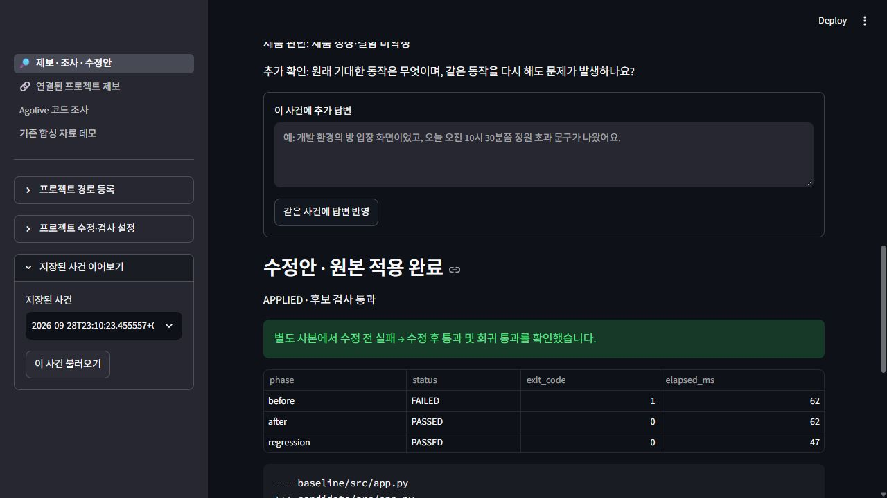
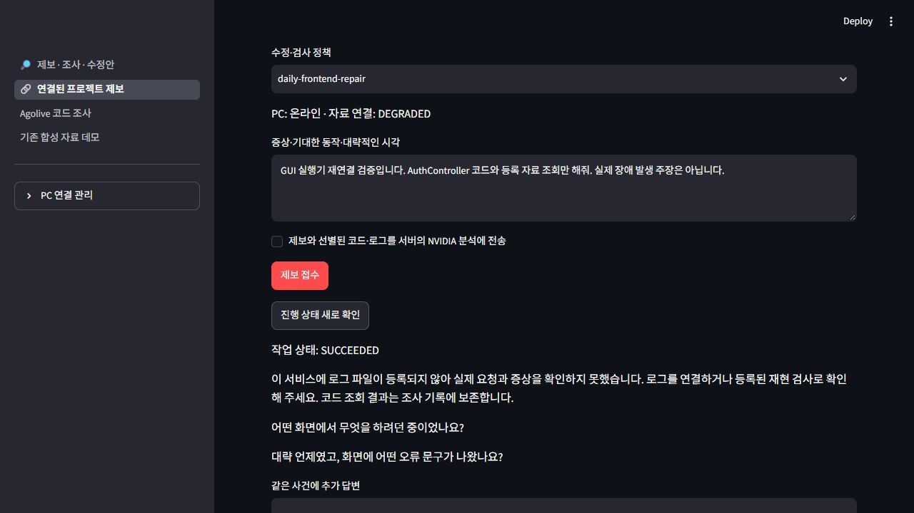

# 로컬 GUI 최종 검증

2026-09-29. Windows / Python 3.12에서 실제 브라우저로 `http://127.0.0.1:8502`를 조작했다. AppTest와 실제 브라우저 검증을 구분한다. [사용법](../guides/real-projects.md), [직전 연결 검증](real-project-operations.md), [기계 판독 기록](local-gui-final.json)을 함께 확인한다.

## 실제 GUI에서 확인한 흐름

| 흐름 | 실제 결과 |
| --- | --- |
| daily 코드·자료 진단과 제보 | 등록된 두 코드 경로를 조회하고 로그 미등록을 명시. 근거 없이 사용자 책임·원인을 확정하지 않음 |
| 프로젝트 경로 등록 | 별도 frontend/backend 경로와 backend JSONL 로그를 화면으로 입력·저장. 빈 표 행을 포함해 저장 |
| 수정·검사 정책 등록 | 수정 대상 frontend, `src/app.py` 허용, 고정 Python 검사와 성공/실패 문구를 화면에서 저장 |
| 제보와 같은 사건 답변 | request ID 제보 후 발생 시각을 추가 답변으로 보내 HTTP 500 로그와 정확 연결 |
| 실제 모델 실패 | 첫 NVIDIA 호출의 HTTP 500을 `MODEL_FAILED`로 보존. 원본 미변경, 적용 버튼 미제공 |
| 같은 사건의 재검증 | 추가 답변으로 새 조사, 실제 NVIDIA 후보 준비. 수정 전 실패 1 → 수정 후 성공 0 → 회귀 성공 0 |
| 검토와 원본 적용 | 검토 전 버튼 비활성, diff 검토 후 공개 검증 프로젝트에 적용. 원본 검사 두 개도 `CHECK_PASSED` |
| 페이지 다시 열기 | 페이지 재로드, 프로젝트 선택, 저장된 사건 불러오기. `APPLIED`·후보 검사·diff를 표시하고 모델 재호출 없음 |
| 실행기 중단·재연결 | 이 작업의 PC 실행기만 중단. GUI에서 daily 읽기 전용 제보 접수 후 `QUEUED`, 재연결 후 `SUCCEEDED`, epoch 1·모델 0회 |

공개 검증 프로젝트 ID는 `gui-local-37a6651e`다. 실제 daily 원본과 DB를 수정한 사례가 아니다. 실제 모델 호출 두 번 중 한 번은 서빙 실패, 한 번은 후보 검증 성공이었다. 첫 실패를 삭제하거나 덮어쓰지 않았다.

## GUI 검증 중 보완

- 등록 표의 `None` 빈 행 처리와 저장 후 새 프로젝트의 명시적 선택.
- 로그 미등록 및 제보 시각 누락을 수집 한도 오류와 구분해 안내.
- 일반 프로젝트 후속 답변을 최신 후보 실행 기록에서 이어가고 이전 후보 표시를 제거.
- 검토 체크를 후보 ID와 diff 해시에 묶어 새 후보에 이전 동의를 재사용하지 않음.
- 원본 적용 후 최소 저장 기록에 `history`가 없을 때 발생하던 `KeyError` 수정.
- 재열기한 적용 완료 상태를 표시하고 적용 버튼을 다시 제시하지 않음.
- 기존 씨드의 후보 검토 흐름도 유지하고 기존 Streamlit 폭 옵션을 갱신.

## 검사와 증거

최종 전체 회귀 **551개 통과(110.50초)**. 새 GUI 통합 검사는 실제 파일·로그·사본 검사·SQLite·적용·재열기를 사용하며 모델 부분은 명시적인 테스트 더블이다. 실제 브라우저 경로는 실제 NVIDIA를 사용했다. `pip check`는 `No broken requirements found`를 반환했다. 마지막 두 브라우저 탭의 error 로그는 0개였다.

상세 로컬 자료는 `output/gui-validation/final-result.json`, `reopened-dom.txt`, `reconnected-dom.txt`, `browser-console.json`에 보존하며 Git에 포함하지 않는다. 새 clone에서도 확인할 공개 화면 네 장은 [검토 전](assets/local-gui/candidate-review.png), [적용 후 재열기](assets/local-gui/applied-reopened.png), [오프라인 대기](assets/local-gui/runner-offline-queued.png), [재연결 완료](assets/local-gui/reconnected.png)로 저장소에 포함했다. 수정 후보 `d8ed43fb625e4a1c8c9beff1a383949d`, 적용 실행 `e186d1b206014cd5ba3954350f118eeb`, 재연결 작업 `eabf58470c0b4518a25cfe043139e93f`를 기록했다.

JSON의 소스 SHA256은 최종 전체 회귀를 수행한 로컬 파일 바이트 기준이다. Git blob ID나 다른 OS의 줄바꿈 변환 후 파일 해시와 구분한다. `artifact_ref`는 이 PC에만 남긴 상세 결과 경로이며 공개 메타데이터와 화면이 저장소의 검증 증거다.

커밋 전 문서 마무리에서 Markdown 57개·내부 링크 350개를 검사해 깨진 링크 0개를 확인했다. 증거 이미지의 패키지 포함과 위장 DB·credential·임시 출력 제외에 대한 기존 패키징 검사 3개를 다시 실행해 모두 통과했다. 위 전체 회귀와 중복되는 검사이므로 합산하지 않는다. 커밋 대상에서 주요 API 키·개인키 패턴 검출은 0개였고 로컬 `output`·DB·인증 파일은 Git 제외 규칙을 유지했다.

## 검증 범위

소유자 전용 localhost HTTP와 신뢰하는 코드의 로컬 검사 범위다. 공개 HTTPS 배포, 새 서버 이미지 설치, 악성 코드에 대한 Docker 격리, 원격 사진, 공개 다중 사용자 인증은 검증하지 않았다. 적용한 공개 예시의 `fix_applied=true`와 실제 서비스 원인·회복 미확인은 분리했다.

최종 세션의 daily 개발 서버 3100/8081은 응답하지 않았으며 원격 실행기의 온라인 표시는 PC 파일 조회 가능 상태다. daily의 지속 로그·실행 SHA는 아직 등록되지 않았다. 앞서 독립 사본에서 통과한 daily 프론트 229개 테스트는 해당 시점의 검사이며 이번 실제 GUI 적용 대상은 별도 공개 검증 프로젝트다. daily 코드·DB·개발 프로세스에 수정·재시작 작업을 수행하지 않았다.
