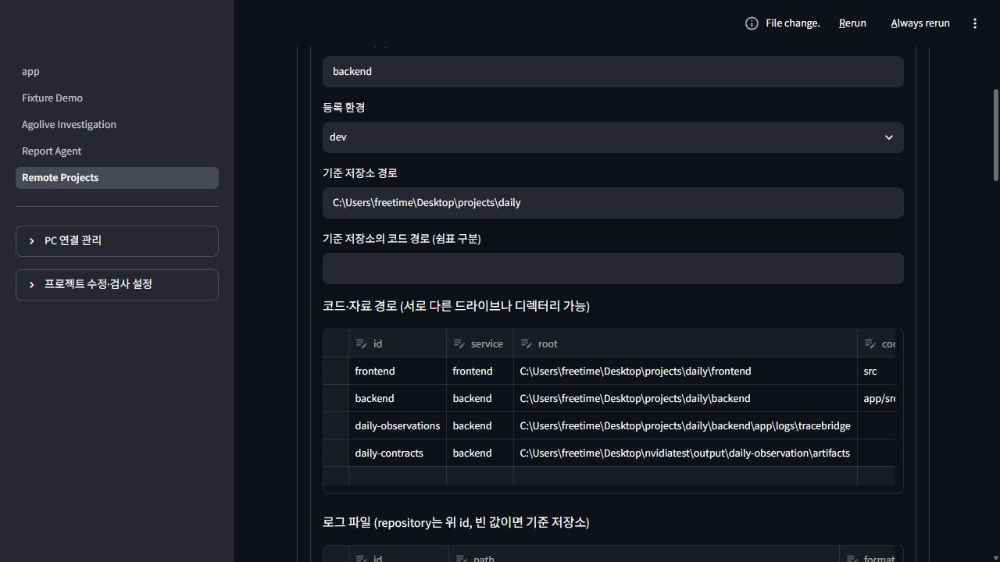
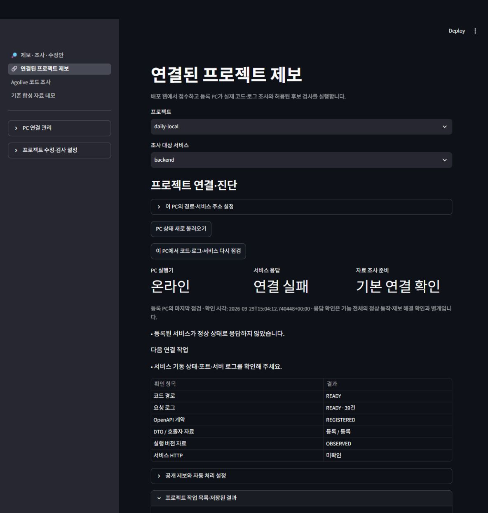

# 프로젝트 경로·연결 진단 검증

2026-09-29~30. 연결 화면의 경로 편집과 서비스별 사실 기반 진단을 추가했다. **최종 전체 756개 통과(284.62초)**이며 실제 PostgreSQL을 포함한다. 실패·오류·건너뛰기 0개다. 실행 이력과 최종 소스 해시는 [메타데이터](project-connection.json)에 기록했다.

## 구현 및 확인

- 기존 프로필 경로·서비스 URL을 불러오는 로컬 소유자 폼, 정책 참조 보존과 오래된 설정의 덮어쓰기 거부.
- PC online, 서비스 HTTP/health, 코드·로그·계약·실행 버전 자료의 독립 표시. 서비스별 범위와 120초 관측 유효성.
- 연결 실패와 401/403·404·redirect·5xx·잘못된 JSON의 구분. HTTP 응답 본문·헤더·로컬 경로는 진단 manifest에 포함하지 않음.
- 실제 loopback HTTP 서버의 UP → DOWN → 연결 종료 전환, AppTest의 설정 저장·직접 점검·원격 화면 입력 비노출, 구 API와 실행기 호환.
- 실제 브라우저에서 daily-local의 저장소·로그·서비스 주소를 확인하고 직접 점검. 기존 요청·사진 접수 흐름은 유지.
- 오래된 직접 점검 결과가 최신 PC 게시 결과를 가리지 않도록 제외. PC 상태 새로 불러오기는 직접 점검 cache를 지우고 게시 결과를 읽음.
- Windows의 실제 읽기 핸들 경합에서 프로필·정책의 원자적 교체 재시도, 영구 거부 시 이전 파일·임시 파일 정리, 재시도 중 변경된 프로필의 덮어쓰기 거부.

관련 107개 검사는 220.17초에 통과했다. 자료 전용 저장소의 코드 연결 제외와 오래된 직접 점검 보완 후 전용 20개 검사가 43.79초에 통과했다. 첫 전체 실행은 750개 중 749개 통과·1개 실패(578.35초)로 기록했다. 실패는 Windows 정책 파일 교체의 WinError 5였고, 검증용 파일에서 열린 읽기 핸들이 같은 오류를 만드는 것을 확인했다. 제한된 재시도 보완 후 연결·읽기 경합·원본 중복 적용 방지 27개 검사가 17.24초에 통과했고, 최종 소스 전체 756개가 284.62초에 통과했다.

## 실제 로컬 관측

갱신한 API·웹·PC 실행기에서 기존 4건의 SUCCEEDED 작업과 인증·실행기 config·프로젝트 설정을 보존했다. daily-local PC는 온라인이었고 프론트·백엔드의 등록 URL은 모두 연결 실패였다. 백엔드는 코드·로그 39건·OpenAPI·DTO/호출자·실행 버전 자료가 연결됐다. 프론트는 코드 경로가 있고 요청 로그·계약·실행 버전 자료가 부족했다.

최종 소스를 현재 로컬 API·웹·PC 실행기에 반영했다. 검증 DB의 잔여 생성 데이터베이스 0개를 확인하고 전용 PostgreSQL 클러스터를 종료했다. 문서 링크·Python 구문과 현재 Python 소스의 wheel 포함을 확인했다. 이전 731개 기록과 당시 소스 해시는 [기본 서비스 검증](basic-service.md)에 보존한다.

이 기록은 대상 서비스의 기동·연결 관측이며 daily 실제 버그 해결이나 기능 전체 정상의 증거가 아니다. 외부 모델 호출, 대상 프로젝트 원본 수정, 자동 적용 권한 변경은 수행하지 않았다.

## 남은 실사용 확인

대상 서비스가 실행 중일 때 실제 사건·요청·실행 버전 대응과 등록된 재현/회귀 검사를 진행해야 한다. 상태 URL의 HTTP 200은 사건 회복을 대신하지 않는다. 실제 NIM 반복, Docker 코드 실행, 공개 HTTPS·부하·팀 인가 등의 기존 출시 조건은 [점검표](../guides/basic-service-rollout.md)를 따른다.
