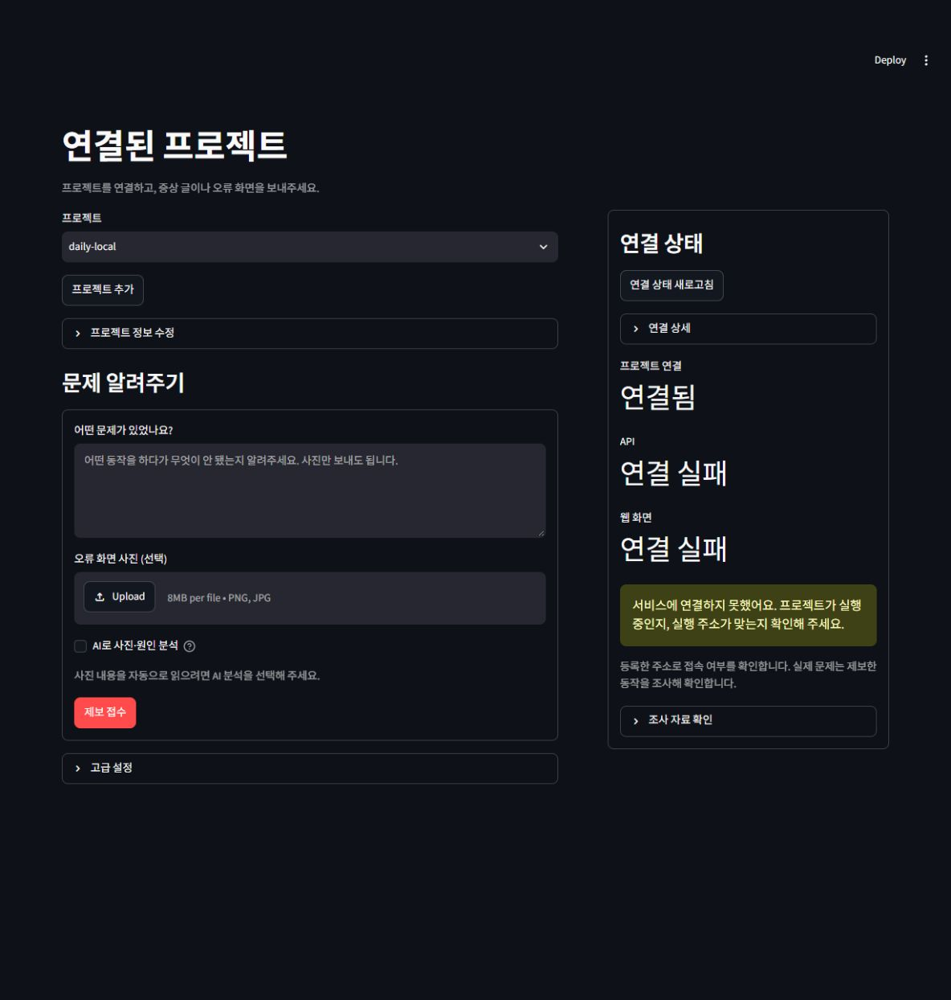

# 간편 프로젝트 화면 검증

2026-09-30. **최종 전체 회귀 782개 통과(307.921초), 실패·오류·건너뛰기 0개**다. 실제 PostgreSQL을 사용한 저장소 검사가 포함된다. JUnit 경로·해시와 핵심 소스 해시는 [검증 메타데이터](simple-project.json)에 기록한다. 이전 756개 회귀는 [연결 진단 검증](project-connection.md)의 당시 결과로 보존한다.

문서·패키지 검사와 마지막 화면 표시 조정 뒤 간편 흐름 및 제출 초안 전용 **27개 검사도 통과(20.30초)**했다.

## 확인한 흐름

- 기본 화면은 **연결된 프로젝트**다. 왼쪽에 이름·프로젝트 폴더·선택적 실행 주소만 묻는 등록 폼, 글/사진 제보와 후속 설명을 놓고 오른쪽에 프로젝트 PC와 대상 웹/API의 상태를 표시한다. 서비스 범위·수정 검사 정책·운영 기능은 고급 설정에 있다.
- 신규 로컬 프로젝트의 전용 실행기 연결은 범위가 해당 프로젝트 하나로 제한된다. 기존 프로젝트 인증 파일과 정책·서비스 연결을 유지하고, 다른 PC에 이미 연결된 프로젝트를 임의로 재연결하지 않는다. 새 등록만으로 원본 수정·코드 실행 권한은 생기지 않는다.
- 글 없이 PNG/JPEG 사진 한 장만 접수할 수 있다. 전송 전 크기·픽셀 수·형식을 검사하고 제한된 JPEG로 변환한다. **AI로 사진·원인 분석**을 선택하지 않으면 외부 OCR·vision을 호출하지 않고 화면의 문구·동작을 추가로 묻는다.
- 분석을 선택하면 서버가 현재 임대한 작업에 등록된 사진만 OCR/vision에 전달한다. 임의 이미지 주소, 다른 작업 사진, 만료된 임대·철회된 동의로 호출할 수 없다. 실패/미확인 호출을 무작정 반복하지 않고 저장한 단계 결과를 재사용한다. 공개 제보 API는 이 소유자 전용 사진 경로와 별개다.
- 서비스가 여러 개인 프로젝트에서는 기본 범위를 사용하고 후속 제보는 원 사건의 서비스에 묶는다. 수정 후보 검사는 같은 서비스에 등록된 정책만 고른다.

실제 브라우저에서 기본 화면의 왼쪽 등록·제보, 오른쪽 서비스 상태와 숨겨진 기본 탐색을 확인했다. [기본 화면](assets/project-connection/simple-dashboard.png)을 보존한다. 사진 파일을 실제 브라우저에서 최종 접수해 외부 모델까지 호출한 검증은 아니다. 파일 입력 표시와 기본 화면은 Streamlit AppTest로, 사진 접수·변환·동의·서버/실행기 전달은 테스트 클라이언트로 검증했다.

## 실제 로컬 연결과 남은 조건

기존 `daily-local`의 작업 4건, 소유자 토큰·PC 연결 정보·프로젝트 프로필은 보존했다. TraceBridge PC 실행기는 연결됐으나 등록된 대상 웹과 API의 HTTP 주소는 연결 실패로 표시됐다. 이는 대상 서비스가 지금 작동한다고 판단할 수 없다는 의미다. 프로젝트 폴더나 실행기 연결만으로 실제 기능 정상·오류 재현·장애 해결을 주장하지 않는다.

현 소스의 문서 링크와 Python 파일 점검에서 오류가 없었다. 배포용 검토 초안에는 간편 화면·사진 전달 코드·가이드·검증 기록이 포함됐고 인증 파일·DB·로컬 실행 산출물은 제외됐다. 설치용 wheel에도 신규 Python 모듈이 포함됐다. 전용 PostgreSQL의 잔여 테스트 DB 0개를 확인하고 해당 클러스터를 종료했다.

대상 앱이 실행될 때 신고 요청·로그·실행 버전·계약을 같은 사건에 대응시키고, 등록된 재현/회귀 검사와 실제 사용자 여정을 확인해야 한다. 외부 NVIDIA 모델의 이 변경에 대한 실호출, 공개 사진 접수, 팀 인가·공개 HTTPS 운영은 이번 검증 범위가 아니다. [운영 조건](../guides/basic-service-rollout.md)을 따른다.
