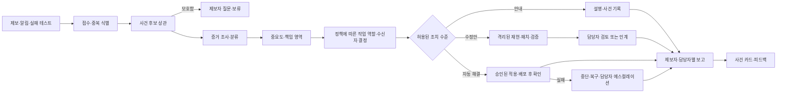

# 사건 흐름, 담당자 라우팅, 보고

## 전체 흐름

## 상태와 불변 조건

`RECEIVED → CORRELATING → NEEDS_CONTEXT | IDENTIFIED → INVESTIGATING → CLASSIFIED → ROUTED → ACTION_PLANNED → [CHANGE_PREPARED → VERIFYING → WAITING_REVIEW | APPLYING → POST_VERIFYING] → RESOLVED | INCONCLUSIVE | REJECTED | ROLLED_BACK`.

사건 식별, 실제 결함 관측, 원인 확인, 수정 재현, 배포 후 해결은 **별도 사실**이다. 중복 제보가 같은 `Incident`에 합쳐져도 각 `Report`의 제출자와 통지 상태는 유지한다. 모든 상태 전이는 실행 주체·시각·근거·정책 결정을 사건 이벤트로 기록한다. 시간 초과·도구 오류·새로운 반대 근거가 나오면 이전 성공 가설을 유지한 채 강행하지 않는다.

## 접수와 사건 식별

먼저 요청 ID/trace ID 정확 일치, 프로젝트·환경·시간·메서드·경로의 제한된 후보 검색을 규칙으로 수행한다. [OpenTelemetry 로그 상관](https://opentelemetry.io/docs/specs/otel/logs/)처럼 trace ID와 서비스 버전이 수집되면 연결 근거로 쓴다. ID가 없고 여러 후보가 남을 때는 에이전트가 후보를 구별할 관측이나 제보자에게 물을 **최소 질문**을 선택한다. 단어가 비슷하다는 이유만으로 로그를 동일 사건으로 확정하지 않는다. 프론트 캡처가 없는 일반 제보도 허용하지만 식별 불가능한 경우 `NEEDS_CONTEXT`가 정상 결과다.

## 분류와 반증

규칙 검사기는 제보된 상태·메서드·경로·오류 코드와 실제 요청을 대조한다. 에이전트는 남은 가설마다 `지지 증거`, `반대 증거`, `구별할 다음 조회`를 기록하고 관련 도구를 선택한다. 예를 들어 “500” 제보의 실제 응답이 422라면 입력·API 계약을 확인하고 불필요한 백엔드 패치를 막는다. 실제 500과 DB 예외가 연결되면 배포된 코드와 스키마·마이그레이션 상태를 대조한다. 스키마가 정상이라면 첫 가설을 폐기한다.

분류값은 관측 결과와 책임 판단을 섞지 않는다. `REPORT_CONTRADICTED`, `EXPECTED_BEHAVIOR`, `CALLER_CONTRACT_ERROR`, `APPLICATION_DEFECT`, `INFRA_OR_DB_DEFECT`, `SECURITY_SUSPECTED`, `UNDETERMINED`를 시작 분류로 둔다. 사용자의 입력이 잘못됐더라도 계약·문서·UI가 혼동을 만들었다면 별도 개선 과제를 남길 수 있다. `SECURITY_SUSPECTED`는 공개 제보 화면에 상세 내용을 노출하지 않는다.

## 중요도, 작업 역할, 알림 수신자

중요도는 `P0 긴급 / P1 높음 / P2 보통 / P3 낮음 / 미정`으로 제안한다. 입력은 재현성과 관측된 장애율, 영향 사용자/핵심 기능, 환경, 데이터 손상 가능성, 보안 민감도, 중복 제보 수다. 관측되지 않은 영향은 추측으로 표시한다. 프로젝트 정책이 최종 중요도와 에스컬레이션을 결정하고 담당자는 수정할 수 있다.

에이전트 역할은 별도 모델을 뜻하지 않는다. **허용 도구와 책임이 다른 논리적 작업자**다: `Correlation`(사건 상관), `Diagnosis`(원인 조사), `Frontend/Backend Repair`(허용된 저장소 수정), `Data/Infrastructure`(DB·배포 상태 진단), `Security Review`(제한된 보안 분류), `Communicator`(권한별 보고). 모델은 필요한 역할을 제안할 수 있지만, 정책 엔진이 프로젝트·변경 유형·권한을 검사해 실제 작업자를 시작한다.

책임 팀/사람은 서비스-저장소 매핑, CODEOWNERS 또는 프로젝트의 소유자 설정, 현재 온콜, 사건 분류를 순서대로 사용한다. 소유자가 충돌하거나 없으면 프로젝트의 기본 triage 큐로 보낸다. `P0/P1`은 설정된 온콜로, 보안 의심은 제한된 보안 수신자로 보낸다. 신고자에게는 접수·추가 질문·해결 여부를, 담당자에게는 내부 근거·변경·테스트를 보여준다. 메시지의 수신자와 공개 범위는 정책으로 확정한다.

## 해결과 보고

분류 후 가능한 결과는 (a) 사용법·입력 안내, (b) 결함은 확인했으나 조치 보류, (c) 검토 가능한 수정안, (d) 정책이 허용한 자동 해결, (e) 증거 부족이다. 수정은 기준 배포 커밋의 격리 사본에서 재현 테스트를 먼저 실행하고 같은 테스트·회귀 검사로 검증한다. 배포까지 자동화한 경우에도 배포 후 관측이 회복됐는지 확인한 뒤에만 `RESOLVED`로 표시한다. 실패하면 중단·복구·담당자 통지를 수행한다.

한 사건의 보고에는 `제보와 실제 관측`, `분류·중요도·책임자`, `주요 근거와 미확인 사항`, `수행한 작업`, `검증 범위`, `제보자에게 안내한 내용`, `다음 조치`를 담는다. 보고자의 접근권한에 따라 외부용/내부용 내용을 나눈다. 자동 알림과 외부 시스템 전송은 프로젝트 설정의 수신자에게만 수행한다.
