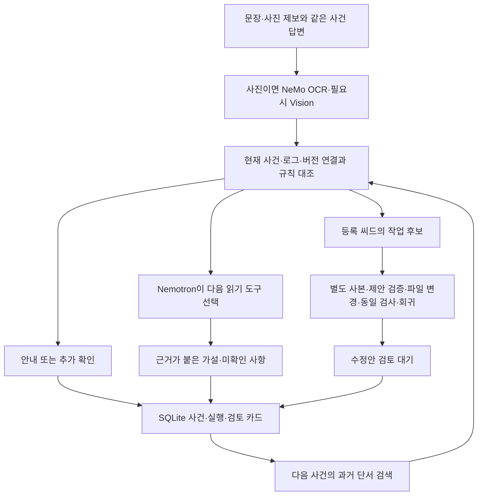

**TraceBridge 독립 분석 보고서 — NVIDIA × 패스트캠퍼스 해커톤**

분석일은 2026-09-28입니다. 최종 분석 기준은 **20:39:51 KST에 복사한 작업 트리**이며, HEAD는 `34ce50b0cf6f214726e64a3fbee1f4195c397d4e`입니다. 미커밋 변경과 새 파일을 포함한 상태를 분석했습니다. 이 커밋 하나를 checkout하면 분석한 모든 기능이 재현된다는 의미는 아닙니다. 다른 세션의 소스 변경은 보존했고, 분석 자료와 이 보고서만 `output/independent-review-478db4531b/`에 만들었습니다.

분석 마무리 시 다른 세션이 제보 페이지의 한국 시각 표시, 프로젝트 전환 시 전송/자동 작업 선택 초기화, 조사와 수정 제안의 호출 수 구분을 추가했습니다. 그 diff도 읽었으며 아래 핵심 판단과 로그 절단 재현에는 영향이 없습니다. **247개 통과 기록은 위 스냅샷의 결과**이고 이 후속 UI 변경까지 포함한 새 전체 회귀 결과로 표현하지 않습니다.

**아이디어는 Creative Use-case 트랙에 적절합니다.** 소프트웨어 운영을 위한 솔루션이라는 이유로 주제에서 벗어나지 않습니다. 다만 현재 구현의 적절한 설명은 “거친 제보를 관측과 대조하고, 제한된 조사를 수행하며, 등록된 개발 사례의 검증된 수정안을 준비하는 로컬 서비스”입니다. “아무 프로젝트나 연결하면 모든 문제를 자동 해결하고 완벽하게 관리한다”는 설명까지 뒷받침하지는 못합니다.

사진의 **NeMo Framework 또는 NeMo Microservices 활용** 조건에는 충족 근거가 있습니다. NeMo Retriever OCR을 실제 기능에 연결했고, 저장된 호스팅 호출 성공 기록도 확인했습니다. 반면 가장 큰 개선 과제는 기술 제품의 수를 늘리는 일이 아니라 **실제 프로젝트와 연결한 한 가지 사건의 처리 완결성, 기억이 주는 효과, 판정 오류를 막는 검증**입니다.

기존 회귀 검사는 최신 스냅샷에서 **247개가 모두 통과**했습니다. 그러나 별도 탐색에서 **로그가 잘릴 때 반대 증거를 잃고 안내를 확정하는 문제**를 재현했습니다. 이 문제는 제출 전 우선 수정해야 합니다. 테스트 통과와 서비스의 모든 상황에서의 올바른 판단은 구분해야 합니다.

검토 범위와 증거를 먼저 명확히 합니다. 주요 조사·접수·기억·변경 작업자·UI·CLI·설정·테스트와 제품/대회 문서를 읽었습니다. 다른 세션과 충돌하지 않도록 소스 105개 파일을 별도 스냅샷으로 복사했습니다. 초기 스냅샷의 244개 검사가 통과한 뒤, 다른 세션에서 추가한 세 검사와 조사 변경을 포함해 최종 스냅샷의 247개를 다시 확인했습니다. 최초 제한된 Windows 실행에서는 pytest 임시 폴더 접근 오류가 발생했으며, 정상 파일 권한으로 실행하자 전체 검사가 통과했습니다. 애플리케이션의 기능 실패와 실행 환경의 권한 오류를 구분했습니다.

| 확인 항목 | 이번 분석에서 확인한 결과 | 해석의 범위 |
| --- | --- | --- |
| 전체 회귀 | `247 passed in 52.64s` | 설치된 기존 Python 환경의 코드·통합·Streamlit AppTest 검사. 운영 품질/모델 정확도 100%라는 뜻은 아님 |
| 합성 사건 세 종류와 정보 부족 | 안내·작업 후보·보류 분기를 독립 실행 | 실제 프로젝트의 모든 오류 유형을 검사한 것은 아님 |
| 일반화 탐색 | `account_id/accountId` 사례가 `GUIDANCE`로 분류됨 | 현재 판정기가 샘플의 이름에 의존한다는 증거 |
| 로그 절단 탐색 | 짧은 로그는 보류, 바이트/줄 제한으로 잘린 로그는 안내 확정 | 현재 범위 완전성 판단의 구체적인 오류 |
| 기존 NVIDIA 산출물 | OCR, Super 조사, Omni 사진 해석, Super 수정 제안의 성공 기록 확인 | 이번 분석에서 외부 모델을 새로 호출한 결과는 아님 |
| 실제 수정 산출물 | diff, 후보 6개 파일, 원본 6개 파일의 저장 해시 일치 확인 | 씨드 사본의 변경·검증 증거. 원본 적용/배포/운영 회복은 아님 |
| 제출 패키지 검사 | 분석 스냅샷에서 생성된 ZIP에 소스 100개, 씨드·OCR 코드 포함, `.env` 제외 | 새 컴퓨터의 처음 설치나 실시간 NVIDIA 종단 시연까지 검증한 것은 아님 |

직접 확인한 근거는 [최종 스냅샷 목록](C:/Users/freetime/Desktop/nvidiatest/output/independent-review-478db4531b/snapshot-final-manifest.json), [회귀 검사 출력](C:/Users/freetime/Desktop/nvidiatest/output/independent-review-478db4531b/pytest-final-output.txt), [회귀 XML](C:/Users/freetime/Desktop/nvidiatest/output/independent-review-478db4531b/pytest-final-results.xml), [일반화 탐색 결과](C:/Users/freetime/Desktop/nvidiatest/output/independent-review-478db4531b/offline-probes.json), [로그 절단 탐색 결과](C:/Users/freetime/Desktop/nvidiatest/output/independent-review-478db4531b/log-truncation-probes.json)에 보존했습니다.

대회 적합성은 사용자가 제공한 사진의 조건과 공개 모집 페이지를 구분해서 판단해야 합니다. 공개 소개도 목표를 받아 계획하고 도구를 호출해 실제 문제를 해결하는 에이전트를 요구합니다. 운영 오류 처리 서비스는 이 방향에 잘 맞습니다. 심사 배점이나 수상 가능성을 확인할 자료는 없으므로 임의의 점수나 수상 확률은 제시하지 않습니다. [패스트캠퍼스 공식 대회 소개](https://fastcampus.co.kr/NVIDIA_hackathon?trk=public_post_comment-text)

| 사진의 항목 | 현재 판정 | 판단 근거와 보완할 점 |
| --- | --- | --- |
| 가장 독창적인 AI 에이전트 & 서비스 | **주제 적합, 차별성 증명 필요** | 제보→관측→작업→기억이라는 사용 사례는 적절함. 일반적인 AI 디버거와 다른 가치를 보여야 함 |
| 스스로 판단하고 실행 | **부분 충족** | Nemotron이 다음 코드/로그 조회를 선택하고 검색어를 바꾼 실제 기록이 있음. 등록 씨드의 수정 제안·후보 적용·검사도 연결됨. 범용 작업 역할/모델 수준 선택은 없음 |
| 진짜 문제를 해결 | **제품 문제는 명확, 실프로젝트 해결 증거는 부족** | 반복 제보 처리의 부담은 타당한 문제임. 현재 수정 성공은 인프로세스 씨드 앱에 한정됨 |
| 모델 서빙 기반 에이전트 구현 | **방향 부합** | 호스팅 NVIDIA NIM을 사용함. 사진에는 참가자 로컬 GPU 사용을 필수라고 쓰지 않음 |
| NeMo Framework 또는 NeMo Microservices | **Microservices 활용의 기술적 근거 확인** | 사진 접수에서 NeMo Retriever OCR 실제 호출. Framework 학습이나 일반 LLM NIM만 사용했다는 주장과 구분 |
| 재현 가능한 코드 | **기반 있음, 제출본 고정 필요** | 코드·검사·예시·패키징 있음. 미커밋 기능, 의존성 범위, 누락된 실행 증빙을 고정해야 함 |
| 작동하는 데모/서비스 | **로컬 제한 범위에서 구현** | 접수·같은 사건 답변·후보 선택·수정안·기억 검토 UI와 검사가 있음. 최신 UI 사진 업로드부터 실제 외부 호출까지의 새 종단 검증은 별도 필요 |
| Nemotron/NIM/NAT/Skills/Skill Spector/OpenShell 목록 | **일부 실제 사용, 일부 보조/미구현** | 사진만으로 나열된 도구 전부가 필수라고 단정할 근거는 없음. 실제 사용 범위는 정직하게 구분해야 함 |

NVIDIA 문서는 NeMo Framework, Microservices, Agent Toolkit을 구분합니다. **NAT를 설치했거나 Nemotron을 호출했다는 사실만으로 해당 필수 조건을 충족했다고 설명하는 것은 약합니다.** 이 프로젝트에는 그보다 직접적인 OCR 사용 근거가 있습니다. 공식 문서는 Image OCR을 NeMo Retriever의 OCR 마이크로서비스로 설명하며, NVIDIA가 배포한 OCR v2 모델 카드도 NeMo Retriever 소속을 명시합니다. 따라서 “사진 제보 접수에 NeMo Retriever OCR Microservice를 사용했다”는 설명은 기술적으로 타당합니다. 최종 전형별 인정은 주최 측의 실제 안내를 따라야 합니다. [NeMo 제품 구분](https://docs.nvidia.com/nemo/), [Image OCR 공식 문서](https://docs.nvidia.com/nim/ingestion/image-ocr/latest/overview.html), [NVIDIA OCR v2 모델 카드](https://huggingface.co/nvidia/nemotron-ocr-v2)

공개 페이지의 예선 안내에는 별도의 교육 미션 **Securing Agents with NemoClaw and OpenShell** 확인과 `build.nvidia.com`의 “Skill API” 활용이 적혀 있습니다. 프로젝트의 일반 호스팅 NIM 호출을 그 문구와 자동으로 동일시하면 안 됩니다. 저장소의 신청 초안도 이 의미를 주최 측에 확인할 질문으로 남겨두었습니다. 또한 공식 이미지 안에 9/28과 10/02가 함께 보여 일정이 일치하지 않고, 본선 미션은 당일 안내라고 적혀 있습니다. **사진의 기술 조건, 예선의 교육/접수 조건, 본선의 별도 미션은 서로 다른 확인 항목**입니다. 프로젝트 파일로 교육 이수나 팀 신청 완료까지 확인할 수는 없습니다. [공식 예선 안내 이미지](https://cdn.day1company.io/prod/uploads/202609/175812-1931/group-2086389378.webp), [공식 예선 단계 이미지](https://cdn.day1company.io/prod/uploads/202609/153942-1931/%E1%84%80%E1%85%A2%E1%84%8B%E1%85%AD-01.webp), [본선 안내 이미지](https://cdn.day1company.io/prod/uploads/202609/153945-1931/%E1%84%80%E1%85%A2%E1%84%8B%E1%85%AD-02.webp)

현재 코드의 구조는 예상보다 서비스 흐름에 가까워졌습니다. 최종 스냅샷의 기본 화면은 예전 fixture 선택 화면이 아니라 **제보·조사·수정안**입니다. 프로젝트 선택, 거친 문장/사진 접수, 후보 동작 확인, 같은 사건의 후속 답변, 허용된 수정안 준비, 카드 검토가 한 페이지에 연결돼 있습니다. 자동 수정안 준비를 선택하면 저장된 적격 씨드 사건에서 작업자로 이어집니다. 아직 가입 동작은 실제 HTTP 서버가 아니라 등록된 Python 요청 생성기와 인프로세스 API입니다.



| 핵심 구성 | 실제 책임 | 현재 한계 |
| --- | --- | --- |
| `report_contract.py` | 접수 범위, 시간대, 실행 상태, 행동 제한 | 제한된 표현/시간 해석. 범용 대화 의미 이해는 아님 |
| `report_intake.py` | ID 정확 연결, 시간/작업 후보, 관측 충돌 | 로컬 목록 또는 제공된 관측. 연속적인 운영 수집은 아님 |
| `triage.py` | 제보 항목 대조와 안내/조사/작업 후보 | 구체적인 이름에 의존한 진단 규칙 |
| `report_agent.py` | OCR·Vision·읽기 도구·Nemotron 반복·증거 확인 | 일반 프로젝트 수정 실행이나 DB/계약 조회 연결기 없음 |
| `project_sources.py` | Agolive 코드 검색, 제한된 로그 파싱·Docker 조회·버전 출처 | 고정된 프로젝트 구조, 키워드 검색, 로그 절단 문제 |
| `incident_memory.py` | 실행/카드 저장·검토·정확 신호/FTS5 검색·현재 재확인 | 매뉴얼 자동 정리·의미 검색·효과 비교는 없음 |
| `change_policy.py`, `change_proposal.py`, `change_worker.py` | 등록 정책/해시, 제안 검증, 씨드 사본 변경과 검사 | 한 종류의 요청 사전 키 편집. OS 격리/원본 적용/배포 없음 |
| `seed_project.py`, `report_service.py` | 현재 씨드 동작 캡처, 조사와 수정안/답변 연결 | 일반 저장소 등록 시스템은 아님 |
| `nat_workflow.yml`, `nat_plugin.py` | NAT의 합성 읽기 도구 네 개 | 최신 주 조사 흐름과 별도이며 fixture 중심 |
| `skills/tracebridge-triage/SKILL.md` | 프로젝트 조사 지침 | 예전 fixture/NAT 경로에서 읽음. 최신 조사 경로의 자동 성장 매뉴얼은 아님 |

중요한 코드는 [접수·조사](C:/Users/freetime/Desktop/nvidiatest/tracebridge/report_agent.py:435), [규칙 판정](C:/Users/freetime/Desktop/nvidiatest/tracebridge/triage.py:43), [프로젝트 자료](C:/Users/freetime/Desktop/nvidiatest/tracebridge/project_sources.py:121), [사건 기억](C:/Users/freetime/Desktop/nvidiatest/tracebridge/incident_memory.py:492), [수정 작업자](C:/Users/freetime/Desktop/nvidiatest/tracebridge/change_worker.py:151), [서비스 UI](C:/Users/freetime/Desktop/nvidiatest/pages/2_Report_Agent.py:20)에 있습니다. 이후 다른 세션이 변경하면 줄 번호나 동작이 달라질 수 있으므로 확정 기준은 분석 스냅샷입니다.

사용자가 제안한 첫 기능은 **실현 가능하고 핵심 MVP로 적절**합니다. 자연어 증상을 받아 실제 관측과 연결하고, 명확한 검증 응답은 빠르게 안내하며, 불명확한 사건에서는 에이전트가 필요한 자료를 찾아야 합니다. 현재 코드에도 그 뼈대가 있습니다. 주 조사 경로는 최대 모델 4회·읽기 도구 6회이며, 알려진 규칙 판정에서는 모델 없이 끝낼 수 있습니다. 사진에서 읽은 ID/문구는 제보 단서로만 취급하고, 서버 증거와 별도로 보존합니다.

첫 기능에서 주의할 점은 **“오보”, “사용자 실수”, “서비스 문제”를 한 축으로 묶지 않는 것**입니다. “500이 난다”는 보고가 실제 422와 달라도 “가입이 안 된다”는 증상은 사실일 수 있습니다. 호출자가 잘못된 필드명을 생성한다면 고객에게 입력을 다시 하라고 안내하는 것으로 끝나지 않습니다. 보고된 HTTP 상태의 일치 여부, 제품 동작의 실패 여부, 책임 영역, 조치 필요성을 별도로 판단해야 합니다. 현재 코드가 HTTP 제보와 관측을 분리하고 4xx만으로 사용자 책임을 확정하지 않는 점은 유지해야 합니다.

“적절한 수준의 에이전트”는 적어도 세 축으로 정의하는 편이 좋습니다. **업무 역할**은 호출자/프론트, 백엔드, 데이터/인프라 등을 뜻합니다. **자동화 권한**은 조사만, 수정안 준비, 비운영 적용, 운영 반영을 뜻합니다. **추론 자원**은 규칙만 사용하거나 작은/큰 모델을 선택하는 것입니다. 중요도가 높다는 이유만으로 모델 크기나 쓰기 권한을 함께 올리면 안 됩니다. 지금의 `work_role`은 역할 이름을 반환하는 라우팅이지, 각 역할의 작업 에이전트를 실제 호출하는 시스템은 아닙니다. 일반 조사에는 기본 Super를 사용하며 난도별 모델 라우터도 없습니다.

현재 기능에 맞는 목표는 **한 등록 프로젝트에서 A0 조사와 A2 수정안 준비까지 연결**하는 것입니다. 큰 모델을 모든 단계에 사용하거나 발표를 위해 에이전트 개수를 늘릴 이유는 없습니다. 정형 비교·권한·최종 성공 판정은 프로그램이 담당하고, 모델은 모호한 증상의 해석·다음 구별 조회·해결 후보를 담당하는 구성이 적절합니다. 여러 에이전트를 쓰더라도 도구 권한, 예산, 근거 전달, 종료 조건이 달라지는 실질적인 역할이어야 합니다.

두 번째 기능인 **프로젝트에 맞춰 발전하는 매뉴얼**도 방향이 좋습니다. 다만 지금의 기능은 SQLite에 사건과 실행을 저장하고 검토된 카드를 검색하는 **검색형 기억의 첫 단계**입니다. 모델의 가중치를 학습하거나, 모든 기록을 자동으로 사실인 매뉴얼로 승격하는 기능은 없습니다. 검토 승인과 사실/수정 검증을 구분하고 과거 자료를 현재 증거로 쓰지 않는 설계는 좋은 출발점입니다.

실제로 쓸 수 있는 매뉴얼로 발전하려면 사건마다 증상·적용 환경·서비스/컴포넌트·계약/코드 버전·확인된 원인·재현 절차·수정안·검사 결과·실패한 접근·재사용 조건을 정리해야 합니다. **승인된 조사 단서, 검증된 후보 수정, 배포 후 해결된 사건**은 다른 유형으로 남겨야 합니다. 현재 카드 생성은 안내 외에는 기본적으로 `UNCONFIRMED`이며, 씨드 수정은 `prepared_change`의 별도 검증 범위를 기록합니다. 이 분리는 올바르지만 사용자에게 보이는 매뉴얼/패턴 정리 화면은 아직 없습니다.

기억은 시간이 흐른다고 저절로 더 정확해지지 않습니다. 잘못된 카드가 늘거나 API 계약이 바뀌면 오히려 조사 품질을 낮출 수 있습니다. 승인·수정·반려 외에도 적용 버전/환경, 만료/대체, 재사용 후 결과, 실패한 패치의 기록이 필요합니다. 같은 사건의 여러 실행 카드가 검색 결과를 독점하지 않도록 중복을 묶는 것도 좋습니다. 처음에는 정확 신호와 FTS5로 충분히 평가하고, 의미 검색이 필요한 누락이 관측될 때 Retriever embedding/reranking을 추가하는 편이 낫습니다.

현재 기억 검색은 오류 코드/경로/예외/스택 지문에 고정된 가중치를 주고 최대 두 카드를 반환하며, 정확 신호 검색에 결과가 있으면 FTS5를 사용하지 않습니다. 같은 경로의 무관한 카드가 상위 결과를 채울 수 있고, 한국어의 다른 표현을 충분히 연결하는 검색도 아닙니다. 또한 재확인은 기존 판정을 바꾸는 규칙이 아니라 단서의 상태를 기록하는 기능이며, 알려진 빠른 판정은 기억을 조회하기 전부터 결정됩니다. 따라서 **“과거 카드 적중”을 “조사 시간 절감”이나 “AI가 학습했다”로 발표하면 근거가 부족합니다.**

세 번째 기능인 **제보 없는 문제 감지와 종합 관리**는 장기 확장으로 적절하지만, 이번 해커톤의 핵심 범위로 잡으면 너무 넓습니다. 현재 제보 없는 조사 기능은 입력으로 이미 제공한 사건을 조사하는 수준입니다. 운영 로그/APM을 계속 수집하고 새로운 문제를 탐지하는 watcher, 전체 API 검사, 브라우저 실테스트, 성능 원인 조사, CI/배포와 사후 검증은 구현되지 않았습니다.

확장은 같은 사건 파이프라인의 **입력원을 추가하는 순서**로 하는 것이 좋습니다. 먼저 기존 관측 시스템이나 JSON 로그의 새 오류를 받아 중복을 묶고, 그 사건을 기존 조사기에 넣습니다. 이후 인증과 테스트 데이터를 갖춘 비운영 API 검사, 핵심 사용자 여정의 브라우저 검사, 변경된 코드의 영향 분석을 단계적으로 추가합니다. 성능 문제에는 오류 문구 검색 외에 지연 분포·오류율·요청량·배포 시각 같은 정량 관측이 필요합니다. 단순한 5xx나 WARN 증가만으로 성능 원인을 확정해서는 안 됩니다.

“완벽한 관리”는 측정 가능한 제품 계약으로 바꾸는 편이 좋습니다. 예를 들어 “등록된 핵심 사용자 여정 세 개와 API 다섯 개를 매 배포에서 검사하고, 실패하면 근거가 붙은 사건과 수정안을 준비한다”는 목표는 검증할 수 있습니다. 전체 코드의 모든 결함을 없애거나 모든 API 조합을 검사한다는 약속은 인증·상태·데이터·동시성·외부 의존성 때문에 증명하기 어렵습니다. 일반 프로젝트까지 넓히기 전에 좁은 범위에서 처리 완결성을 보여야 합니다.

현재 프로젝트에서 유지할 만한 장점은 구체적입니다. 모델 문장을 최종 사실로 취급하지 않고, 실제 관측을 프로그램에서 대조합니다. 복수 후보·범위 충돌·누락 필드·버전 불일치에서 보류하는 경로가 있습니다. 모델이 만든 ID를 사건 식별 증거로 승격하지 않고, 도구도 등록된 읽기 도구만 제공합니다. 실패/시간 초과/호출 예산 소진과 조사 결과를 별도로 기록합니다. 저장 실패의 재시도는 모델이나 수정 작업을 다시 실행하지 않습니다. 씨드 수정에서는 원본·검사 파일·입력·AST의 나머지를 보존하고 같은 검사와 회귀를 확인합니다. 이는 심사에서 구체적인 동작으로 보여줄 수 있는 강점입니다.

NVIDIA 사용도 단순한 의존성 표기만 있는 것은 아닙니다. 저장된 사진 조사 기록에는 OCR 이후 Super가 `search_code → find_logs → finish_investigation`을 선택한 세 응답이 있습니다. 자연어 조사에서는 첫 검색 후 다른 검색어로 다시 찾는 흐름도 있습니다. 씨드 수정에서는 실제 Super 응답을 구조화 제안으로 받아 프로그램이 검증한 뒤 실제 파일을 바꿨습니다. 초기 형식 위반 응답을 거절한 기록도 보존돼 있습니다. [기존 NVIDIA 검증 설명](C:/Users/freetime/Desktop/nvidiatest/docs/nvidia-validation.md), [실제 씨드 수정 기록](C:/Users/freetime/Desktop/nvidiatest/output/changes/241fe70fb7bc46088407339f5bceffe2/result.json)

| 보존된 실제 호출 | 관측된 시간/호출 | 이번 분석에서 확인한 의미 |
| --- | --- | --- |
| OCR smoke | 약 1.625초 | `ROOM_FULL`와 ID 라벨 추출 성공 기록. 한국어 전체/모든 사진 성능 증거는 아님 |
| 사진 제보 조사 | 전체 8.360초, Super 3회, OCR 포함 | 모델이 읽기 도구를 선택한 실제 경로 |
| 거친 자연어 조사 | 전체 4.469초, Super 4회 | 검색어 변경과 후속 조회의 실제 경로 |
| 문구 없는 로딩 사진 | 전체 15.766초, Vision 포함 | 보이는 증상만 해석하고 정보 부족을 유지한 경로 |
| 씨드 수정 제안 | 전체 3.750초, Super 1회 | 실제 후보 diff, 동일 검사 422→201, 회귀 세 개 통과 |

이 숫자는 서로 다른 한 번의 성공 실행 기록입니다. 평균/p95나 성공률, 다른 모델/수동 처리와의 비교가 아닙니다. 당시 코드 이후 범위 검사가 강화됐으므로 과거 가설의 지지 상태를 현재 판정 수준으로 그대로 복사해서도 안 됩니다. 현재 새 UI의 사진 업로드·외부 호출·수정안 준비를 하나의 종단 기록으로 다시 남기면 시연 근거가 더 선명해집니다.

**제출 전 우선 수정할 구체적인 오류는 로그 절단과 자료 완전성의 불일치입니다.** 같은 ID·환경·서비스·시각에 HTTP 500과 422가 있는 로그로 실험했습니다. 짧은 파일에서는 충돌을 찾고 `REQUEST_CONTEXT`로 보류했습니다. 앞쪽의 500과 뒤쪽의 422 사이에 무관한 줄을 넣었을 뿐인데, 읽기 제한 때문에 500이 없어지고 `GUIDANCE / COMPLETED / HTTP 422 / claim CONTRADICTED`로 바뀌었습니다. 세 경우 모두 모델 호출은 0회였습니다.

| 별도 재현 | 파일 크기/형태 | 실제 판정 | 문제 |
| --- | --- | --- | --- |
| 짧은 충돌 로그 | 971 bytes, 500과 422 모두 보임 | `REQUEST_CONTEXT`, 응답 미확정, 충돌 기록 | 의도한 보류 동작 |
| 바이트 제한 초과 | 480,971 bytes, 중간 무관한 줄 | `GUIDANCE`, 422 확정, `complete=true` | 앞쪽 반대 관측이 300KB tail에서 사라짐 |
| 줄 제한 초과 | 18,971 bytes, 중간 짧은 줄 6,000개 | `GUIDANCE`, 422 확정, `complete=true` | 작은 파일이어도 마지막 5,000줄 제한에서 반대 관측이 사라짐 |

원인은 연결돼 있습니다. `report_agent._log_tail`은 마지막 300KB를 반환하지만 절단 여부를 함께 반환하지 않습니다. `project_sources.collect_scoped_logs`도 마지막 5,000줄만 검사합니다. `ProjectTools._load_logs`의 완전성 판단은 사건 수 한도·deadline·읽기 실패를 보지만 이 두 절단을 반영하지 않습니다. 실제로 읽은 조각 안에 충돌이 없다는 사실이, 요청 범위의 모든 관련 관측을 확인했다는 사실처럼 사용됩니다. [바이트 제한 처리](C:/Users/freetime/Desktop/nvidiatest/tracebridge/report_agent.py:172), [줄 제한 처리](C:/Users/freetime/Desktop/nvidiatest/tracebridge/project_sources.py:414)

수정 방향은 단순히 한도를 늘리는 것이 아닙니다. 소스에서 **바이트/줄 절단 여부, 요청한 시간 범위의 수집 완료 여부, 제외/중단 이유**를 반환하고 aggregate까지 전달해야 합니다. 요청 ID·시간·프로젝트 범위로 관측을 먼저 조회한 뒤 모델에 보여줄 발췌만 줄이는 것이 좋습니다. 수집된 조각만으로 범위의 완전성을 보장하지 못하면 `GUIDANCE/WORK_CANDIDATE`를 확정하지 않도록 해야 합니다. 큰 실제 로그에서 언제나 보류만 하는 문제를 피하려면, 장기적으로는 ID/시간 범위 검색과 페이지 완료를 지원하는 연결기를 쓰는 편이 좋습니다.

회귀 완료 기준은 위 세 파일에서 모두 충돌 또는 불완전성을 보존하고, “500 제보가 틀렸다”거나 적격 작업이라고 단정하지 않는 것입니다. 시간대·다중 소스·기존 100개 사건 한도 검사와 함께 유지해야 합니다. 재현 스크립트는 [probe_log_truncation.py](C:/Users/freetime/Desktop/nvidiatest/output/independent-review-478db4531b/probe_log_truncation.py)입니다. 원본 코드를 바꾸지 않고 새 분석 폴더만 생성합니다.

```powershell
.\.venv\Scripts\python.exe -B .\output\independent-review-478db4531b\probe_log_truncation.py
```

이어서 중요한 것은 범용 판정의 간격입니다. `triage.py`의 계약 오류는 `userId` 누락과 `user_id`의 예상 밖 필드, DTO의 `userId`를 직접 검사합니다. 마이그레이션 오류도 `no column named phone`에 맞춰져 있습니다. 독립 실행에서 이를 `accountId/account_id`로 바꾼 같은 형태의 422 사건은 `expected_validation / GUIDANCE`가 됐습니다. 이는 알려진 샘플을 처리하는 현재 범위에서는 설명 가능한 제한이지만, “연결한 프로젝트의 단순 실수와 결함을 자동 구분한다”는 서비스 약속에는 부족합니다.

범용화는 모든 원인을 LLM에게 확정시키는 방식으로 해결하지 않는 편이 좋습니다. OpenAPI/JSON Schema의 필수 값·타입·명명/직렬화와 실제 요청을 비교하는 공통 검사, 호출자와 서버의 소유자 근거, 허용된 불일치 후보를 만들고 모델이 조사할 지점을 선택하도록 구성해야 합니다. 필드명의 유사성만으로 자동 교체를 확정해서도 안 됩니다. 해당 필드가 같은 의미인지, 요청 생성기인지 서버 계약인지, 배포 버전과 일치하는지, 재현/회귀가 통과하는지 확인해야 합니다.

실제 프로젝트 연결도 별도 과제입니다. 일반 조사 경로는 `validate_agolive_repo`에서 Kotlin/Go/Python/Next.js 네 manifest를 요구하며, 검색 루트와 서비스 이름도 고정돼 있습니다. 일반적인 “프로젝트 등록” API나 어댑터가 아닙니다. 씨드 경로는 또 다른 고정 등록부입니다. API 계약·DTO·마이그레이션의 정형 판정은 예시 목록이나 로그에 포함된 snapshot에 의존할 수 있지만, 주 조사 도구에는 실제 프로젝트의 계약/DB 상태를 직접 읽는 도구가 없습니다. 일반 운영 로그에는 그런 snapshot이 들어 있지 않는 경우가 많으므로 현재 데모 데이터를 그대로 실제 환경에 대입할 수는 없습니다.

우선 한 프로젝트 설정에 저장소/서비스 루트, 등록된 로그 소스, 환경/시간대, 실행 버전 출처, API 계약 위치, 담당자 매핑, 검사 명령 ID, 수정 허용 범위를 넣는 편이 좋습니다. 기존 Agolive/씨드를 이 등록 계약의 어댑터 두 개로 취급하면 이후 프로젝트를 추가할 때 사건 모델과 권한 검사를 재사용할 수 있습니다. 해커톤에는 한 프로젝트와 한 중요한 경로만 실제로 연결해도 충분히 가치 있는 증거가 됩니다.

자연어 접수와 사건 식별의 연결에는 클라이언트 메타데이터가 중요합니다. 지금도 ID를 제보자 필수 입력으로 요구하지 않고 평범한 질문과 후보 동작 선택을 제공하는 점은 좋습니다. 다만 실제 트래픽에서는 ±5분에 같은 동작이 여러 번 일어날 수 있습니다. 제보 위젯이 사용자의 해당 화면/동작 ID, 요청 trace, 프론트 빌드, 발생 시각을 허용된 범위에서 자동 첨부하면 반복 질문을 줄일 수 있습니다. 계정이나 세션 값은 원문 수집 대신 필요한 범위의 비식별 식별자를 사용해야 합니다. ID 없는 후보를 모델이 임의로 확정하는 방식으로 편의성을 높이면 안 됩니다.

코드 검색 품질도 개선 여지가 있습니다. 현재는 제한된 확장자/루트에서 문자열 점수로 5줄 정도의 발췌를 뽑고, 모델에는 코드 최대 여섯 조각을 둡니다. 큰 코드베이스의 호출 관계나 테스트에 있는 기대 동작을 이해하기에 충분하지 않을 수 있습니다. Agolive 검색은 테스트 디렉터리를 제외하고 SQL/설정 파일도 일반 소스 검색 대상으로 두지 않습니다. 따라서 “전체 코드베이스를 분석한다”는 설명은 부적절합니다. 오류 코드/스택 위치→해당 함수→직접 호출자/계약/관련 테스트 순서로 추가 읽기를 허용하고, 읽은 범위와 제외된 자료를 명확히 남기는 개선이 적절합니다.

수정 능력은 장점과 한계를 함께 설명해야 합니다. 현재 작업자는 사전에 해시로 등록된 작은 씨드 프로젝트의 `client.py` 반환 사전 키 리터럴만 바꿀 수 있습니다. 검사/입력/설정 변경, import/표현식/명령 추가, 경로 이탈 등은 거절합니다. 고정 패치를 적용했다고만 주장하는 데모보다 실제 모델의 구조화 제안과 파일 diff를 검증한다는 점은 강합니다. 그러나 모델에게 사실상 한 가지 좁은 작업만 주므로 범용 코딩 에이전트나 실제 Agolive 결함 해결 능력의 증거는 아닙니다.

해커톤 다음 개선은 운영 자동 배포보다 **허용된 실제 개발 코드의 수정안과 검토 가능한 diff/PR**입니다. 처음에는 작은 변경 유형 몇 개를 명시적으로 허용하고, 같은 재현 실패→수정 후 통과→관련 회귀를 보존해야 합니다. 모델이 검사 자체를 바꿔 통과하는 일을 성공으로 집계하면 안 됩니다. 원본 적용과 배포 후 회복은 별도 단계로 남기는 현재 상태 모델이 적절합니다.

실행 격리는 아직 운영/범용 확장의 경계입니다. 별도 폴더, Python `-I -B`, 환경 변수 허용 목록, timeout은 의미 있는 제한이지만 코드의 파일시스템/네트워크/CPU/메모리 접근을 OS에서 막는 샌드박스는 아닙니다. 현재 작업자는 이 사실을 기록하고 신뢰 가능한 씨드만 실행합니다. 임의 저장소 코드를 실행하려면 별도의 격리가 필요합니다. OpenShell은 이 작업자에 적용할 역할이 자연스럽습니다. 지원되는 실행 환경에서 원본 읽기·후보 쓰기 범위, 외부 네트워크, 자격 증명, 자원을 제한하고 실제 차단 사례를 검사해야 “OpenShell을 활용했다”고 말할 수 있습니다. [NVIDIA OpenShell 공식 설명](https://docs.nvidia.com/openshell/latest/about/overview)

NVIDIA 기술 통합의 깊이는 지금보다 더 선명하게 만들 수 있습니다. 주 서비스는 직접 NIM을 호출하는 Python 오케스트레이터이며, NAT 경로는 별도 합성 workflow입니다. 스킬 파일도 예전 fixture/NAT 실행에서 읽지만 주 조사 경로가 그 파일을 프로젝트 매뉴얼로 사용하지는 않습니다. 그러므로 “주 서비스 전체가 NAT로 운영되고 스킬이 자동 성장한다”는 설명은 현재 코드와 다릅니다. 필요한 도구와 기존 결과 계약을 유지하면서 주 조사 함수를 NAT workflow로 연결하거나 실제 프로파일/평가 경로에 올리는 개선이 유용합니다. 이를 위해 이미 안정적으로 사용한 Super 경로와 별도 NAT의 Lightning 설정 차이도 정리해야 합니다. [NeMo Agent Toolkit 설명](https://developer.nvidia.com/agentiq), [NAT 평가 공식 문서](https://docs.nvidia.com/nemo/agent-toolkit/latest/workflows/evaluate.html)

SkillSpector 검사는 `SKILL.md` 한 파일에 대한 정적 검사입니다. 저장된 결과는 이슈 0건이지만 모델의 근거 판단, 애플리케이션 권한, 실행 격리, 모든 프로젝트 스킬의 안전성을 검증한 것은 아닙니다. 앞으로 프로젝트별 조사/수정 지침을 생성한다면 검토된 버전을 배포하고 변경마다 스캔하는 역할이 적절합니다. 스킬이나 과거 카드가 실행 권한을 부여하도록 만들지는 않아야 합니다. [프로젝트 스캔 기록](C:/Users/freetime/Desktop/nvidiatest/SKILL_SCAN_REPORT.md), [SkillSpector 공식 저장소](https://github.com/NVIDIA/SkillSpector)

사진 접수에는 두 가지 구체적인 보완점이 있습니다. 첫째, `prepare_image`는 형식/크기/픽셀 수를 검사하고 메타데이터를 없애지만 **사진 픽셀의 이메일·토큰·개인정보를 전송 전에 가리지 않습니다.** OCR 문자열을 받은 뒤 비식별화하는 것은 이미 전송한 사진에 대한 보호가 아닙니다. 현재 UI의 전송 선택은 유지하되, 촬영 영역 자르기/가림/전송 미리보기와 처리 범위를 제공하는 것이 좋습니다. 둘째, Vision 보완 여부를 OCR 문구 길이 20자 미만으로 결정합니다. 메뉴 글자가 많지만 문제는 로딩/레이아웃에 나타나는 사진은 Vision을 건너뛸 수 있습니다. 증상을 설명할 문구인지와 시각 관측의 필요성을 기준으로 보완하는 것이 더 적절합니다.

NVIDIA OCR v2 계열에는 한국어를 포함한 다국어 variant가 있으므로 “한국어를 지원하지 않는다”고 단정할 수는 없습니다. 그러나 현재 보존된 성공 화면은 영어 오류 문구와 ID 중심입니다. 호스팅 endpoint의 한국어 오류창, 작은 글자, 잘린 화면, 숫자/ID 혼동, 메뉴만 있는 로딩 화면을 별도로 검사해야 합니다. 사진 해석은 끝까지 제보 단서이며, 보이는 로딩을 서버 장애의 원인으로 승격하면 안 됩니다. [NVIDIA 모델 카드의 variant 설명](https://huggingface.co/nvidia/nemotron-ocr-v2)

공개 서비스에 필요한 인증·인가와 비동기 처리는 아직 목표 문서의 영역입니다. UI 안의 카드 검토자 문자열은 인증된 신원이 아니고, `project_id` 검색 조건도 테넌트 권한 검사가 아닙니다. 제보자와 내부 담당자가 같은 상세 조사/검토 화면을 사용하는 현재 구조를 그대로 외부에 열 수는 없습니다. 로컬 내부 시연에는 현재 범위를 명시하면 되지만, 실제 사용자 접수에는 본인 제보 조회와 내부 로그/코드/승인 권한을 분리해야 합니다.

긴 모델 호출과 수정 작업은 현재 동기 함수이며 작업 큐/lease가 없습니다. 수정 작업은 저장된 기존 작업을 확인한 뒤 실행하므로, 다중 워커로 넓히면 실행 전에 같은 출처를 원자적으로 예약하는 절차가 필요합니다. 그렇지 않으면 두 실행이 각각 모델과 검사를 먼저 수행한 뒤 저장 충돌을 알게 될 수 있습니다. 이는 현재 로컬 범위의 247개 검사 실패라는 뜻이 아니라 여러 사용자/상시 운영으로 확장할 때 추가해야 할 계약입니다. 작은 백엔드와 SQLite로 시작하더라도 접수 ID, 중복 키, 작업 상태, 종료/재시도, 내부 검토자의 권한은 먼저 정해야 합니다.

대화 복원에는 의도된 tradeoff도 있습니다. 현재는 원문/사진/로그를 DB에 쌓지 않고 최소 구조화 단서와 해시를 저장합니다. 이는 자료 보관을 줄이는 장점이지만, 재시작 후 자연어의 세부 문맥까지 복원하는 일반 채팅 서비스는 아닙니다. 최소한 비식별화한 동작/기대 결과/증상 요약과 사용자에게 설명 가능한 첨부 만료 상태가 필요할 수 있습니다. 원문 보관을 무조건 늘리기보다 실제 재질문률을 측정해서 필요한 필드만 추가하는 편이 좋습니다.

제출 재현성과 문안도 고쳐야 합니다. `requirements.txt`와 `pyproject.toml`은 버전 범위를 두고 있으며 lockfile은 없습니다. 이번 검사는 Python 3.12.7, nvidia-nat 1.8.0, openai 2.54.0, Streamlit 1.64.0, pytest 9.1.1, httpx 0.28.1, Pillow 12.3.0 환경에서 실행했습니다. 새 환경 설치의 동일성을 보장한 결과는 아닙니다. 제출본의 의존성을 고정하고 키 없이 가능한 경로와 실제 NVIDIA 경로를 분리해서 설명하는 것이 좋습니다.

패키지는 키와 runtime 자료를 제외하지만, 그 때문에 현재 `output/validation`과 `output/changes`의 실제 성공 증거도 ZIP에 들어가지 않습니다. 개인정보와 비밀을 제거한 작은 증거 묶음, 모델/endpoint/호출 상태/응답 식별자/입력 종류/테스트 결과/제출 코드 해시를 별도로 포함하면 검토자가 기술 사용을 확인하기 쉽습니다. 모든 로그와 DB를 넣을 필요는 없습니다. 합성 자료, 실제로 실행한 씨드, 실제 프로젝트 사건은 각 파일에서 구분해야 합니다.

신청 초안은 9/27의 fixture 데모를 기준으로 하고 있어 trace ID 필수 입력과 고정 pytest 템플릿이 중심입니다. 최신 자연어/사진 접수, Microservice 활용, 사건 기억, 실제 씨드 diff와 기본 서비스 화면을 충분히 설명하지 않습니다. README와 상태 문서 일부도 예전 루트 화면/검사 수/단계 상태를 설명합니다. 현재 소스 기준으로 하나의 제출 문안을 갱신해야 합니다. 제품 목표는 앞으로의 계획으로, 직접 검증한 현재 능력은 시연 기능으로 분리하는 것이 좋습니다. [기존 신청 초안](C:/Users/freetime/Desktop/nvidiatest/SUBMISSION_DRAFT.md)

창의성을 강조할 때 “AI가 로그를 읽고 버그를 고친다”만으로는 약합니다. 이미 Sentry Seer의 공식 API도 원인 분석·해결 제안·코드 변경·PR 생성 기능을 설명합니다. 따라서 이런 기능 자체를 최초라고 주장하는 것은 적절하지 않습니다. 비교 제품이 특정 기능을 못 한다고 추측해서 차별성을 만드는 것도 피해야 합니다. [Sentry 공식 Issue Fix API](https://docs.sentry.io/api/seer/start-seer-issue-fix/)

TraceBridge에서 밀어볼 차별점은 **불완전하거나 잘못 표현된 제보를 현재 관측과 연결하고, 과거 해결 이력을 재검증해서 허용된 작업으로 이어주는 경험**입니다. PM/QA/프론트 개발자가 디버깅 메타데이터를 찾아 붙이지 않아도 접수할 수 있고, “잘못 보고한 HTTP 상태”와 “실제로 남아 있는 제품 결함”을 구분하며, 과거와 비슷해 보여도 다른 원인은 기각하는 모습을 보여줄 수 있습니다. 이것은 차별화 방향에 대한 판단이며 경쟁 제품에 없는 기능이라는 확인된 사실은 아닙니다. 실제 데이터와 비교 결과로 가치가 입증돼야 합니다.

추천하는 제품 소개 한 문장은 다음과 같습니다. **“TraceBridge는 모호한 오류 제보를 실제 관측과 대조하고, 프로젝트가 허용한 범위에서 조사·수정·검증하며, 검토된 사건 지식을 다음 제보에 다시 사용하는 프로젝트 운영 에이전트입니다.”** 현재 제출본에는 뒤에 “수정 검증은 등록 개발 사례의 사본에 한정한다”는 범위를 붙이면 정확합니다.

모델이 꼭 필요한 부분도 시연에서 보여야 합니다. 현재 요청 키 한 개를 바꾸는 씨드는 규칙으로도 처리할 수 있는 쉬운 문제입니다. 그러므로 그것만 시연하면 “규칙 파이프라인에 LLM을 붙인 것 아닌가”라는 질문을 받을 수 있습니다. 모호한 제보에서 초기 검색이 실패하고, 새 근거를 보고 다른 검색/조회로 전환한 경로, 서로 다른 후보를 구분하기 위해 어떤 질문을 했는지, 왜 과거 사례를 기각했는지를 함께 보여야 합니다. 안전한 최종 판정은 규칙이 담당해도 에이전트의 유용성은 그 조사 과정에서 드러날 수 있습니다.

해커톤용 MVP는 **한 프로젝트의 한 중요한 사용자 경로에서 사건 처리 한 바퀴를 증명**하는 범위가 가장 좋습니다. 기본 가입/방 입장 같은 한 경로를 골라 다음 결과를 보여주는 것이 적절합니다.

1. 평범한 문장이나 사진으로 접수하고 현재 동작과 연결한다. 제보자가 내부 ID를 알아야만 시작할 수 있는 시연은 피한다.
2. 잘못 표현한 상태와 실제 결함을 구분한다. 예를 들어 500 제보·실제 422이지만 호출자 계약 오류가 남아 있다는 사실을 보여준다.
3. 불명확한 사건에서 Nemotron이 코드/로그/버전 조회를 선택하고 근거가 붙은 후보를 낸다.
4. 등록된 허용 범위에서 수정 전 실패, 실제 후보 diff, 같은 검사 후 통과, 회귀 결과를 보여준다.
5. 검토된 카드를 저장한 뒤 같은 유형의 새 사건에서 참조하고, 현재 자료로 다시 확인한다.
6. 같은 화면/경로지만 다른 원인, 자료 충돌, 재현 실패 중 하나를 보여주어 잘못된 자동 작업을 막는 모습을 증명한다.

5~6분 시연이라면 접수/상관 1분, 실제 NVIDIA 조사와 OCR 1분, 후보 수정/검사 1~2분, 기억과 반대 사례 1분 정도로 구성할 수 있습니다. 녹화·재생을 사용하면 화면에 그 사실을 표시하고 라이브 경로의 결과로 섞지 않아야 합니다. 현재 숫자로 “평균 4초 해결” 같은 문구를 붙이지는 않는 것이 좋습니다. 네트워크 장애 때도 로컬 판정과 확보된 근거가 남는 경로를 설명하면 서비스의 완성도가 드러납니다.

실제 Agolive 실행 관측을 하나 확보하면 씨드와의 간격이 크게 줄어듭니다. 가장 좋은 증거는 해당 프로젝트의 비운영 환경에서 발생한 한 사건을, 요청 ID·시각·환경·실행 SHA·계약·관련 코드·수정 전후 검사로 연결하는 것입니다. Agolive 전체 네 서비스를 모두 자율 관리하려고 시작할 필요는 없습니다. 실자료 사용이 어려우면 실제 HTTP 요청을 받는 작은 공개 가능한 개발 서비스의 시드 결함으로 같은 처리 계약을 증명하되, 실운영 사건으로 설명하지 않아야 합니다.

우선순위는 다음과 같이 잡는 편이 좋습니다. 시간 추정은 구현 완료 보장이 아니라 작업 순서를 정하기 위한 범위입니다.

| 우선순위 | 작업 | 완료를 판단할 증거 |
| --- | --- | --- |
| **제출 전 필수** | 로그 바이트/줄 절단의 불완전성 전파와 잘못된 안내/작업 확정 차단 | 세 별도 재현과 기존 회귀에서 보류/충돌 보존 |
| **제출 전 필수** | 현재 UI·OCR·기억·씨드 diff에 맞는 신청서/README, 코드·의존성·증빙 고정 | 제출본과 문안/명령/시연 결과가 일치하고 키 없는 경로 재현 |
| **가장 큰 다음 개선** | 한 실제 개발 프로젝트/HTTP 경로의 관측·실행 버전·계약 연결 | 해당 코드가 실행된 요청부터 후보 수정 검사까지 이어지는 기록 |
| **높은 우선순위** | 특정 이름에 묶인 진단을 계약 비교와 책임 영역 후보로 확장 | 다른 필드/경로에서도 사용자 실수와 호출자 결함을 혼동하지 않음 |
| **높은 우선순위** | 기억 유무와 규칙 기준의 비교 평가 | 정확도/오판/보류/호출/시간이 같은 자료 접근권한에서 비교됨 |
| **여유가 있으면** | 주 조사 흐름의 NAT 연결·실제 프로파일/평가 | fixture 보조 경로가 아닌 서비스 실행/평가 기록 |
| **실행 범위를 넓히기 전** | OpenShell 또는 동등한 OS 격리, 작업 예약/재시도, 내부 승인 권한 | 파일/네트워크/권한 차단과 중복 실행 방지가 실제 검사됨 |
| **장기 확장** | 수동 제보 없는 오류 입력, 핵심 여정/API 검사, 성능 관측 | 각각의 범위·빈도·정확도·변경 위험에 대한 검증 |

지금 당장 범용 코딩 에이전트, 여러 조직/프로젝트, 전체 API 검사, 자동 배포, 벡터 DB, 새로운 NeMo 서비스 여러 개를 한 번에 추가하면 시연과 검증이 흩어집니다. 이미 OCR로 Microservices 활용 근거가 있으므로 조건 충족을 위해 NeMo Framework 학습을 억지로 넣을 필요는 없습니다. 기억 검색의 누락이 실제로 문제일 때 Retriever를 추가하고, 평가 운영을 반복할 필요가 커질 때 Evaluator 서비스를 고려하는 순서가 더 자연스럽습니다.

“시간이 지나며 더 좋아진다”를 증명하려면 제품 비교 평가가 필요합니다. 회귀 247개는 코드의 경계를 검사하는 자료이고, 모델의 일반 사건 처리 성능 데이터셋이 아닙니다. 우선 실제 또는 별도로 시드한 사건 15~30개를 만들고, 개발에 사용한 사건과 평가 사건을 나누는 것이 좋습니다. 예를 들어 500 제보/422 관측, 호출자 계약 오류, 서버 예외, 같은 시각의 복수 후보, 로컬/실행 버전 차이, 과거와 다른 원인, 로그 절단, 회귀 실패, 모델 시간 초과, 잘못된 과거 카드에 각각 다른 입력을 준비할 수 있습니다.

| 비교 경로 | 같게 해야 할 조건 | 확인할 의미 |
| --- | --- | --- |
| 규칙 파이프라인 | 같은 관측·계약·소스 범위 | 어떤 사건은 LLM 없이 충분한가 |
| Nemotron 조사, 기억 없음 | 같은 모델/예산/자료 접근권한 | 적응형 조사가 추가하는 가치 |
| Nemotron 조사, 검토 기억 있음 | 평가 사건의 정답을 미리 넣지 않은 기억 | 기억이 조사와 판단을 실제로 개선하는가 |
| 개발자+코딩 AI 수동 처리 | 같은 자료/권한, 동일한 완료 정의 | 독립 서비스로 줄이는 질문/찾기/작업 시간 |

| 지표 | 정의/중요한 이유 |
| --- | --- |
| 실제 결함을 안내로 종결한 비율 | 사용자 실수/오보로 잘못 닫는 위험을 직접 측정 |
| 잘못된 원인 확정 | 그럴듯한 설명이나 잘못된 과거 카드로 단정한 건수 |
| 올바른 보류와 처리 범위 | 정확도만 높이려고 모든 사건을 보류하는 결과를 함께 드러냄 |
| 사건 연결 정확도 | 요청/환경/서비스/버전이 맞는 실제 사건을 찾았는가 |
| 검증된 후보 수정 | 같은 실패의 수정 전 재현, 수정 후 통과, 관련 회귀까지 확인한 비율 |
| 기억 검색/기각 품질 | 관련 카드가 두 후보 안에 들어오는가, 무관한 카드를 제대로 기각하는가 |
| 모델·도구·토큰 | 단순한 사건의 0회 처리와 어려운 사건의 실제 자원 사용 |
| 조사 시간·질문 횟수 | 검색 함수 수 ms와 전체 처리 시간의 차이를 구분 |
| 권한/자료 경계 | 미등록 작업 실행, 내부 자료 노출, 검사/정책 우회가 없는가 |

보고서에 넣을 수 있는 개선 목표를 임의의 측정 결과로 바꾸지는 말아야 합니다. 예를 들어 “기억으로 호출 40% 절감”은 동일한 평가 사건의 기억 없는/있는 경로 결과가 있어야 합니다. 작은 표본에서는 사건별 원자료와 실패도 함께 제시하고, p95 같은 통계는 충분한 반복 관측이 있을 때 사용하는 편이 좋습니다. 지식 검색 자체가 수 ms라는 사실은 모델 호출/도구 조사가 빨라졌다는 증거가 아닙니다.

현재 제출 문구의 권장 범위는 다음과 같습니다.

| 사용할 수 있는 표현 | 현재 근거로 피해야 할 표현 |
| --- | --- |
| 자연어/사진 접수와 현재 관측 기반 분기 | 아무 제보나 오보/사용자 실수로 완벽하게 구분 |
| NeMo Retriever OCR Microservice 실제 활용 | NAT나 일반 NIM 설치만으로 NeMo Framework 활용 |
| Nemotron이 필요한 읽기 도구를 선택 | 모든 단계가 자율 판단이고 고정 규칙이 없음 |
| 등록 씨드 사본의 실제 diff와 동일 검사/회귀 검증 | 실제 Agolive 또는 운영 서비스의 자동 해결 완료 |
| 검토된 사건 카드 검색과 현재 재확인 | 모델이 자동 학습해 지속적으로 정확도 향상 |
| 247개 회귀 통과 | 사건 판정 정확도 100%, 모든 버그 방지 |
| SkillSpector의 스킬 파일 정적 검사 | 전체 시스템 보안 검증/공식 Verified Skill 인증 |
| 원본 적용·배포와 구분된 검토 대기 | 검사 통과만으로 사용자 문제가 해결됨 |

다른 구현 세션에 전달한다면 작업 지시는 다음 정도로 좁히는 것이 좋습니다. 이는 전달용 제안이며 이번 분석에서 다른 세션에 메시지를 보내거나 소스를 수정하지는 않았습니다.

> 현재 구현의 접수·기억·씨드 수정안을 유지하되, 먼저 독립 분석의 로그 절단 재현을 확인한다. 300KB tail과 5,000줄 제한에서 관련 반대 관측이 사라졌을 때 aggregate.complete가 true가 되는 문제를 고친다. 소스 절단/요청 범위 완료 여부를 전파하고, 범위가 불완전하면 GUIDANCE/WORK_CANDIDATE를 확정하지 않는다. 기존 회귀와 세 절단 재현을 모두 유지한다. 이어 제출본은 한 등록 프로젝트의 자연어/사진 제보→현재 관측→조사→씨드의 검증된 수정안→카드 검토/재확인으로 고정한다. 실제 프로젝트/배포 연결, 기억의 효율 개선, OpenShell 사용을 검증 전 완료로 표시하지 않는다. 제출 문안은 최신 UI와 NeMo Retriever OCR의 실제 활용 증거에 맞춰 갱신하고, 다음 단계는 실제 개발 경로 한 개 연결과 기억 유무 비교 평가로 둔다.

제공한 서비스 구상은 계속 발전시킬 가치가 있습니다. 해커톤에서 가장 설득력 있는 결과는 넓은 관리 기능의 목록보다 **거친 제보 하나를 받아 사실을 확인하고, 필요한 에이전트 행동을 선택하고, 허용된 수정안을 검증한 뒤 다음 사건에 지식을 다시 쓰는 한 흐름**입니다. 현재 저장소는 그 흐름을 만들 토대와 일부 실제 실행 증거를 갖췄습니다. 로그 절단 오류를 먼저 고치고, 실프로젝트 연결 또는 명확히 표시된 실행 가능한 개발 서비스와 비교 평가를 추가하면 대회 주제·에이전트 활용·서비스 가치가 훨씬 분명해집니다.
